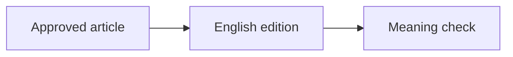

# Supported Article Rendering

Use these only when they improve reading. Preserve the same semantic element in both language editions and translate visible labels.

## Default Markdown

- Use `> quote` for a real quotation or a line that deserves visual pause. The site already gives top-level blockquotes an accent reveal.
- Keep headings, lists, tables, fenced code, footnotes, horizontal rules, and images as standard Markdown.
- For internal links written with ``, preserve the shortcode so Hugo resolves the current language. English routes live at the site root; they do not use an `/en/` prefix.

## Figure with caption

```text

```

Keep `src`; translate `alt`, `caption`, `title`, and attribution text.

## Optional detail

```text

Markdown content.

```

Use for useful material that would interrupt the main reading path. Translate `summary` and the body.

## Relationship diagram

Use a fenced Mermaid block when three or more relationships are clearer as a flow, sequence, state, or hierarchy:

````text

````

Keep node IDs stable; translate only visible labels. Do not use Mermaid for a simple list.

## Technical interactive components

For instructional animation or reader-controlled exploration, prefer the native Web Component pathway when its teaching model fits. Read [the author guide](../../../../docs/interactive-articles.md) for the current schema, static fallback, and validation commands; inspect `layouts/shortcodes/interactive.html` before adding an instance.

| Teaching need | Preferred registered kind |
|---|---|
| Capacity allocation, changing input size, remaining space and overflow | `interactive kind="context-budget"` |
| Authored Agent/tool sequence, failure recovery, explicit stopping | `interactive kind="agent-loop"` |

```text

```

The example uses the existing illustrative spec. Use an appropriate spec under `data/interactive/` and a unique ID for each new instance. Visible text lives in the spec's language copies; the shortcode ID/spec name, computation, and event sequence stay aligned across editions. New kinds require the reviewed registry/schema/static-rendering/test path; do not fit unrelated animations into these two kinds by changing their meaning.

For needs outside those kinds, the following existing renderers remain available. Read the usage comment in the owning file and reuse its supported behavior before adding new runtime code. Existing `demo-*` pages do not require automatic migration.

| Need | Shortcode source |
|---|---|
| Before/after or A/B comparison | `layouts/shortcodes/demo-compare.html` + `demo-case.html` |
| Multi-step process | `layouts/shortcodes/demo-steps.html` + `demo-step.html` |
| Terminal transcript | `layouts/shortcodes/demo-terminal.html` |
| Existing Agent trace compatibility (prefer `interactive` for new authored traces) | `layouts/shortcodes/demo-agent-trace.html` |
| Annotated image | `layouts/shortcodes/demo-anno.html` + `demo-spot.html` |

Translate reader-visible titles, questions, labels, notes, and answers. Preserve commands, JSON keys, tool names, IDs, coordinates, and syntax unless the source itself localizes them.

## Avoid

- `rawhtml`, inline scripts, and new embedded HTML;
- legacy `<aside>` formatting;
- adding a renderer merely to make the page look busy;
- hiding essential claims or safety information inside `collapse`;
- changing one language's meaning to fit a visual component.
