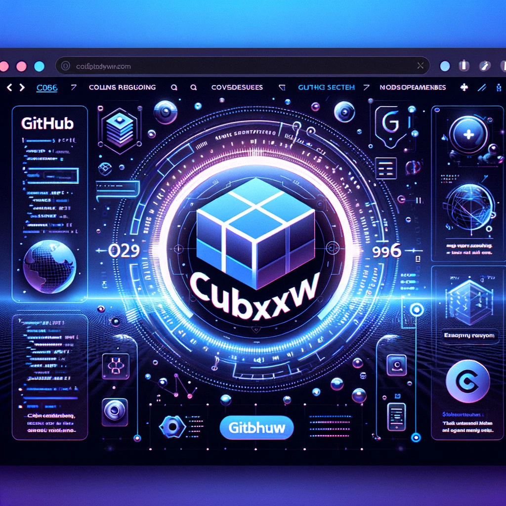
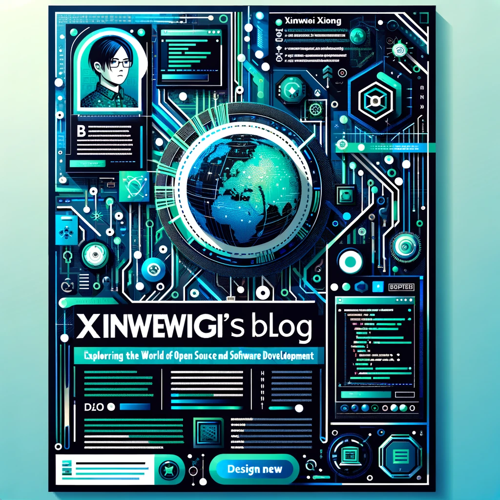

以下是您提供的文本的中文翻译：

```html
<h3 align="center" style="border-bottom: none">
    <a href="https://nsddd.top">
      ⭐️  欢迎来到我的博客 ⭐️ <br>
    </a>
</h3>

## 介绍

[](https://app.netlify.com/sites/cubxxw/deploys)

> [!TIP]
> 这是我的第三代博客。前两代博客是动态博客，后台服务器不够稳定。幸运的是，这个博客现在更加稳定，将会持续维护。

## 自我介绍海报

<div align="center">
    <table>
        <tr>
            <td align="center" valign="top" width="50%">
                <a href="https://github.com/cubxxw">
                    
                </a>
                <br>
                😎 查看我的 GitHub！
            </td>
            <td align="center" valign="top" width="50%">
                <a href="https://nsddd.top">
                    
                </a>
                <br>
                🚀 访问我的博客！
            </td>
        </tr>
    </table>
</div>

## 订阅

博客上发布的文章都是独立的，这是我参与开源项目后看到和学到的东西，我希望这个模式可以取得成功并被复制。[👀 我的博客](https://nsddd.top/)有很多优质内容，值得一读。如果您想订阅 SSR 🔍 [在这里](https://nsddd.top/posts/index.xml)

[][zhihu] 

[zhihu]: https://www.zhihu.com/people/3293172751

<a href="https://www.zhihu.com/people/3293172751" target="_blank"></a>
<a href="http://sm.nsddd.top/sm0d220ad72063197b9875379403f6c88.jpg" target="_blank"></a>


**默认英文博客订阅：**

+ 英文: [https://nsddd.top/posts/index.xml](https://nsddd.top/posts/index.xml)


**默认中文博客订阅：**

+ 中文: [https://nsddd.top/zh/posts/index.xml](https://nsddd.top/zh/posts/index.xml)


**默认西班牙语博客订阅：**

+ 西班牙语: [https://nsddd.top/es/posts/index.xml](https://nsddd.top/es/posts/index.xml)


**默认法语博客订阅：**

+ 法语: [https://nsddd.top/fr/posts/index.xml](https://nsddd.top/fr/posts/index.xml)


**不可访问网络的加速订阅链接：**

```bash
https://rss.starerror.com/${RSS_ADDRESS}
```


### 英文精选博客订阅（默认）

在这里，您将找到来自Xinwei Xiong(cubxxw)的最新和最有趣的英文博客文章。

<!-- My-Blog-EN:START -->
- [OpenIM：构建高效的版本控制和测试工作流程](https://nsddd.top/posts/openim-building-an-efficient-version-control-and-testing-workflow/)
- [2024年新兴挑战与趋势](https://nsddd.top/posts/emerging-challenges-and-trends-in-2024/)
- [2023年度总结：反思与展望](https://nsddd.top/posts/2023-annual-summary-reflections-and-aspirations/)
- [GitOps实践理论：深入分析Kubernetes部署策略](https://nsddd.top/posts/gitops-practice-theory-part/)
- [管理后台和监控的部署和设计](https://nsddd.top/posts/deployment-and-design-of-management-backend-and-monitoring/)
- [Hugo高级教程](https://nsddd.top/posts/hugo-advanced-tutorial/)
- [学习Kustomize的Kubernetes](https://nsddd.top/posts/kubernetes-for-kustomize-learning/)
- [OpenIM使用Harbor构建企业镜像仓库](https://nsddd.top/posts/openim-use-harbor-build-enterprise-mirror-repositories/)
- [了解自动化测试](https://nsddd.top/posts/learn-about-automated-testing/)
- [深入了解Kubernetes Kube apisserver的组件](https://nsddd.top/posts/deep-dive-into-the-components-of-kubernetes-kube-apiserver/)
- [深入了解Kubernetes Etcd的组件](https://nsddd.top/posts/deep-dive-into-the-components-of-kubernetes-etcd/)
- [设计提案：通过配置文件简化Kubernetes部署的端口配置](https://nsddd.top/posts/openim-cluster-deployment-parameter-passing-policy/)
- [OpenIM集群化设计Kubernetes部署总结](https://nsddd.top/posts/openim-cluster-deployment-scheme-of/)
- [关于开源商业化的反思和全球流量大会（GTC）的学习和总结](https://nsddd.top/posts/openim-open-source-business-journey/)
- [在开源社区中提问的艺术](https://nsddd.top/posts/the-art-of-asking-questions-in-open-source-communities/)
- [开源贡献指南](https://ns

ddd.top/posts/open-source-contribution-guidelines/)
- [跨平台编译](https://nsddd.top/posts/cross-platform-compilation/)
- [GitHub Actions高级技巧](https://nsddd.top/posts/github-actions-advanced-techniques/)
- [OpenIM Devops设计](https://nsddd.top/posts/openim-devops-design/)
- [GoReleaser：自动化软件发布](https://nsddd.top/posts/go-release-tools/)
- [OpenIM多进程管理](https://nsddd.top/posts/openim-multi-process-management/)
- [关于我的博客](https://nsddd.top/posts/my-first-blog/)
- [关于我的Hugo教程](https://nsddd.top/posts/my-hugo/)
- [Openkf多架构镜像](https://nsddd.top/posts/openkf-multi-architecture-image/)
- [Prow生态学习](https://nsddd.top/posts/prow-ecological-learning/)
- [OpenIM远程工作文化](https://nsddd.top/posts/openim-remote-work-culture/)
- [高级Githook设计](https://nsddd.top/posts/advanced-githook-design/)
- [OpenIM离线部署设计](https://nsddd.top/posts/openim-offline-deployment-design/)
- [阅读OpenIM项目Sealos OpenIM源代码](https://nsddd.top/posts/read-openim-project-sealos-openim-source-code/)
- [开源的阶段性成长](https://nsddd.top/posts/stage-growth-of-open-source/)
- [使用Auto Gpt](https://nsddd.top/posts/use-auto-gpt/)
- [使用Go工具Dlv](https://nsddd.top/posts/use-go-tools-dlv/)
- [Kubernetes快速入门文章](https://nsddd.top/posts/kubernetes-an-article-to-get-started-quickly/)
<!-- My-Blog-EN:END -->


### 中文博客精选订阅

在这里，您可以找到Xinwei Xiong(cubxxw)的最新和最有趣的中文博客文章。

<!-- My-Blog-ZH:START -->
- [OpenIM：构建高效的版本控制和测试工作流程](https://nsddd.top/zh/posts/openim-building-an-efficient-version-control-and-testing-workflow/)
- [2024年的新兴挑战与趋势](https://nsddd.top/zh/posts/emerging-challenges-and-trends-in-2024/)
- [2023年度总结：反思与展望](https://nsddd.top/zh/posts/2023-annual-summary-reflections-and-aspirations/)
- [对开源商业化的思考 & 全球流量大会（GTC）学习以及总结](https://nsddd.top/zh/posts/openim-open-source-business-journey/)
- [GitOps 实践理论：Kubernetes 部署策略深入解析](https://nsddd.top/zh/posts/gitops-practice-theory-part/)
- [管理后台和监控的部署与设计](https://nsddd.top/zh/posts/deployment-and-design-of-management-backend-and-monitoring/)
- [Hugo 的高级教程](https://nsddd.top/zh/posts/hugo-advanced-tutorial/)
- [Kubernetes Kustomize 学习指南](https://nsddd.top/zh/posts/kubernetes-for-kustomize-learning/)
- [OpenIM 使用 Harbor 构建企业镜像仓库](https://nsddd.top/zh/posts/openim-use-harbor-build-enterprise-mirror-repositories/)
- [自动化测试的学习(一)](https://nsddd.top/zh/posts/learn-about-automated-testing/)
- [Kubernetes 控制平面 - Kubectl](https://nsddd.top/zh/posts/deep-dive-into-the-components-of-kubernetes-kubectl/)
- [Kubernetes 控制平面 - 调度器](https://nsddd.top/zh/posts/deep-dive-into-the-components-of-kubernetes-scheduler/)
- [Kubernetes 的 CNI，CRI，CSI 详解](https://nsddd.top/zh/posts/deep-dive-into-the-components-of-kubernetes-cni-csi-cri/)
- [深入了解Kubernetes Kube apisserver的组件](https://nsddd.top/zh/posts/deep-dive-into-the-components-of-kubernetes-kube-apiserver/)
- [深入了解Kubernetes等组件之ETCD](https://nsddd.top/zh/posts/deep-dive-into-the-components-of-kubernetes-etcd/)
- [设计建议:通过配置文件简化Kubernetes部署的端口配置](https://nsddd.top/zh/posts/openim-cluster-deployment-parameter-passing-policy/)
- [OpenIM 的集群化设计 | Kubernetes 部署 | 方案讨论 | 总结](https://nsddd.top/zh/posts/openim-cluster-deployment-scheme-of/)
- [在开源社区中学会如何提问](https://nsddd.top/zh/posts/the-art-of-asking-questions-in-open-source-communities/)
- [Prow 是什么？kubernetes 为什么需要它](https://nsddd.top/zh/posts/prow-ecological-learning/)
- [一份完整的开源贡献指南（第一次踏入开源）](https://nsddd.top/zh/posts/open-source-contribution-guidelines/)
- [开源社区的规范设计思路](https://nsddd.top/zh/posts/advanced-githook-design/)
- [GoReleaser：自动化你的软件发布](https://nsddd.top/zh/posts/go-release-tools/)
- [我的第一个博客](https://nsddd.top/zh/posts/my-first-blog/)
- [关于我的 Hugo (教程)](https://nsddd.top/zh/posts/my-hugo/)
- [速读开源项目 Sealos 的源码](https://nsddd.top/zh/posts/read-openim-project-sealos-openim-source-code/)
- [DevOps OpenIM 的标准设计](https://nsddd.top/zh/posts/openim-devops-design/)
- [OpenIM 多进程管理](https://nsddd.top/zh/posts/openim-multi-process-management/)
- [如何安装和使用自主人工智能工具Auto-GPT](https://nsddd.top/zh/posts/use-auto-gpt/)
- [go 调试 测试 以及调试工具 dlv 学习](https://nsddd.top/zh/posts/use-go-tools-dlv/)
- [Github Actions 的高级使用技巧](https://nsddd.top/zh/posts/github-actions-advanced-techniques/)

<!-- My-Blog-ZH:END -->
