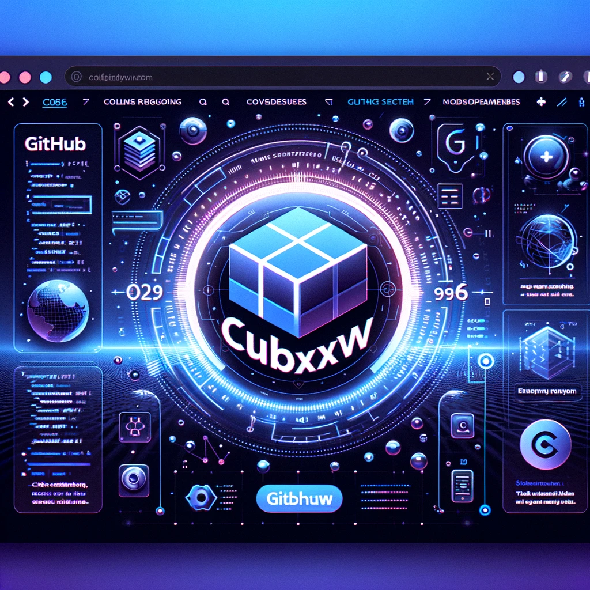
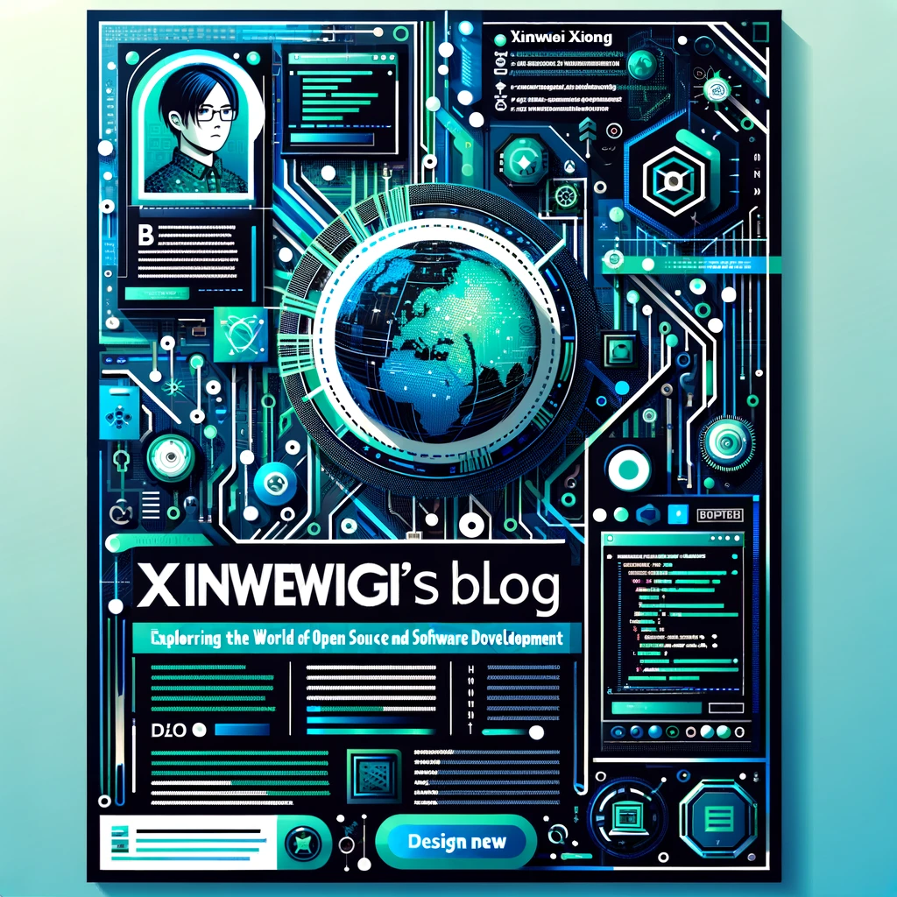

<h3 align="center" style="border-bottom: none">
    <a href="https://nsddd.top">
      ⭐️  Welcome to my blog ⭐️ <br>
    </a>
</h3>

## Introduction

[](https://app.netlify.com/sites/cubxxw/deploys)

> [!TIP]
> This is my third generation blog. The first two generations were dynamic blogs with unstable servers in the background. Fortunately, this blog is now more stable and will be continuously maintained.

## Readme Poster

<div align="center">
    <table>
        <tr>
            <td align="center" valign="top" width="50%">
                <a href="https://github.com/cubxxw">
                    
                </a>
                <br>
                😎 Check out my GitHub!
            </td>
            <td align="center" valign="top" width="50%">
                <a href="https://nsddd.top">
                    
                </a>
                <br>
                🚀 Visit my Blog!
            </td>
        </tr>
    </table>
</div>

## Subscribe

The articles published on the blog are independent, which is what I have seen and learned since participating in open source projects, and I hope this model can be successful and copied. [👀 My blog](https://nsddd.top/) has a lot of good content and is worth a read. If you want to subscribe to the SSR 🔍 [here](https://nsddd.top/posts/index.xml)

[][zhihu] 

[zhihu]: https://www.zhihu.com/people/3293172751

<a href="https://www.zhihu.com/people/3293172751" target="_blank"></a>
<a href="http://sm.nsddd.top/sm0d220ad72063197b9875379403f6c88.jpg" target="_blank"></a>


**Default English blog subscription：**

+ English: [https://nsddd.top/posts/index.xml](https://nsddd.top/posts/index.xml)


**Default Chinese blog subscription：**

+ Chinese: [https://nsddd.top/zh/posts/index.xml](https://nsddd.top/zh/posts/index.xml)


**Default Spain blog subscription：**

+ Spain: [https://nsddd.top/es/posts/index.xml](https://nsddd.top/es/posts/index.xml)


**Default French blog subscription：**

+ French: [https://nsddd.top/fr/posts/index.xml](https://nsddd.top/fr/posts/index.xml)


**Speed up subscription links for inaccessible networks：**

```bash
https://rss.starerror.com/${RSS_ADDRESS}
```


### Featured blog subscriptions in English (default)

Here you'll find the latest and most interesting blog posts in English from Xinwei Xiong(cubxxw).

<!-- My-Blog-EN:START -->
- [Brain-Friendly English Learning Strategies: Tools and Techniques Explained](https://nsddd.top/posts/brain-friendly-english-learning-strategies-tools-and-techniques-explained/)
- [Unlocking the Magic of Flow State: A Guide to Enhanced Focus and Happiness](https://nsddd.top/posts/flow-state/)
- [GTD and the Quadrant Method Practice](https://nsddd.top/posts/gtd-and-the-four-quadrant-rule-practice/)
- [Decoding Go Language Source Code: A Deep Dive into go: Directives and the Use of Automation Tools](https://nsddd.top/posts/directives-and-the-use-of-automation-tools/)
- [Concurrent Type Checking and Cross-Platform Development in Go](https://nsddd.top/posts/concurrent-type-checking-and-cross-platform-development-in-go/)
- [Vector Database Learning](https://nsddd.top/posts/vector-database-learning/)
- [OpenIM: Building an Efficient Version Control and Testing Workflow](https://nsddd.top/posts/openim-building-an-efficient-version-control-and-testing-workflow/)
- [Emerging Challenges and Trends in 2024](https://nsddd.top/posts/emerging-challenges-and-trends-in-2024/)
- [2023 Annual Summary Reflections and Aspirations](https://nsddd.top/posts/2023-annual-summary-reflections-and-aspirations/)
- [GitOps Practice Theory: In-Depth Analysis of Kubernetes Deployment Strategies](https://nsddd.top/posts/gitops-practice-theory-part/)
- [Deployment and Design of Management Backend and Monitoring](https://nsddd.top/posts/deployment-and-design-of-management-backend-and-monitoring/)
- [Hugo Advanced Tutorial](https://nsddd.top/posts/hugo-advanced-tutorial/)
- [Kubernetes for Kustomize Learning](https://nsddd.top/posts/kubernetes-for-kustomize-learning/)
- [OpenIM Use Harbor Build Enterprise Mirror Repositories](https://nsddd.top/posts/openim-use-harbor-build-enterprise-mirror-repositories/)
- [Learn About Automated Testing](https://nsddd.top/posts/learn-about-automated-testing/)
- [In-depth understanding of the components of Kubernetes Kube apisserver](https://nsddd.top/posts/deep-dive-into-the-components-of-kubernetes-kube-apiserver/)
- [Deep Dive Into the Components of Kubernetes Etcd](https://nsddd.top/posts/deep-dive-into-the-components-of-kubernetes-etcd/)
- [Design Proposal: Simplified Port Configuration via Config Files for Kubernetes Deployment](https://nsddd.top/posts/openim-cluster-deployment-parameter-passing-policy/)
- [OpenIM clustering design Kubernetes deploy concludes](https://nsddd.top/posts/openim-cluster-deployment-scheme-of/)
- [Reflection on Open Source Commercialization & Learning and Summary of Global Traffic Conference (GTC)](https://nsddd.top/posts/openim-open-source-business-journey/)
- [The Art of Asking Questions in Open Source Communities](https://nsddd.top/posts/the-art-of-asking-questions-in-open-source-communities/)
- [Open Source Contribution Guidelines](https://nsddd.top/posts/open-source-contribution-guidelines/)
- [Cross Platform Compilation](https://nsddd.top/posts/cross-platform-compilation/)
- [Github Actions Advanced Techniques](https://nsddd.top/posts/github-actions-advanced-techniques/)
- [Openim Devops Design](https://nsddd.top/posts/openim-devops-design/)
- [GoReleaser: Automate your software releases](https://nsddd.top/posts/go-release-tools/)
- [Openim Multi Process Management](https://nsddd.top/posts/openim-multi-process-management/)
- [About My Blog](https://nsddd.top/posts/my-first-blog/)
- [About My Hugo teaching](https://nsddd.top/posts/my-hugo/)
- [Openkf Multi Architecture Image](https://nsddd.top/posts/openkf-multi-architecture-image/)
- [Prow Ecological Learning](https://nsddd.top/posts/prow-ecological-learning/)
- [Openim Remote Work Culture](https://nsddd.top/posts/openim-remote-work-culture/)
- [Advanced Githook Design](https://nsddd.top/posts/advanced-githook-design/)
- [Openim Offline Deployment Design](https://nsddd.top/posts/openim-offline-deployment-design/)
- [Read Openim Project Sealos Openim Source Code](https://nsddd.top/posts/read-openim-project-sealos-openim-source-code/)
- [Project Management From Theory to Practice](https://nsddd.top/posts/project-management-from-theory-to-practice/)
- [Stage Growth of Open Source](https://nsddd.top/posts/stage-growth-of-open-source/)
- [Use Auto Gpt](https://nsddd.top/posts/use-auto-gpt/)
- [Use Go Tools Dlv](https://nsddd.top/posts/use-go-tools-dlv/)
- [Participating in This Project](https://nsddd.top/posts/participating-in-this-project/)
- [Kubernetes an Article to Get Started Quickly](https://nsddd.top/posts/kubernetes-an-article-to-get-started-quickly/)
<!-- My-Blog-EN:END -->


### 中文博客精选订阅

这里您可以看到Xinwei Xiong(cubxxw)的最新和最有趣的中文博客文章。

<!-- My-Blog-ZH:START -->
- [脑友好型英语学习策略：工具与技巧解析](https://nsddd.top/zh/posts/brain-friendly-english-learning-strategies-tools-and-techniques-explained/)
- [心流状态的魔力：专注与幸福感提升指南](https://nsddd.top/zh/posts/flow-state/)
- [GTD与四象限法则实践](https://nsddd.top/zh/posts/gtd-and-the-four-quadrant-rule-practice/)
- [参与这个项目](https://nsddd.top/zh/posts/participating-in-this-project/)
- [Go 源码里的这些 go: 指令 && go 自动化工具](https://nsddd.top/zh/posts/directives-and-the-use-of-automation-tools/)
- [Go 语言中的并发类型检查与跨平台开发](https://nsddd.top/zh/posts/concurrent-type-checking-and-cross-platform-development-in-go/)
- [向量数据库的学习](https://nsddd.top/zh/posts/vector-database-learning/)
- [OpenIM：构建高效的版本控制和测试工作流程](https://nsddd.top/zh/posts/openim-building-an-efficient-version-control-and-testing-workflow/)
- [2024年的新兴挑战与趋势](https://nsddd.top/zh/posts/emerging-challenges-and-trends-in-2024/)
- [2023年度总结：反思与展望](https://nsddd.top/zh/posts/2023-annual-summary-reflections-and-aspirations/)
- [对开源商业化的思考 & 全球流量大会（GTC）学习以及总结](https://nsddd.top/zh/posts/openim-open-source-business-journey/)
- [GitOps 实践理论：Kubernetes 部署策略深入解析](https://nsddd.top/zh/posts/gitops-practice-theory-part/)
- [管理后台和监控的部署与设计](https://nsddd.top/zh/posts/deployment-and-design-of-management-backend-and-monitoring/)
- [Hugo 的高级教程](https://nsddd.top/zh/posts/hugo-advanced-tutorial/)
- [Kubernetes Kustomize 学习指南](https://nsddd.top/zh/posts/kubernetes-for-kustomize-learning/)
- [OpenIM 使用 Harbor 构建企业镜像仓库](https://nsddd.top/zh/posts/openim-use-harbor-build-enterprise-mirror-repositories/)
- [自动化测试的学习(一)](https://nsddd.top/zh/posts/learn-about-automated-testing/)
- [Kubernetes 控制平面 - Kubectl](https://nsddd.top/zh/posts/deep-dive-into-the-components-of-kubernetes-kubectl/)
- [Kubernetes 控制平面 - 调度器](https://nsddd.top/zh/posts/deep-dive-into-the-components-of-kubernetes-scheduler/)
- [Kubernetes 的 CNI，CRI，CSI 详解](https://nsddd.top/zh/posts/deep-dive-into-the-components-of-kubernetes-cni-csi-cri/)
- [深入了解Kubernetes Kube apisserver的组件](https://nsddd.top/zh/posts/deep-dive-into-the-components-of-kubernetes-kube-apiserver/)
- [深入了解Kubernetes等组件之ETCD](https://nsddd.top/zh/posts/deep-dive-into-the-components-of-kubernetes-etcd/)
- [设计建议:通过配置文件简化Kubernetes部署的端口配置](https://nsddd.top/zh/posts/openim-cluster-deployment-parameter-passing-policy/)
- [OpenIM 的集群化设计 | Kubernetes 部署 | 方案讨论 | 总结](https://nsddd.top/zh/posts/openim-cluster-deployment-scheme-of/)
- [在开源社区中学会如何提问](https://nsddd.top/zh/posts/the-art-of-asking-questions-in-open-source-communities/)
- [Prow 是什么？kubernetes 为什么需要它](https://nsddd.top/zh/posts/prow-ecological-learning/)
- [一份完整的开源贡献指南（第一次踏入开源）](https://nsddd.top/zh/posts/open-source-contribution-guidelines/)
- [开源社区的规范设计思路](https://nsddd.top/zh/posts/advanced-githook-design/)
- [GoReleaser：自动化你的软件发布](https://nsddd.top/zh/posts/go-release-tools/)
- [我的第一个博客](https://nsddd.top/zh/posts/my-first-blog/)
- [关于我的 Hugo (教程)](https://nsddd.top/zh/posts/my-hugo/)
- [速读开源项目 Sealos 的源码](https://nsddd.top/zh/posts/read-openim-project-sealos-openim-source-code/)
- [DevOps OpenIM 的标准设计](https://nsddd.top/zh/posts/openim-devops-design/)
- [OpenIM 多进程管理](https://nsddd.top/zh/posts/openim-multi-process-management/)
- [如何安装和使用自主人工智能工具Auto-GPT](https://nsddd.top/zh/posts/use-auto-gpt/)
- [go 调试 测试 以及调试工具 dlv 学习](https://nsddd.top/zh/posts/use-go-tools-dlv/)
- [Github Actions 的高级使用技巧](https://nsddd.top/zh/posts/github-actions-advanced-techniques/)
- [开源的阶段性成长指南](https://nsddd.top/zh/posts/stage-growth-of-open-source/)
- [从理论到实践的项目管理打通](https://nsddd.top/zh/posts/project-management-from-theory-to-practice/)
- [Openkf 多架构镜像的构建策略设计](https://nsddd.top/zh/posts/openkf-multi-architecture-image/)
- [OpenIM 远程工作团队协作协议 v1.3](https://nsddd.top/zh/posts/openim-remote-work-culture/)
- [跨平台以及多架构编译设计](https://nsddd.top/zh/posts/cross-platform-compilation/)
- [Kubernetes一篇快速入门的文章](https://nsddd.top/zh/posts/kubernetes-an-article-to-get-started-quickly/)
- [Openim离线部署设计](https://nsddd.top/zh/posts/openim-offline-deployment-design/)
<!-- My-Blog-ZH:END -->


### Español blog destacado suscripción

Aquí encontrarás las últimas y más interesantes entradas de blog en español de Xinwei Xiong(cubxxw).

<!-- My-Blog-ES:START -->

<!-- My-Blog-ES:END -->


### Français blog fr vedette abonnement

Ici, vous trouverez les derniers articles de blog les plus intéressants en français de Xinwei Xiong(cubxxw).

<!-- My-Blog-FR:START -->

<!-- My-Blog-FR:END -->


### 繁體中文博客精選訂閱

這裡您可以看到Xinwei Xiong(cubxxw)的最新和最有趣的繁體中文博客文章。

<!-- My-Blog-TW:START -->
- [深入了解Kubernetes Kube apisserver的组件](https://nsddd.top/zh-tw/posts/deep-dive-into-the-components-of-kubernetes-kube-apiserver/)
- [深入了解Kubernetes等组件之ETCD](https://nsddd.top/zh-tw/posts/deep-dive-into-the-components-of-kubernetes-etcd/)
- [Openkf 多架構鏡像的構建策略設計](https://nsddd.top/zh-tw/posts/openkf-multi-architecture-image/)
- [我的第一個博客](https://nsddd.top/zh-tw/posts/my-first-blog/)
- [Kubernetes an Article to Get Started Quickly](https://nsddd.top/zh-tw/posts/kubernetes-an-article-to-get-started-quickly/)
<!-- My-Blog-TW:END -->


## Content style

We don’t mandate any particular style for your page contents. However, if you’d like some guidance on how to write and format clear, concise technical documentation, we recommend the [Google Developer Documentation Style Guide](https://developers.google.com/style/), particularly the [Style Guide Highlights](https://developers.google.com/style/highlights).


## Running the website locally

Clone the minikube project fork with option `--recurse-submodules --depth 1` to download and update submodule dependencies.

```bash
❯ git clone --recurse-submodules --depth 1 https://github.com/cubxxw/blog.git  # replace path with your github fork of minikube 
❯ cd blog
```

## Use

```bash
❯ make run
```

## Create a new article

```bash
❯ make new-post POST_NAME="openim-offline-deployment-design"
```

**Named by an environment variable:**

```bash
❯ POST_NAME="openim-k8s-deployment" make new-post  # penim-k8s-deployment.md
❯ export POST_NAME="my-hugo"
❯ make new-post    # my-hugo.md
```

## Common Issues

```bash
Start building sites …
hugo v0.86.0+extended darwin/amd64 BuildDate=unknown
Error: Error building site: "/minikube/site/content/en/docs/contrib/releasing/binaries.md:64:1": failed to extract shortcode: template for shortcode "alert" not found
Built in 667 ms
```

This indicates the submodules are not updated. Please run the following command to fix.

```bash
❯ git submodule update --init --recursive
```


## Reference

Uer netlify to deploy the blog, and use the [hexo-theme-next](ttps://cubxxw.netlify.app) theme. 🚀 Shanghai time of last status update by the bot <a href='https://github.com/kubbot'>@kubbot</a>: 2024-02-18 12:05:35
 🚀 Shanghai time of last status update by the bot <a href='https://github.com/kubbot'>@kubbot</a>: 2024-02-18 12:05:37
