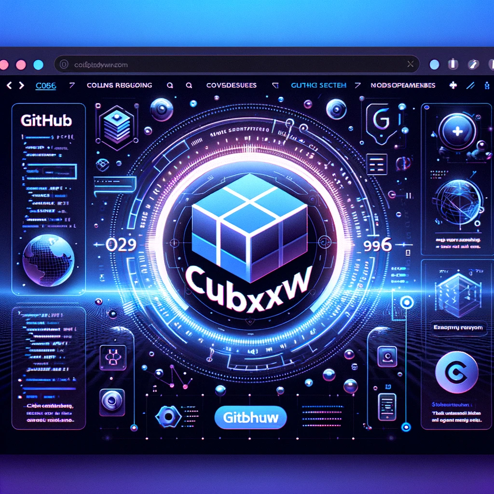
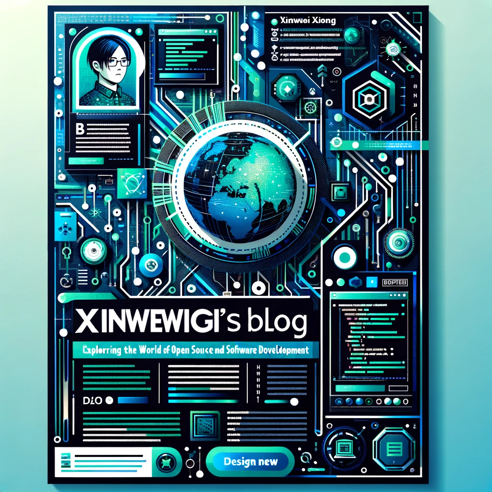

<h3 align="center" style="border-bottom: none">
    <a href="https://nsddd.top">
      ⭐️  Welcome to my blog ⭐️ <br>
    </a>
</h3>

## Introduction

[](https://app.netlify.com/sites/cubxxw/deploys)

> [!TIP]
> This is my third generation blog. The first two generations were dynamic blogs with unstable servers in the background. Fortunately, this blog is now more stable and will be continuously maintained.

> [!NOTE]
> 我从大学开始远程工作，经历了 [OpenIM 开源社区](https://github.com/openimsdk/open-im-server) 实习，外企到现在创业，现在正在环游世界，在思考，在记录，在创造 ..
> + [关于我](https://nsddd.top/zh/about/)
> + [一些碎片的思考笔记](https://diary.nsddd.top/flomo-original/)
> + [跟着我看我环游世界旅居的笔记](https://www.polarsteps.com/cubxxw)


### 🔍 项目导航

- [LLM 相关项目](/tags/llm/)
- [向量数据库](/tags/向量数据库/)
- [AI 框架](/tags/ai框架/)
- [AI 工具链](/tags/ai工具链/)

## Readme Poster

<div align="center">
    <table>
        <tr>
            <td align="center" valign="top" width="50%">
                <a href="https://github.com/cubxxw">
                    
                </a>
                <br>
                😎 Check out my GitHub!
            </td>
            <td align="center" valign="top" width="50%">
                <a href="https://nsddd.top">
                    
                </a>
                <br>
                🚀 Visit my Blog!
            </td>
        </tr>
    </table>
</div>

## Tagging Standards

Based on your professional skills, technical expertise, and personal interests, I have prepared a more comprehensive list of tags and categories, presented in a table format, distinguishing between Chinese and English blogs.

### 中文博客的标签和分类

| 类别       | 标签                                                                                               | 分类                             |
|------------|----------------------------------------------------------------------------------------------------|----------------------------------|
| 技术       | `Golang (GO语言)`, `Kubernetes`, `OpenIM`, `云原生 (Cloud Native)`, `微服务 (Microservices)`, `服务网格 (Service Mesh)`, `Docker`, `CI/CD`, `Prometheus` | `开发 (Development)`             |
| AI开源项目 | `LLM`, `向量数据库`, `AI框架`, `模型训练`, `推理优化`, `AI工具链`, `AI应用`, `AI部署`, `AI性能优化` | `AI开源 (AI Open Source)`        |
| 安全       | `安全性 (Security)`, `代码审查 (Code Review)`                                                       | `安全 (Security)`                |
| 敏捷与流程 | `敏捷软件开发 (Agile Software Development)`, `响应式编程 (Reactive Programming)`, `函数式编程 (Functional Programming)` | `项目管理 (Project Management)`   |
| 个人兴趣   | `户外探险 (Outdoor Adventures)`, `环球旅行 (World Travel)`, `自行车骑行 (Cycling)`, `摄影 (Photography)`, `旅行 (Travel)`, `自我发现 (Self Discovery)`, `冒险 (Adventure)`, `探索 (Exploration)` | `个人成长 (Personal Development)`|
| 生活方式   | `个人效率 (Personal Productivity)`, `健康生活 (Healthy Living)`, `生活方式 (Lifestyle)`, `远程工作 (Remote Work)` | `生活与教育 (Living & Education)`|
| 人工智能   | `深度学习 (Deep Learning)`, `自然语言处理 (NLP, Natural Language Processing)`, `计算机视觉 (Computer Vision)`, `强化学习 (Reinforcement Learning)`, `转移学习 (Transfer Learning)`, `LLM` | `人工智能 (AI)`                  |

### Tags and Categories for English Blogs

| Category            | Tags                                                                                       | Classification                  |
|---------------------|--------------------------------------------------------------------------------------------|---------------------------------|
| Technology          | `Golang`, `Kubernetes`, `OpenIM`, `Cloud Native`, `Microservices`, `Service Mesh`, `Docker`, `CI/CD`, `Prometheus` | `Development`                   |
| Security            | `Security`, `Code Review`                                                                   | `Security`                      |
| Agile & Processes   | `Agile Software Development`, `Reactive Programming`, `Functional Programming`             | `Project Management`            |
| Personal Interests  | `Outdoor Adventures`, `World Travel`, `Cycling`, `Photography`, `Travel`, `Self Discovery`, `Adventure`, `Exploration` | `Personal Development`          |
| Lifestyle           | `Personal Productivity`, `Healthy Living`, `Lifestyle`, `Remote Work`                      | `Learning & Education`          |
| Artificial Intelligence | `Deep Learning`, `Natural Language Processing`, `Computer Vision`, `Reinforcement Learning`, `Transfer Learning`， `LLM` | `AI`       |

### Keywords

Keywords can generally be generated by AI.

### Usage Standards

- **Tag Naming**: Choose directly related tags, ensuring accuracy and consistency of professional terms in both Chinese and English blogs.
- **Category Selection**: Select the most relevant 1-2 categories for each article. Avoid over-categorization to maintain focus and efficiency of the content.
- **Category Coverage**: Each category should cover several articles to avoid creating "empty categories" that have no articles.
- **Avoid Duplication**: Be mindful not to repeat tags, avoiding situations where the same concept is labeled differently, such as "编程" and "程序设计".
- **Language Consistency**: For bilingual blogs, ensure that tags and categories are represented in both Chinese and English to accommodate readers of different languages.
- **Language Neutrality**: Choose category names that are universally understandable across languages, such as industry terms or widely recognized concepts. For example, "Technology" and "科技", "Health" and "健康".


## Subscribe

The articles published on the blog are independent, which is what I have seen and learned since participating in open source projects, and I hope this model can be successful and copied. [👀 My blog](https://nsddd.top/) has a lot of good content and is worth a read. If you want to subscribe to the SSR 🔍 [here](https://nsddd.top/articles/index.xml)

[][zhihu] 

[zhihu]: https://www.zhihu.com/people/3293172751

<a href="https://www.zhihu.com/people/3293172751" target="_blank"></a>
<a href="assets/wechat.jpg" target="_blank"></a>


**Default English blog subscription：**

+ English: [https://nsddd.top/articles/index.xml](https://nsddd.top/articles/index.xml)


**Default Chinese blog subscription：**

+ Chinese: [https://nsddd.top/zh/articles/index.xml](https://nsddd.top/zh/articles/index.xml)


**Default Spain blog subscription：**

+ Spain: [https://nsddd.top/es/articles/index.xml](https://nsddd.top/es/articles/index.xml)


**Default French blog subscription：**

+ French: [https://nsddd.top/fr/articles/index.xml](https://nsddd.top/fr/articles/index.xml)


**Speed up subscription links for inaccessible networks：**

```bash
https://rss.starerror.com/${RSS_ADDRESS}
```


### Featured blog subscriptions in English (default)

Here you'll find the latest and most interesting blog posts in English from Xinwei Xiong(cubxxw).

<!-- My-Blog-EN:START -->
- [I'm Wandering, But I'm Not Lost — 2025-2026 Annual Review](https://nsddd.top/growth/posts/2025-annual-review/)
- [AI Is Getting Smarter, But I'm Losing Myself](https://nsddd.top/growth/posts/ai-and-self-identity/)
- [February 2026 Thought Notes | 2026 年 2 月思考笔记](https://nsddd.top/growth/posts/2026-02-thought-notes/)
- [January 2026 Thought Notes | 2026 年 1 月思考笔记](https://nsddd.top/growth/posts/2026-01-thought-notes/)
- [December 2025 Thought Notes | 2025 年 12 月思考笔记](https://nsddd.top/growth/posts/2025-12-thought-notes/)
- [2025 November Thought Notes](https://nsddd.top/growth/posts/2025-11-thought-notes/)
- [2025 August Thought Notes](https://nsddd.top/growth/posts/2025-08-thought-notes/)
- [2025 July Thought Notes](https://nsddd.top/growth/posts/2025-07-thought-notes/)
- [2025 June Thought Notes](https://nsddd.top/growth/posts/2025-06-thought-notes/)
- [Metacognitive Transformation Review](https://nsddd.top/growth/posts/metacognitive-transformation-review/)
- [2025 May Thought Notes](https://nsddd.top/growth/posts/2025-05-thought-notes/)
- [2025 April Thought Notes](https://nsddd.top/growth/posts/2025-04-thought-notes/)
- [Ai Recommend 开源项目深度学习](https://nsddd.top/projects/ai-recommend/)
- [Notebooklm 开源项目深度学习](https://nsddd.top/projects/notebooklm/)
- [Tdd 开源项目深度学习](https://nsddd.top/projects/tdd/)
- [MarkItdown 开源项目深度学习](https://nsddd.top/projects/markitdown/)
- [Langgraph 开源项目深度学习](https://nsddd.top/projects/langgraph/)
- [Langchain 开源项目深度学习](https://nsddd.top/projects/langchain/)
- [LLM/AI API 网关市场分析 & 创业团队选型推荐](https://nsddd.top/projects/ai-getway/)
- [Independent Developer 开源项目深度学习](https://nsddd.top/projects/independent-developer/)
- [Gpt Researcher 开源项目深度学习](https://nsddd.top/projects/gpt-researcher/)
- [Jina](https://nsddd.top/projects/jina/)
- [2025 March Thought Notes](https://nsddd.top/growth/posts/2025-03-thought-notes/)
- [2024 Annual Review](https://nsddd.top/growth/posts/2024-annual-review/)
- [Travel](https://nsddd.top/travel/)
- [Kubernetes Resources and Learning Path Summary](https://nsddd.top/ai-technology/posts/kubernetes-learning/)
- [Harnessing Language Model Applications with LangChain: A Developer's Guide](https://nsddd.top/ai-technology/posts/harnessing-language-model-applications-with-langchain-a-developer-is-guide/)
- [Exploring Large Language Models (LLMs): Pioneering AI Understanding, Generation & Human Language](https://nsddd.top/ai-technology/posts/exploring-large-language-models-llms-pioneering-ai-understanding-generation-human-language/)
- [Crafting Your Career Pathway: A Guide to Open Source Resume Builders and Expert Resume Tips](https://nsddd.top/growth/posts/crafting-your-career-pathway-a-guide-to-open-source-resume-builders-and-expert-resume-tips/)
- [Troubleshooting Guide for OpenIM](https://nsddd.top/ai-technology/posts/troubleshooting-guide-for-openim/)
- [Navigating the Open Source Landscape](https://nsddd.top/ai-technology/posts/navigating-the-open-source-landscape/)
- [Sora Ease Guide: Mastering Sora AI for Developers](https://nsddd.top/ai-technology/posts/sora-ease-guide-mastering-sora-ai-for-developers/)
- [In 2023, I Was Wandering at the Edge of the World](https://nsddd.top/growth/posts/in-2023-i-was-wandering-at-the-edge-of-the-world/)
- [Exploring Sora Technology for Enthusiasts and Developers](https://nsddd.top/ai-technology/posts/exploring-sora-technology-for-enthusiasts-and-developers/)
- [Combining GitHub and Google Workspace for Effective Project Management](https://nsddd.top/growth/posts/combining-github-and-google-workspace-for-project-management/)
- [Brain-Friendly English Learning Strategies: Tools and Techniques Explained](https://nsddd.top/ai-technology/posts/brain-friendly-english-learning-strategies-tools-and-techniques-explained/)
- [Unlocking the Magic of Flow State: A Guide to Enhanced Focus and Happiness](https://nsddd.top/growth/posts/flow-state/)
- [GTD and the Quadrant Method Practice](https://nsddd.top/growth/posts/gtd-and-the-four-quadrant-rule-practice/)
- [Decoding Go Language Source Code: A Deep Dive into go: Directives and the Use of Automation Tools](https://nsddd.top/ai-technology/posts/directives-and-the-use-of-automation-tools/)
- [Concurrent Type Checking and Cross-Platform Development in Go](https://nsddd.top/ai-technology/posts/concurrent-type-checking-and-cross-platform-development-in-go/)
- [Vector Database Learning](https://nsddd.top/ai-technology/posts/vector-database-learning/)
- [OpenIM: Building an Efficient Version Control and Testing Workflow](https://nsddd.top/ai-technology/posts/openim-building-an-efficient-version-control-and-testing-workflow/)
- [Emerging Challenges and Trends in 2024](https://nsddd.top/ai-technology/posts/emerging-challenges-and-trends-in-2024/)
- [2023 Annual Summary Reflections and Aspirations](https://nsddd.top/growth/posts/2023-annual-summary-reflections-and-aspirations/)
- [GitOps Practice Theory: In-Depth Analysis of Kubernetes Deployment Strategies](https://nsddd.top/ai-technology/posts/gitops-practice-theory-part/)
- [Deployment and Design of Management Backend and Monitoring](https://nsddd.top/ai-technology/posts/deployment-and-design-of-management-backend-and-monitoring/)
- [Hugo Advanced Tutorial](https://nsddd.top/ai-technology/posts/hugo-advanced-tutorial/)
- [Kubernetes for Kustomize Learning](https://nsddd.top/ai-technology/posts/kubernetes-for-kustomize-learning/)
- [OpenIM Use Harbor Build Enterprise Mirror Repositories](https://nsddd.top/ai-technology/posts/openim-use-harbor-build-enterprise-mirror-repositories/)
- [Learn About Automated Testing](https://nsddd.top/ai-technology/posts/learn-about-automated-testing/)
- [Deep Dive into Kubernetes CNI, CRI, CSI Components](https://nsddd.top/ai-technology/posts/deep-dive-into-the-components-of-kubernetes-cni-csi-cri/)
- [Kubernetes Control Plane - Detailed Analysis of Kubelet](https://nsddd.top/ai-technology/posts/deep-dive-into-the-components-of-kubernetes-kubectl/)
- [Kubernetes Control Plane - Scheduler](https://nsddd.top/ai-technology/posts/deep-dive-into-the-components-of-kubernetes-scheduler/)
- [In-depth understanding of the components of Kubernetes Kube apisserver](https://nsddd.top/ai-technology/posts/deep-dive-into-the-components-of-kubernetes-kube-apiserver/)
- [Deep Dive Into the Components of Kubernetes Etcd](https://nsddd.top/ai-technology/posts/deep-dive-into-the-components-of-kubernetes-etcd/)
- [Design Proposal: Simplified Port Configuration via Config Files for Kubernetes Deployment](https://nsddd.top/ai-technology/posts/openim-cluster-deployment-parameter-passing-policy/)
- [OpenIM clustering design Kubernetes deploy concludes](https://nsddd.top/ai-technology/posts/openim-cluster-deployment-scheme-of/)
- [Reflection on Open Source Commercialization & Learning and Summary of Global Traffic Conference (GTC)](https://nsddd.top/ai-technology/posts/openim-open-source-business-journey/)
- [The Art of Asking Questions in Open Source Communities](https://nsddd.top/ai-technology/posts/the-art-of-asking-questions-in-open-source-communities/)
- [Open Source Contribution Guidelines](https://nsddd.top/ai-technology/posts/open-source-contribution-guidelines/)
- [Cross Platform Compilation](https://nsddd.top/ai-technology/posts/cross-platform-compilation/)
- [Github Actions Advanced Techniques](https://nsddd.top/ai-technology/posts/github-actions-advanced-techniques/)
- [Openim Devops Design](https://nsddd.top/ai-technology/posts/openim-devops-design/)
- [GoReleaser: Automate your software releases](https://nsddd.top/ai-technology/posts/go-release-tools/)
- [Openim Multi Process Management](https://nsddd.top/ai-technology/posts/openim-multi-process-management/)
- [About My Blog](https://nsddd.top/growth/posts/my-first-blog/)
- [About My Hugo teaching](https://nsddd.top/ai-technology/posts/my-hugo/)
- [Openkf Multi Architecture Image](https://nsddd.top/ai-technology/posts/openkf-multi-architecture-image/)
- [Prow Ecological Learning](https://nsddd.top/ai-technology/posts/prow-ecological-learning/)
- [Openim Remote Work Culture](https://nsddd.top/ai-technology/posts/openim-remote-work-culture/)
- [Advanced Githook Design](https://nsddd.top/ai-technology/posts/advanced-githook-design/)
- [Openim Offline Deployment Design](https://nsddd.top/ai-technology/posts/openim-offline-deployment-design/)
- [Read Openim Project Sealos Openim Source Code](https://nsddd.top/ai-technology/posts/read-openim-project-sealos-openim-source-code/)
- [Project Management From Theory to Practice](https://nsddd.top/ai-technology/posts/project-management-from-theory-to-practice/)
- [Stage Growth of Open Source](https://nsddd.top/growth/posts/stage-growth-of-open-source/)
- [Use Auto Gpt](https://nsddd.top/ai-technology/posts/use-auto-gpt/)
- [Use Go Tools Dlv](https://nsddd.top/ai-technology/posts/use-go-tools-dlv/)
- [Participating in This Project](https://nsddd.top/ai-technology/posts/participating-in-this-project/)
- [Kubernetes an Article to Get Started Quickly](https://nsddd.top/ai-technology/posts/kubernetes-an-article-to-get-started-quickly/)
- [About](https://nsddd.top/about/)
- [分类 · CATEGORIES](https://nsddd.top/categories/)
<!-- My-Blog-EN:END -->


### 中文博客精选订阅

这里你可以看到Xinwei Xiong(cubxxw)的最新和最有趣的中文博客文章。

<!-- My-Blog-ZH:START -->
- [Agent 的自我：从洛克到 OpenClaw](https://nsddd.top/zh/ai-technology/posts/agent-identity-from-locke-to-openclaw/)
- [在不被需要的时代，如何维持自我的重量](https://nsddd.top/zh/growth/posts/weight-of-self-in-ai-age/)
- [2026 年 3 月思考笔记 | March 2026 Thought Notes](https://nsddd.top/zh/growth/posts/2026-03-thought-notes/)
- [拉萨——一座城市的慢与重](https://nsddd.top/zh/growth/posts/2026-03-27-lhasa-slow-and-heavy/)
- [我在游荡，但我没有迷路 — 2025-2026 年度总结](https://nsddd.top/zh/growth/posts/2025-annual-review/)
- [AI 越来越聪明，我却越来越不知道自己是谁](https://nsddd.top/zh/growth/posts/ai-and-self-identity/)
- [2026 年 2 月思考笔记 | February 2026 Thought Notes](https://nsddd.top/zh/growth/posts/2026-02-thought-notes/)
- [2026 年 1 月思考笔记 | January 2026 Thought Notes](https://nsddd.top/zh/growth/posts/2026-01-thought-notes/)
- [2025 年 12 月思考笔记 | December 2025 Thought Notes](https://nsddd.top/zh/growth/posts/2025-12-thought-notes/)
- [日本旅居笔记 - 用木头、火与缺口和时间共处](https://nsddd.top/zh/growth/posts/japan-travel-2025/)
- [2025年11月思考笔记](https://nsddd.top/zh/growth/posts/2025-11-thought-notes/)
- [2025年10月思考笔记](https://nsddd.top/zh/growth/posts/2025-10-thought-notes/)
- [2025年9月思考笔记](https://nsddd.top/zh/growth/posts/2025-09-thought-notes/)
- [2025年8月思考笔记](https://nsddd.top/zh/growth/posts/2025-08-thought-notes/)
- [2025年7月思考笔记](https://nsddd.top/zh/growth/posts/2025-07-thought-notes/)
- [2025年6月思考笔记](https://nsddd.top/zh/growth/posts/2025-06-thought-notes/)
- [四个月的一些思考片段整理](https://nsddd.top/zh/growth/posts/metacognitive-transformation-review/)
- [2025年5月思考笔记](https://nsddd.top/zh/growth/posts/2025-05-thought-notes/)
- [Mem0 开源项目：AI记忆层的技术分析与实践](https://nsddd.top/zh/ai-technology/posts/mem0/)
- [微软UFO项目深度解析：设计、实现、原理与架构](https://nsddd.top/zh/ai-technology/posts/ufo/)
- [Argo CD: Declarative GitOps for Kubernetes Continuous Delivery](https://nsddd.top/zh/ai-technology/posts/argo-cd/)
- [2025年4月思考笔记](https://nsddd.top/zh/growth/posts/2025-04-thought-notes/)
- [Ai Recommend 技术、实践和深度学习](https://nsddd.top/zh/projects/ai-recommend/)
- [Google NotebookLM 的 RAG 深度调研思考](https://nsddd.top/zh/projects/notebooklm/)
- [AI 时代初创企业的测试驱动开发（TDD）实践方案](https://nsddd.top/zh/projects/tdd/)
- [MarkItdown 开源项目深度学习](https://nsddd.top/zh/projects/markitdown/)
- [LangGraph 深度解析：设计、架构、原理与应用](https://nsddd.top/zh/projects/langgraph/)
- [Langchain 开源项目深度学习](https://nsddd.top/zh/projects/langchain/)
- [Ai Getway 开源项目深度学习](https://nsddd.top/zh/projects/ai-getway/)
- [独立开发者必备技能及现代工具 & 分别的上手指导](https://nsddd.top/zh/projects/independent-developer/)
- [Gpt Researcher 开源项目深度学习](https://nsddd.top/zh/projects/gpt-researcher/)
- [Jina 开源项目深度学习](https://nsddd.top/zh/projects/jina/)
- [2025年3月思考笔记](https://nsddd.top/zh/growth/posts/2025-03-thought-notes/)
- [2024 年度回顾](https://nsddd.top/zh/growth/posts/2024-annual-review/)
- [关于我](https://nsddd.top/zh/about/)
- [旅行足迹](https://nsddd.top/zh/travel/)
- [Kubernetes 资源与学习路径总结](https://nsddd.top/zh/ai-technology/posts/kubernetes-learning/)
- [利用 LangChain 框架的语言模型应用：开发者指南](https://nsddd.top/zh/ai-technology/posts/harnessing-language-model-applications-with-langchain-a-developer-is-guide/)
- [探索大型语言模型（llm）：人工智能在理解与生成人类语言方面的先锋](https://nsddd.top/zh/ai-technology/posts/exploring-large-language-models-llms-pioneering-ai-understanding-generation-human-language/)
- [塑造职业道路：开源简历生成器与专业简历技巧指南](https://nsddd.top/zh/growth/posts/crafting-your-career-pathway-a-guide-to-open-source-resume-builders-and-expert-resume-tips/)
- [这是一篇我职业生涯总结的 OpenIM 故障排查指南](https://nsddd.top/zh/ai-technology/posts/troubleshooting-guide-for-openim/)
- [探索开源以及开源商业模式研究](https://nsddd.top/zh/ai-technology/posts/navigating-the-open-source-landscape/)
- [Sora Ease 指南：开发者掌握 Sora AI 的全面指南](https://nsddd.top/zh/ai-technology/posts/sora-ease-guide-mastering-sora-ai-for-developers/)
- [2023年，我的旅行起点 - 2023年的我漫步在世界边缘](https://nsddd.top/zh/growth/posts/in-2023-i-was-wandering-at-the-edge-of-the-world/)
- [Sora 技术讨论以及普通人和开发者如何利用 Sora 改变世界](https://nsddd.top/zh/ai-technology/posts/exploring-sora-technology-for-enthusiasts-and-developers/)
- [双剑合璧：结合GitHub与Google Workspace的项目管理艺术](https://nsddd.top/zh/growth/posts/combining-github-and-google-workspace-for-project-management/)
- [脑友好型英语学习策略：工具与技巧解析](https://nsddd.top/zh/ai-technology/posts/brain-friendly-english-learning-strategies-tools-and-techniques-explained/)
- [心流状态的魔力：专注与幸福感提升指南](https://nsddd.top/zh/growth/posts/flow-state/)
- [GTD与四象限法则实践](https://nsddd.top/zh/growth/posts/gtd-and-the-four-quadrant-rule-practice/)
- [Go 源码里的这些 go: 指令 && go 自动化工具](https://nsddd.top/zh/ai-technology/posts/directives-and-the-use-of-automation-tools/)
- [Go 语言中的并发类型检查与跨平台开发](https://nsddd.top/zh/ai-technology/posts/concurrent-type-checking-and-cross-platform-development-in-go/)
- [向量数据库的学习](https://nsddd.top/zh/ai-technology/posts/vector-database-learning/)
- [OpenIM：构建高效的版本控制和测试工作流程](https://nsddd.top/zh/ai-technology/posts/openim-building-an-efficient-version-control-and-testing-workflow/)
- [AI元年: 2024年的新兴挑战与趋势](https://nsddd.top/zh/ai-technology/posts/emerging-challenges-and-trends-in-2024/)
- [回顾与前瞻：我的2023年度总结报告](https://nsddd.top/zh/growth/posts/2023-annual-summary-reflections-and-aspirations/)
- [对开源商业化的思考 & 全球流量大会（GTC）学习以及总结](https://nsddd.top/zh/ai-technology/posts/openim-open-source-business-journey/)
- [GitOps 实践理论：Kubernetes 部署策略深入解析](https://nsddd.top/zh/ai-technology/posts/gitops-practice-theory-part/)
- [管理后台和监控的部署与设计](https://nsddd.top/zh/ai-technology/posts/deployment-and-design-of-management-backend-and-monitoring/)
- [Hugo 的高级教程](https://nsddd.top/zh/ai-technology/posts/hugo-advanced-tutorial/)
- [Kubernetes Kustomize 学习指南](https://nsddd.top/zh/ai-technology/posts/kubernetes-for-kustomize-learning/)
- [设计 OpenIM 使用 Harbor 构建企业镜像仓库](https://nsddd.top/zh/ai-technology/posts/openim-use-harbor-build-enterprise-mirror-repositories/)
- [自动化测试的学习(一)](https://nsddd.top/zh/ai-technology/posts/learn-about-automated-testing/)
- [Kubernetes 控制平面 - Kubectl 详细讲解](https://nsddd.top/zh/ai-technology/posts/deep-dive-into-the-components-of-kubernetes-kubectl/)
- [Kubernetes 控制平面 - 调度器](https://nsddd.top/zh/ai-technology/posts/deep-dive-into-the-components-of-kubernetes-scheduler/)
- [Kubernetes 的 CNI，CRI，CSI 详解](https://nsddd.top/zh/ai-technology/posts/deep-dive-into-the-components-of-kubernetes-cni-csi-cri/)
- [深入了解Kubernetes Kube apisserver的组件](https://nsddd.top/zh/ai-technology/posts/deep-dive-into-the-components-of-kubernetes-kube-apiserver/)
- [深入了解Kubernetes等组件之ETCD](https://nsddd.top/zh/ai-technology/posts/deep-dive-into-the-components-of-kubernetes-etcd/)
- [通过配置文件简化 Kubernetes 部署的参数端口配置](https://nsddd.top/zh/ai-technology/posts/openim-cluster-deployment-parameter-passing-policy/)
- [OpenIM 的集群化设计 | Kubernetes 部署 | 方案讨论 | 会议总结](https://nsddd.top/zh/ai-technology/posts/openim-cluster-deployment-scheme-of/)
- [在开源社区中学会如何提问](https://nsddd.top/zh/ai-technology/posts/the-art-of-asking-questions-in-open-source-communities/)
- [自动化的高级追求： Prow 是什么？Kubernetes 为什么需要它](https://nsddd.top/zh/ai-technology/posts/prow-ecological-learning/)
- [一份完整的开源贡献指南（提供给第一次踏入开源伙伴秘籍）](https://nsddd.top/zh/ai-technology/posts/open-source-contribution-guidelines/)
- [我的实践总结：开源社区的规范设计思路](https://nsddd.top/zh/ai-technology/posts/advanced-githook-design/)
- [GoReleaser：自动化你的软件发布](https://nsddd.top/zh/ai-technology/posts/go-release-tools/)
- [我的第一个博客](https://nsddd.top/zh/growth/posts/my-first-blog/)
- [关于我的 Hugo 博客 (教程)](https://nsddd.top/zh/ai-technology/posts/my-hugo/)
- [速读开源项目 Sealos 的源码](https://nsddd.top/zh/ai-technology/posts/read-openim-project-sealos-openim-source-code/)
- [我如何设计 DevOps 下的 OpenIM 标准开发流 & 敏捷体系 & 精益模式](https://nsddd.top/zh/ai-technology/posts/openim-devops-design/)
- [我是如何优雅设计 OpenIM 多进程管理策略的](https://nsddd.top/zh/ai-technology/posts/openim-multi-process-management/)
- [如何安装和使用自主人工智能工具Auto-GPT](https://nsddd.top/zh/ai-technology/posts/use-auto-gpt/)
- [Go 调试测试以及调试工具 dlv 学习](https://nsddd.top/zh/ai-technology/posts/use-go-tools-dlv/)
- [Github Actions 的高级使用技巧](https://nsddd.top/zh/ai-technology/posts/github-actions-advanced-techniques/)
- [OpenIM离线部署设计](https://nsddd.top/zh/ai-technology/posts/openim-offline-deployment-design/)
- [开源的阶段性成长指南](https://nsddd.top/zh/growth/posts/stage-growth-of-open-source/)
- [从理论到实践的项目管理打通](https://nsddd.top/zh/ai-technology/posts/project-management-from-theory-to-practice/)
- [Openkf 多架构镜像的构建策略设计](https://nsddd.top/zh/ai-technology/posts/openkf-multi-architecture-image/)
- [在AI时代 - 精益团队的企业文化和远程工作指南 v2.0](https://nsddd.top/zh/ai-technology/posts/openim-remote-work-culture/)
- [跨平台以及多架构编译设计](https://nsddd.top/zh/ai-technology/posts/cross-platform-compilation/)
- [Kubernetes一篇快速入门的文章](https://nsddd.top/zh/ai-technology/posts/kubernetes-an-article-to-get-started-quickly/)
- [参与我们的区块链学习平台项目](https://nsddd.top/zh/ai-technology/posts/participating-in-this-project/)
- [分类 · CATEGORIES](https://nsddd.top/zh/categories/)
<!-- My-Blog-ZH:END -->


### Español blog destacado suscripción

Aquí encontrarás las últimas y más interesantes entradas de blog en español de Xinwei Xiong(cubxxw).

<!-- My-Blog-ES:START -->

<!-- My-Blog-ES:END -->


### Français blog fr vedette abonnement

Ici, vous trouverez les derniers articles de blog les plus intéressants en français de Xinwei Xiong(cubxxw).

<!-- My-Blog-FR:START -->

<!-- My-Blog-FR:END -->


## Content style

We don't mandate any particular style for your page contents. However, if you'd like some guidance on how to write and format clear, concise technical documentation, we recommend the [Google Developer Documentation Style Guide](https://developers.google.com/style/), particularly the [Style Guide Highlights](https://developers.google.com/style/highlights).


## Running the website locally

Clone the minikube project fork with option `--recurse-submodules --depth 1` to download and update submodule dependencies.

```bash
❯ git clone --recurse-submodules --depth 1 https://github.com/cubxxw/blog.git  # replace path with your github fork of minikube 
❯ cd blog
```

## Use

```bash
❯ make run
```

## Create a new article

```bash
❯ make new-post SECTION="ai-technology" POST_NAME="openim-offline-deployment-design"
```

**Named by an environment variable:**

```bash
❯ SECTION="growth" POST_NAME="weekly-notes" make new-post
❯ export POST_NAME="my-hugo"
❯ export SECTION="ai-technology"
❯ make new-post
❯ make new-ai-project PROJECT_NAME="llama"
```

## Common Issues

```bash
Start building sites …
hugo v0.86.0+extended darwin/amd64 BuildDate=unknown
Error: Error building site: "/minikube/site/content/en/docs/contrib/releasing/binaries.md:64:1": failed to extract shortcode: template for shortcode "alert" not found
Built in 667 ms
```

This indicates the submodules are not updated. Please run the following command to fix.

```bash
❯ git submodule update --init --recursive
```

**📱 Join Our WeChat Developer Group 🛠️**
<p>Add as a friend and include the note <code>openkf</code> to receive an invitation to our <strong>' openkf '</strong> developers' group chat.</p>
<p></p>


## Reference

Uer netlify to deploy the blog, and use the [hexo-theme-next](ttps://cubxxw.netlify.app) theme. 
