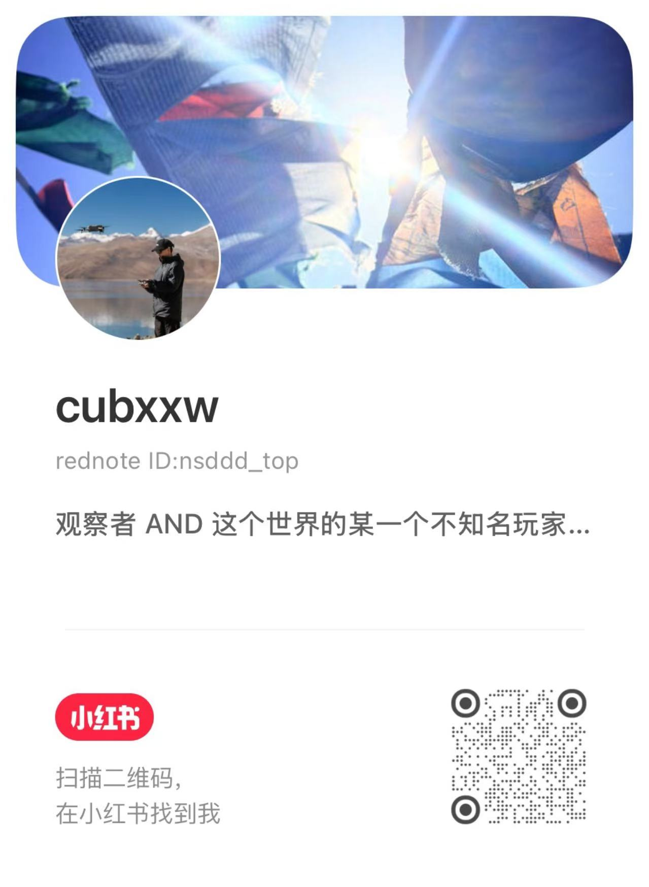

<h3 align="center" style="border-bottom: none">
    <a href="https://cubxxw.com">
      ⭐️  Welcome to my blog · cubxxw.com ⭐️ <br>
    </a>
</h3>

<p align="center">
  <b>熊鑫伟 (Xinwei Xiong / cubxxw)</b> —— AI Builder · 开源贡献者 · 数字游民<br>
  <sub>在技术与人性之间搭建桥梁：AI Agent 工程、云原生、开源实践，以及一场走过 9 国 35+ 城的人生实验。</sub><br>
  <sub><i>Building bridges between technology and humanity — AI agent engineering, cloud-native, open source, and a life experiment across 9 countries.</i></sub>
</p>

<!-- 👋 交个朋友 · Let's connect — 双平台扫码 / copyable ID, mirrors the on-site contact cards -->
<div align="center">
  <br>
  <table>
    <tr>
      <td align="center" width="50%">
        <br>
        <b>💬 微信 · WeChat</b><br>
        <sub>微信号 / ID：<code>cubxxwAI</code></sub><br>
        <sub>聊 AI、开源与远程生活，欢迎进社群 🚀</sub>
      </td>
      <td align="center" width="50%">
        <br>
        <b>📕 小红书 · RedNote</b><br>
        <sub>小红书号 / ID：<code>nsddd_top</code></sub><br>
        <sub>看我记录 AI、开源与旅居的日常 ✍️</sub>
      </td>
    </tr>
  </table>
  <sub>👋 <b>交个朋友 · Let's connect</b> — 扫码添加，或搜索 ID 找到我 / scan or search the ID to reach me</sub>
  <br><br>
</div>

## Introduction

> **这是一个 AI-native 的开源博客**，把「写作 + AI + 开源工程」揉在一起做长期实验。内容围绕四条主线免费开放：**AI Agent 工程**、**云原生 / Go 工程**、**成长与认知**、**旅行与数字游民**。所有文章、源码与实践笔记都可自由取用 —— 若对你有帮助，欢迎 Star、订阅或加我交流。
>
> **An AI-native open-source blog** — a long-running experiment blending writing, AI, and open-source engineering. Everything (posts, source, notes) is free to use across four threads: AI agent engineering, cloud-native/Go, growth & cognition, and travel & the nomad life. If it helps you, a Star or subscribe means a lot.

[](https://app.netlify.com/sites/cubxxw/deploys)

> [!TIP]
> This is my third generation blog. The first two generations were dynamic blogs with unstable servers in the background. Fortunately, this blog is now more stable and will be continuously maintained.

> [!NOTE]
> + [关于我](https://cubxxw.com/zh/about/)
> + [一些碎片的思考笔记](https://diary.nsddd.top/flomo-original/)
> + [跟着我看我环游世界旅居的笔记](https://www.polarsteps.com/cubxxw)


### 🔍 项目导航

- [LLM 相关项目](/tags/llm/)
- [向量数据库](/tags/向量数据库/)
- [AI 框架](/tags/ai框架/)
- [AI 工具链](/tags/ai工具链/)

## Content Architecture (v3.0.0)

This blog uses a **4-section architecture** aligned with the author's identity as **AI Builder, Open Source Contributor, and Digital Nomad**.

| Section | Description | Content Coverage |
|----------|-------------|------------------|
| **AI Agent** (`/ai-agent/`) | Agent engineering, context engineering, LLM applications | Agent architecture, harness design, context/memory/RAG, GEO |
| **Engineering** (`/engineering/`) | Kubernetes cloud-native, Go engineering, DevOps | K8s internals, Go tooling, CI/CD, open-source practice |
| **Projects** | AI open source project deep-dives and product builds | LangChain, GPT-Researcher, Jina analysis, independent developer products |
| **Growth** | Personal growth, annual reviews, mindset, efficiency methods | Annual reviews, monthly thoughts, GTD, Flow State, career development |
| **Travel** | Travel experiences and digital nomad lifestyle | Travel itineraries, digital nomad life, cultural exploration, adventures |

For detailed category documentation, see [`content/CATEGORIES.md`](content/CATEGORIES.md).

---

## Tagging Standards

For comprehensive governance rules on category vs tag decisions, see [`docs/TAG_GOVERNANCE.md`](docs/TAG_GOVERNANCE.md).

### Core Principles

- **Categories (1 per post)**: Broad content buckets for navigation - choose from 4 core categories
- **Tags (5-8 per post)**: Specific topics and technologies - flexible and detailed
- **Tag Naming**: Use Title Case, avoid duplicates (e.g., use `Go` not `golang` or `Golang`)
- **Language Consistency**: Use English tags for both CN/EN blogs for unified tagging

### Tag Groups (9 Categories)
|-------|------|
| **Programming Languages** | Go, Python, JavaScript, TypeScript, Rust, Java |
| **Cloud Native** | Kubernetes, Docker, Cloud Native, Helm, Istio, Containerd |
| **AI/ML** | AI, Machine Learning, Deep Learning, LLM, NLP, Computer Vision |
| **Technology** | DevOps, Automation, Testing, Performance, Security, Monitoring, CI/CD |
| **Architecture** | Microservices, System Design, Distributed Systems, Event-Driven |
| **Tools** | Git, GitHub, VS Code, Linux, Vim, Docker Desktop |
| **Open Source** | Open Source, Community, Contribution, Maintenance |
| **Life** | Blog, Travel, Personal Growth, Self-Discovery, Reading, Reflection |
| **Culture** | Remote Work, Team Collaboration, Management, Leadership |

### Usage Guidelines

- **Categories (1 per post)**: Broad content buckets for navigation - choose from 4 core categories
- **Tags (5-8 per post)**: Specific topics and technologies - flexible and detailed
- **Tag Naming**: Use Title Case, avoid duplicates (e.g., use `Go` not `golang` or `Golang`)
- **Language Consistency**: Use English tags for both CN/EN blogs for unified tagging

For detailed tagging standards, see [`TAGS.md`](TAGS.md).

---

## Subscribe

The articles published on the blog are independent, which is what I have seen and learned since participating in open source projects, and I hope this model can be successful and copied. [👀 My blog](https://cubxxw.com/) has a lot of good content and is worth a read. If you want to subscribe to the SSR 🔍 [here](https://cubxxw.com/articles/index.xml)

[][zhihu] 

[zhihu]: https://www.zhihu.com/people/3293172751

<a href="https://www.zhihu.com/people/3293172751" target="_blank"></a>
<a href="assets/wechat.jpg" target="_blank"></a>


**Default English blog subscription：**

+ English: [https://cubxxw.com/articles/index.xml](https://cubxxw.com/articles/index.xml)


**Default Chinese blog subscription：**

+ Chinese: [https://cubxxw.com/zh/articles/index.xml](https://cubxxw.com/zh/articles/index.xml)


**Default Spain blog subscription：**

+ Spain: [https://cubxxw.com/es/articles/index.xml](https://cubxxw.com/es/articles/index.xml)


**Default French blog subscription：**

+ French: [https://cubxxw.com/fr/articles/index.xml](https://cubxxw.com/fr/articles/index.xml)


**Speed up subscription links for inaccessible networks：**

```bash
https://rss.starerror.com/${RSS_ADDRESS}
```


### Featured blog subscriptions in English (default)

Here you'll find the latest and most interesting blog posts in English from Xinwei Xiong(cubxxw).

<!-- My-Blog-EN:START -->
- [The Red Ocean Is Full: Where the Blue Ocean for AI Agents Is in Late 2026](https://cubxxw.com/ai-agent/posts/ai-agent-red-ocean-blue-ocean-2026/)
- [How Do You Get to the Point Where You Trust an AI Agent Nobody Is Watching?](https://cubxxw.com/ai-agent/posts/trusting-unattended-ai-agent/)
- [The Super Individual's Intelligence System: Building a Personal Pipeline From Information to Action With Agents and MCP](https://cubxxw.com/ai-agent/posts/super-individual-intelligence-system/)
- [Open Models Got Roughly 90% Cheaper. How Big an Agent Fleet Can One Person Afford?](https://cubxxw.com/ai-agent/posts/open-model-cost-collapse-agent-fleet/)
- [When the AI Agent Starts Prompting You, What Has Actually Changed](https://cubxxw.com/ai-agent/posts/proactive-agent-it-prompts-you/)
- [Where an AI That Tracks a Whole Field For You Finally Gets Stuck](https://cubxxw.com/ai-agent/posts/ai-auto-news-pipeline-limits/)
- [What Remains When You Take It All Apart: On No-Self, Suffering, and "You Could Say It Either Way"](https://cubxxw.com/growth/posts/2026-07-14-what-remains-when-taken-apart/)
- [From Chatbot to Agent to Skill: The Real Dividing Line for AI Landing in Traditional Industries](https://cubxxw.com/ai-agent/posts/from-chatbot-to-agent-to-skill/)
- [Give AI Tasks, Not Directions: One Principle That Changes How You Work With AI](https://cubxxw.com/ai-agent/posts/give-ai-tasks-not-directions/)
- [Friction Is Growth: When AI Removes All Resistance for You, Deliberately Keep Some](https://cubxxw.com/growth/posts/friction-is-growth/)
- [Installing Quality Gates Into Your AI Workflow: Bringing Software Engineering Discipline Into Your Personal System](https://cubxxw.com/ai-agent/posts/engineering-discipline-ai-workflow/)
- [Handing Your Notes Over to AI: Building an AI-Native Second Brain With Claude + Obsidian](https://cubxxw.com/ai-agent/posts/ai-second-brain-build/)
- [Layer Four · Creation: Recombining Knowledge Into Something Others Are Willing to Receive](https://cubxxw.com/ai-agent/posts/info-to-creation-creation/)
- [Layer Three · Knowledge: Your Knowledge Base Is Not a Bookmark Folder, It Is Your Capability Sediment Zone](https://cubxxw.com/ai-agent/posts/info-to-creation-knowledge/)
- [Layer Two · Records: The Highest-Conversion Semi-Finished Product Between Information and Knowledge](https://cubxxw.com/ai-agent/posts/info-to-creation-record/)
- [Layer One · Information: What to Show AI, What to Skim Yourself, and Pure Noise](https://cubxxw.com/ai-agent/posts/info-to-creation-information/)
- [Information, Records, Knowledge, Creation: In the AI Era, I Split My Notes Into Four Different Things](https://cubxxw.com/ai-agent/posts/info-to-creation-the-framework/)
- [GEO Measurement & Tools: How to Know If AI Actually Cites You (with a DIY Monitor)](https://cubxxw.com/ai-agent/posts/geo-measurement-and-tools/)
- [GEO Blog Rebuild Case Study: Running the Five-Layer Model on Real Data](https://cubxxw.com/ai-agent/posts/geo-blog-rebuild-case-study/)
- [GEO Trust & Endorsement: Why Reddit and Wikipedia Make Up Half of AI Citations](https://cubxxw.com/ai-agent/posts/geo-trust-and-endorsement/)
- [GEO Structured Tactics: Writing "Worth Citing" Into Every Paragraph (Answer-First, Schema, llms.txt)](https://cubxxw.com/ai-agent/posts/geo-structured-content-tactics/)
- [GEO Mechanics: How AI Retrieves, Re-ranks, and Cites You](https://cubxxw.com/ai-agent/posts/geo-how-ai-retrieves-and-cites/)
- [GEO: The Complete Guide to Generative Engine Optimization (When Search Stops Giving Links and Starts Giving Answers)](https://cubxxw.com/ai-agent/posts/geo-generative-engine-optimization-guide/)
- [2026 June Thought Notes: The Pushing-Away Comes Before the Reason for Pushing Away](https://cubxxw.com/growth/posts/2026-06-thought-notes/)
- [Dissecting open-lovable: An App Generator That Tames the Raw API Without an Agent Framework](https://cubxxw.com/ai-agent/posts/dissecting-open-lovable/)
- [Ignite and Settle (Part 3): Anxious Attachment — Why We Keep Seeking Reassurance in Love](https://cubxxw.com/growth/posts/2026-06-28-ignite-and-settle-3-anxious/)
- [Ignite and Settle (Part 2): Avoidant Attachment — Why We Want to Run When Someone Gets Close](https://cubxxw.com/growth/posts/2026-06-28-ignite-and-settle-2-avoidant/)
- [Ignite and Settle (Part 1): The Quality and Time of Companionship — and Why We Turn Away Just as We Come Close](https://cubxxw.com/growth/posts/2026-06-28-ignite-and-settle-1-quality-and-time/)
- [The Super-Individual Stack: AI-Native Product Directions and Solo Builder Ops in 2026](https://cubxxw.com/growth/posts/super-individual-ai-product-and-solo-builder-stack/)
- [Building a Production-Grade AI Agent System from Scratch: A Full Architecture Breakdown of Relay](https://cubxxw.com/ai-agent/posts/relay-agent-architecture-design/)
- [Seen Clearly, Loved Deeply: Five Lenses on Love, and the Buddhist Synthesis](https://cubxxw.com/growth/posts/love-seen-clearly-loved-deeply/)
- [Context Is Not Prompt: Why Context Engineering Is Becoming AI's New Foundation](https://cubxxw.com/ai-agent/posts/context-engineering-the-new-foundation/)
- [The Agent Engineering Map: Where Does That 98.4% of the Work Actually Live?](https://cubxxw.com/ai-agent/posts/agent-engineering-the-98-percent-harness/)
- [2026 May Thought Notes: On the Edge, I Recognize Myself Through Action](https://cubxxw.com/growth/posts/2026-05-thought-notes/)
- [April 2026 Thought Notes](https://cubxxw.com/growth/posts/2026-04-thought-notes/)
- [Agent Identity: From Locke to OpenClaw](https://cubxxw.com/ai-agent/posts/agent-identity-from-locke-to-openclaw/)
- [Maintaining Self-Worth in the Age of AI](https://cubxxw.com/growth/posts/weight-of-self-in-ai-age/)
- [March 2026 Thought Notes](https://cubxxw.com/growth/posts/2026-03-thought-notes/)
- [Lhasa: Slow and Heavy](https://cubxxw.com/growth/posts/2026-03-27-lhasa-slow-and-heavy/)
- [Wandering & Growing: 2025-2026 Annual Review](https://cubxxw.com/growth/posts/2025-annual-review/)
- [AI and Self-Identity: Who Am I in the AI Age](https://cubxxw.com/growth/posts/ai-and-self-identity/)
- [February 2026 Thought Notes](https://cubxxw.com/growth/posts/2026-02-thought-notes/)
- [January 2026 Thought Notes](https://cubxxw.com/growth/posts/2026-01-thought-notes/)
- [December 2025 Thought Notes](https://cubxxw.com/growth/posts/2025-12-thought-notes/)
- [Japan Travel Notes — Learning to Be with Time Through Wood, Fire, and Gaps](https://cubxxw.com/growth/posts/japan-travel-2025/)
- [2025 November Thought Notes](https://cubxxw.com/growth/posts/2025-11-thought-notes/)
- [October 2025 Thought Notes](https://cubxxw.com/growth/posts/2025-10-thought-notes/)
- [September 2025 Thought Notes](https://cubxxw.com/growth/posts/2025-09-thought-notes/)
- [2025 August Thought Notes](https://cubxxw.com/growth/posts/2025-08-thought-notes/)
- [2025 July Thought Notes](https://cubxxw.com/growth/posts/2025-07-thought-notes/)
- [2025 June Thought Notes](https://cubxxw.com/growth/posts/2025-06-thought-notes/)
- [Metacognitive Transformation Review](https://cubxxw.com/growth/posts/metacognitive-transformation-review/)
- [2025 May Thought Notes](https://cubxxw.com/growth/posts/2025-05-thought-notes/)
- [Mem0 Explained: AI Memory Layer Architecture & How It Works](https://cubxxw.com/projects/mem0/)
- [2025 April Thought Notes](https://cubxxw.com/growth/posts/2025-04-thought-notes/)
- [AI Recommendation Systems: How They Work](https://cubxxw.com/projects/ai-recommend/)
- [NotebookLM: Google's AI Research Tool](https://cubxxw.com/projects/notebooklm/)
- [TDD for AI: Test-Driven Development Guide](https://cubxxw.com/projects/tdd/)
- [Microsoft MarkItDown Tutorial: Convert PDF to Markdown](https://cubxxw.com/projects/markItdown/)
- [LangGraph Architecture: StateGraph, Nodes and Edges](https://cubxxw.com/projects/langgraph/)
- [LangChain: Open Source LLM Framework](https://cubxxw.com/projects/langchain/)
- [LLM/AI API Gateway Comparison: LiteLLM vs Kong vs APISIX and the Best Stack for Startups](https://cubxxw.com/projects/ai-gateway/)
- [Independent Developer in the AI Era: Open Source Deep Dive](https://cubxxw.com/projects/independent-developer/)
- [GPT Researcher Explained: Open Source Deep Research Agent](https://cubxxw.com/projects/gpt-researcher/)
- [Jina AI: Multimodal Search & Embeddings](https://cubxxw.com/projects/jina/)
- [2025 March Thought Notes](https://cubxxw.com/growth/posts/2025-03-thought-notes/)
- [2024 Annual Review](https://cubxxw.com/growth/posts/2024-annual-review/)
- [Travel · The World Game](https://cubxxw.com/travel/)
- [About Me & This Blog](https://cubxxw.com/about/)
- [Kubernetes Resources and Learning Path Summary](https://cubxxw.com/engineering/posts/kubernetes-learning/)
- [LangChain: Building LLM Applications](https://cubxxw.com/ai-agent/posts/harnessing-language-model-applications-with-langchain-a-developer-is-guide/)
- [Large Language Models: How LLMs Work](https://cubxxw.com/ai-agent/posts/exploring-large-language-models-llms-pioneering-ai-understanding-generation-human-language/)
- [Open Source Resume Builders & Career Tips](https://cubxxw.com/growth/posts/crafting-your-career-pathway-a-guide-to-open-source-resume-builders-and-expert-resume-tips/)
- [Troubleshooting Guide for OpenIM](https://cubxxw.com/engineering/posts/troubleshooting-guide-for-openim/)
- [Navigating the Open Source Landscape](https://cubxxw.com/engineering/posts/navigating-the-open-source-landscape/)
- [Sora Ease Guide: Mastering Sora AI for Developers](https://cubxxw.com/ai-agent/posts/sora-ease-guide-mastering-sora-ai-for-developers/)
- [In 2023, I Was Wandering at the Edge of the World](https://cubxxw.com/growth/posts/in-2023-i-was-wandering-at-the-edge-of-the-world/)
- [Exploring Sora Technology for Enthusiasts and Developers](https://cubxxw.com/ai-agent/posts/exploring-sora-technology-for-enthusiasts-and-developers/)
- [Combining GitHub and Google Workspace for Effective Project Management](https://cubxxw.com/growth/posts/combining-github-and-google-workspace-for-project-management/)
- [Brain-Friendly English Learning Strategies](https://cubxxw.com/growth/posts/brain-friendly-english-learning-strategies-tools-and-techniques-explained/)
- [Flow State: Deep Focus and Happiness Guide](https://cubxxw.com/growth/posts/flow-state/)
- [GTD and the Quadrant Method Practice](https://cubxxw.com/growth/posts/gtd-and-the-four-quadrant-rule-practice/)
- [Go Directives & Automation Tools Deep Dive](https://cubxxw.com/engineering/posts/directives-and-the-use-of-automation-tools/)
- [Concurrent Type Checking and Cross-Platform Development in Go](https://cubxxw.com/engineering/posts/concurrent-type-checking-and-cross-platform-development-in-go/)
- [Vector Database Learning](https://cubxxw.com/ai-agent/posts/vector-database-learning/)
- [OpenIM: Version Control & Testing Workflow](https://cubxxw.com/engineering/posts/openim-building-an-efficient-version-control-and-testing-workflow/)
- [Emerging Challenges and Trends in 2024](https://cubxxw.com/ai-agent/posts/emerging-challenges-and-trends-in-2024/)
- [2023 Annual Summary Reflections and Aspirations](https://cubxxw.com/growth/posts/2023-annual-summary-reflections-and-aspirations/)
- [GitOps & Kubernetes Deployment Strategies](https://cubxxw.com/engineering/posts/gitops-practice-theory-part/)
- [Deployment and Design of Management Backend and Monitoring](https://cubxxw.com/engineering/posts/deployment-and-design-of-management-backend-and-monitoring/)
- [Hugo Advanced Tutorial](https://cubxxw.com/engineering/posts/hugo-advanced-tutorial/)
- [Kubernetes for Kustomize Learning](https://cubxxw.com/engineering/posts/kubernetes-for-kustomize-learning/)
- [OpenIM Use Harbor Build Enterprise Mirror Repositories](https://cubxxw.com/engineering/posts/openim-use-harbor-build-enterprise-mirror-repositories/)
- [Learn About Automated Testing](https://cubxxw.com/engineering/posts/learn-about-automated-testing/)
- [Kubernetes Control Plane - Scheduler](https://cubxxw.com/engineering/posts/deep-dive-into-the-components-of-kubernetes-scheduler/)
- [Kubernetes Control Plane - Detailed Analysis of Kubelet](https://cubxxw.com/engineering/posts/deep-dive-into-the-components-of-kubernetes-kubectl/)
- [Deep Dive into Kubernetes CNI, CRI, CSI Components](https://cubxxw.com/engineering/posts/deep-dive-into-the-components-of-kubernetes-cni-csi-cri/)
- [Kubernetes kube-apiserver: Deep Dive into API Server Components](https://cubxxw.com/engineering/posts/deep-dive-into-the-components-of-kubernetes-kube-apiserver/)
- [Deep Dive Into the Components of Kubernetes Etcd](https://cubxxw.com/engineering/posts/deep-dive-into-the-components-of-kubernetes-etcd/)
- [Kubernetes Port Config via Config Files](https://cubxxw.com/engineering/posts/openim-cluster-deployment-parameter-passing-policy/)
<!-- My-Blog-EN:END -->


### 中文博客精选订阅

这里你可以看到Xinwei Xiong(cubxxw)的最新和最有趣的中文博客文章。

<!-- My-Blog-ZH:START -->
- [2026 下半场，AI Agent 的红海已满，蓝海在哪](https://cubxxw.com/zh/ai-agent/posts/ai-agent-red-ocean-blue-ocean-2026/)
- [怎么才能放心把活交给一个没人盯着的 AI Agent](https://cubxxw.com/zh/ai-agent/posts/trusting-unattended-ai-agent/)
- [超级个体的情报系统：用 Agent 和 MCP 搭一条从信息采集到行动的个人流水线](https://cubxxw.com/zh/ai-agent/posts/super-individual-intelligence-system/)
- [开源模型便宜了近九成，一个人能养多大的 Agent 舰队](https://cubxxw.com/zh/ai-agent/posts/open-model-cost-collapse-agent-fleet/)
- [AI Agent 开始"反过来提示你"，这一步意味着什么](https://cubxxw.com/zh/ai-agent/posts/proactive-agent-it-prompts-you/)
- [让 AI 自动帮你追全网资讯，最后会卡在哪里](https://cubxxw.com/zh/ai-agent/posts/ai-auto-news-pipeline-limits/)
- [拆到最后，剩下的才是你：一场关于无我、痛苦与"怎么说都可以"的追问](https://cubxxw.com/zh/growth/posts/2026-07-14-what-remains-when-taken-apart/)
- [从 Chatbot 到 Agent 到 Skill：AI 落地传统行业的真正分水岭](https://cubxxw.com/zh/ai-agent/posts/from-chatbot-to-agent-to-skill/)
- [给 AI 任务，别给方向：一条原则改变你和 AI 的协作](https://cubxxw.com/zh/ai-agent/posts/give-ai-tasks-not-directions/)
- [摩擦即成长：当 AI 替你消除一切阻力，请主动留下一些](https://cubxxw.com/zh/growth/posts/friction-is-growth/)
- [给你的 AI 工作流装上质量门禁：把软件工程的纪律搬进个人系统](https://cubxxw.com/zh/ai-agent/posts/engineering-discipline-ai-workflow/)
- [把笔记交给 AI 操作：Claude + Obsidian 搭一个 AI 原生的第二大脑](https://cubxxw.com/zh/ai-agent/posts/ai-second-brain-build/)
- [第四层·创作：把知识重组成别人愿意接收的东西](https://cubxxw.com/zh/ai-agent/posts/info-to-creation-creation/)
- [第三层·知识：知识库不是收藏夹，是你的能力沉淀区](https://cubxxw.com/zh/ai-agent/posts/info-to-creation-knowledge/)
- [第二层·记录：信息和知识之间，那个转化率最高的半成品](https://cubxxw.com/zh/ai-agent/posts/info-to-creation-record/)
- [第一层·信息：给 AI 看的，给自己扫的，和纯粹的噪音](https://cubxxw.com/zh/ai-agent/posts/info-to-creation-information/)
- [信息、记录、知识、创作：AI 时代，我把笔记拆成了四种东西](https://cubxxw.com/zh/ai-agent/posts/info-to-creation-the-framework/)
- [GEO 度量与工具：怎么知道 AI 到底有没有引用你（附 DIY 监测）](https://cubxxw.com/zh/ai-agent/posts/geo-measurement-and-tools/)
- [GEO 本博客改造复盘：用真实数据把五层模型跑一遍](https://cubxxw.com/zh/ai-agent/posts/geo-blog-rebuild-case-study/)
- [GEO 信任与背书：为什么 Reddit 和 Wikipedia 占了 AI 引用的一大半](https://cubxxw.com/zh/ai-agent/posts/geo-trust-and-endorsement/)
- [GEO 结构化实战：把"值得被引用"写进每一段（Answer-First、Schema、llms.txt）](https://cubxxw.com/zh/ai-agent/posts/geo-structured-content-tactics/)
- [GEO 原理篇：AI 是怎么把你"检索 → 重排 → 引用"的](https://cubxxw.com/zh/ai-agent/posts/geo-how-ai-retrieves-and-cites/)
- [GEO 生成式引擎优化完全指南：当搜索从"给链接"变成"给答案"](https://cubxxw.com/zh/ai-agent/posts/geo-generative-engine-optimization-guide/)
- [2026年6月思考笔记：推开的动作，先于推开的理由](https://cubxxw.com/zh/growth/posts/2026-06-thought-notes/)
- [拆解 open-lovable：一个不靠 Agent 框架、直接驯服裸 API 的应用生成器](https://cubxxw.com/zh/ai-agent/posts/dissecting-open-lovable/)
- [点火与沉底（下）：焦虑型依恋——为什么爱里我们总在确认](https://cubxxw.com/zh/growth/posts/2026-06-28-ignite-and-settle-3-anxious/)
- [点火与沉底（中）：回避型依恋——为什么靠近时我们想逃](https://cubxxw.com/zh/growth/posts/2026-06-28-ignite-and-settle-2-avoidant/)
- [点火与沉底（上）：陪伴的质量与时间，和我们为什么总在快要靠近时转身](https://cubxxw.com/zh/growth/posts/2026-06-28-ignite-and-settle-1-quality-and-time/)
- [超级个体的栈：2026 年 AI 原生 Solo Builder 的产品方向与运营全图](https://cubxxw.com/zh/growth/posts/super-individual-ai-product-and-solo-builder-stack/)
- [从零设计一个生产级 AI Agent 系统：Relay 求职 Agent 的架构全解](https://cubxxw.com/zh/ai-agent/posts/relay-agent-architecture-design/)
- [看穿之后，依然深爱：五副透镜下的爱，与佛学的统摄](https://cubxxw.com/zh/growth/posts/love-seen-clearly-loved-deeply/)
- [Context 不是 Prompt：为什么「上下文工程」正在成为 AI 的新地基](https://cubxxw.com/zh/ai-agent/posts/context-engineering-the-new-foundation/)
- [Agent Engineering 全景地图：那 98.4% 的工程量到底在哪里](https://cubxxw.com/zh/ai-agent/posts/agent-engineering-the-98-percent-harness/)
- [2026年5月思考笔记：在边缘上，用行动认出自己](https://cubxxw.com/zh/growth/posts/2026-05-thought-notes/)
- [2026年4月思考笔记](https://cubxxw.com/zh/growth/posts/2026-04-thought-notes/)
- [Agent 的自我：从洛克到 OpenClaw](https://cubxxw.com/zh/ai-agent/posts/agent-identity-from-locke-to-openclaw/)
- [在不被需要的时代，如何维持自我的重量](https://cubxxw.com/zh/growth/posts/weight-of-self-in-ai-age/)
- [2026年3月思考笔记](https://cubxxw.com/zh/growth/posts/2026-03-thought-notes/)
- [拉萨——一座城市的慢与重](https://cubxxw.com/zh/growth/posts/2026-03-27-lhasa-slow-and-heavy/)
- [我在游荡，但我没有迷路 — 2025-2026 年度总结](https://cubxxw.com/zh/growth/posts/2025-annual-review/)
- [AI 越来越聪明，我却越来越不知道自己是谁](https://cubxxw.com/zh/growth/posts/ai-and-self-identity/)
- [2026年2月思考笔记](https://cubxxw.com/zh/growth/posts/2026-02-thought-notes/)
- [2026年1月思考笔记](https://cubxxw.com/zh/growth/posts/2026-01-thought-notes/)
- [2025年12月思考笔记](https://cubxxw.com/zh/growth/posts/2025-12-thought-notes/)
- [日本旅居笔记 - 用木头、火与缺口和时间共处](https://cubxxw.com/zh/growth/posts/japan-travel-2025/)
- [2025年11月思考笔记](https://cubxxw.com/zh/growth/posts/2025-11-thought-notes/)
- [2025年10月思考笔记](https://cubxxw.com/zh/growth/posts/2025-10-thought-notes/)
- [2025年9月思考笔记](https://cubxxw.com/zh/growth/posts/2025-09-thought-notes/)
- [2025年8月思考笔记](https://cubxxw.com/zh/growth/posts/2025-08-thought-notes/)
- [2025年7月思考笔记](https://cubxxw.com/zh/growth/posts/2025-07-thought-notes/)
- [2025年6月思考笔记](https://cubxxw.com/zh/growth/posts/2025-06-thought-notes/)
- [四个月的一些思考片段整理](https://cubxxw.com/zh/growth/posts/metacognitive-transformation-review/)
- [2025年5月思考笔记](https://cubxxw.com/zh/growth/posts/2025-05-thought-notes/)
- [Mem0 是什么？AI 记忆层原理、架构与实践评估](https://cubxxw.com/zh/projects/mem0/)
- [微软UFO项目深度解析：设计、实现、原理与架构](https://cubxxw.com/zh/projects/UFO/)
- [Argo CD: Declarative GitOps for Kubernetes Continuous Delivery](https://cubxxw.com/zh/engineering/posts/argo-cd/)
- [2025年4月思考笔记](https://cubxxw.com/zh/growth/posts/2025-04-thought-notes/)
- [Ai Recommend 技术、实践和深度学习](https://cubxxw.com/zh/projects/ai-recommend/)
- [Google NotebookLM 的 RAG 深度调研思考](https://cubxxw.com/zh/projects/notebooklm/)
- [AI 时代初创企业的测试驱动开发（TDD）实践方案](https://cubxxw.com/zh/projects/tdd/)
- [MarkItDown 教程：微软开源文档转 Markdown 工具](https://cubxxw.com/zh/projects/markitdown/)
- [LangGraph 架构深度解析：状态图、节点与边的设计原理](https://cubxxw.com/zh/projects/langgraph/)
- [LangChain 开源项目深度学习](https://cubxxw.com/zh/projects/langchain/)
- [AI Gateway（AI 网关）开源项目深度学习笔记](https://cubxxw.com/zh/projects/ai-gateway/)
- [独立开发者必备技能及现代工具 & 分别的上手指导](https://cubxxw.com/zh/projects/independent-developer/)
- [GPT Researcher 是什么？开源 AI 深度研究代理架构解析](https://cubxxw.com/zh/projects/gpt-researcher/)
- [Jina 开源项目深度学习](https://cubxxw.com/zh/projects/jina/)
- [2025年3月思考笔记](https://cubxxw.com/zh/growth/posts/2025-03-thought-notes/)
- [2024 年度回顾](https://cubxxw.com/zh/growth/posts/2024-annual-review/)
- [旅行 · 世界这场游戏](https://cubxxw.com/zh/travel/)
- [关于我与这个博客](https://cubxxw.com/zh/about/)
- [Kubernetes 资源与学习路径总结](https://cubxxw.com/zh/engineering/posts/kubernetes-learning/)
- [利用 LangChain 框架的语言模型应用：开发者指南](https://cubxxw.com/zh/ai-agent/posts/harnessing-language-model-applications-with-langchain-a-developer-is-guide/)
- [探索大型语言模型（llm）：人工智能在理解与生成人类语言方面的先锋](https://cubxxw.com/zh/ai-agent/posts/exploring-large-language-models-llms-pioneering-ai-understanding-generation-human-language/)
- [塑造职业道路：开源简历生成器与专业简历技巧指南](https://cubxxw.com/zh/growth/posts/crafting-your-career-pathway-a-guide-to-open-source-resume-builders-and-expert-resume-tips/)
- [这是一篇我职业生涯总结的 OpenIM 故障排查指南](https://cubxxw.com/zh/engineering/posts/troubleshooting-guide-for-openim/)
- [探索开源以及开源商业模式研究](https://cubxxw.com/zh/engineering/posts/navigating-the-open-source-landscape/)
- [Sora Ease 指南：开发者掌握 Sora AI 的全面指南](https://cubxxw.com/zh/ai-agent/posts/sora-ease-guide-mastering-sora-ai-for-developers/)
- [2023年，我的旅行起点 - 2023年的我漫步在世界边缘](https://cubxxw.com/zh/growth/posts/in-2023-i-was-wandering-at-the-edge-of-the-world/)
- [Sora 技术讨论以及普通人和开发者如何利用 Sora 改变世界](https://cubxxw.com/zh/ai-agent/posts/exploring-sora-technology-for-enthusiasts-and-developers/)
- [双剑合璧：结合GitHub与Google Workspace的项目管理艺术](https://cubxxw.com/zh/growth/posts/combining-github-and-google-workspace-for-project-management/)
- [脑友好型英语学习策略：工具与技巧解析](https://cubxxw.com/zh/growth/posts/brain-friendly-english-learning-strategies-tools-and-techniques-explained/)
- [心流状态的魔力：专注与幸福感提升指南](https://cubxxw.com/zh/growth/posts/flow-state/)
- [GTD与四象限法则实践](https://cubxxw.com/zh/growth/posts/gtd-and-the-four-quadrant-rule-practice/)
- [Go 源码里的这些 go: 指令 && go 自动化工具](https://cubxxw.com/zh/engineering/posts/directives-and-the-use-of-automation-tools/)
- [Go 语言中的并发类型检查与跨平台开发](https://cubxxw.com/zh/engineering/posts/concurrent-type-checking-and-cross-platform-development-in-go/)
- [向量数据库的学习](https://cubxxw.com/zh/ai-agent/posts/vector-database-learning/)
- [OpenIM：构建高效的版本控制和测试工作流程](https://cubxxw.com/zh/engineering/posts/openim-building-an-efficient-version-control-and-testing-workflow/)
- [AI元年: 2024年的新兴挑战与趋势](https://cubxxw.com/zh/ai-agent/posts/emerging-challenges-and-trends-in-2024/)
- [回顾与前瞻：我的2023年度总结报告](https://cubxxw.com/zh/growth/posts/2023-annual-summary-reflections-and-aspirations/)
- [对开源商业化的思考 & 全球流量大会（GTC）学习以及总结](https://cubxxw.com/zh/engineering/posts/openim-open-source-business-journey/)
- [GitOps 实践理论：Kubernetes 部署策略深入解析](https://cubxxw.com/zh/engineering/posts/gitops-practice-theory-part/)
- [管理后台和监控的部署与设计](https://cubxxw.com/zh/engineering/posts/deployment-and-design-of-management-backend-and-monitoring/)
- [Hugo 的高级教程](https://cubxxw.com/zh/engineering/posts/hugo-advanced-tutorial/)
- [Kubernetes Kustomize 学习指南](https://cubxxw.com/zh/engineering/posts/kubernetes-for-kustomize-learning/)
- [设计 OpenIM 使用 Harbor 构建企业镜像仓库](https://cubxxw.com/zh/engineering/posts/openim-use-harbor-build-enterprise-mirror-repositories/)
- [自动化测试的学习(一)](https://cubxxw.com/zh/engineering/posts/learn-about-automated-testing/)
- [Kubernetes 控制平面 - 调度器](https://cubxxw.com/zh/engineering/posts/deep-dive-into-the-components-of-kubernetes-scheduler/)
- [Kubernetes 控制平面 - Kubectl 详细讲解](https://cubxxw.com/zh/engineering/posts/deep-dive-into-the-components-of-kubernetes-kubectl/)
- [Kubernetes 的 CNI，CRI，CSI 详解](https://cubxxw.com/zh/engineering/posts/deep-dive-into-the-components-of-kubernetes-cni-csi-cri/)
<!-- My-Blog-ZH:END -->


### Español blog destacado suscripción

Aquí encontrarás las últimas y más interesantes entradas de blog en español de Xinwei Xiong(cubxxw).

<!-- My-Blog-ES:START -->

<!-- My-Blog-ES:END -->


### Français blog fr vedette abonnement

Ici, vous trouverez les derniers articles de blog les plus intéressants en français de Xinwei Xiong(cubxxw).

<!-- My-Blog-FR:START -->

<!-- My-Blog-FR:END -->


## Content style

We don't mandate any particular style for your page contents. However, if you'd like some guidance on how to write and format clear, concise technical documentation, we recommend the [Google Developer Documentation Style Guide](https://developers.google.com/style/), particularly the [Style Guide Highlights](https://developers.google.com/style/highlights).


## Running the website locally

Clone the minikube project fork with option `--recurse-submodules --depth 1` to download and update submodule dependencies.

```bash
❯ git clone --recurse-submodules --depth 1 https://github.com/cubxxw/blog.git  # replace path with your github fork of minikube 
❯ cd blog
```

## Use

```bash
❯ make run
```

## Create a new article

```bash
❯ make new-post SECTION="engineering" POST_NAME="openim-offline-deployment-design"
```

**Named by an environment variable:**

```bash
❯ SECTION="growth" POST_NAME="weekly-notes" make new-post
❯ export POST_NAME="my-hugo"
❯ export SECTION="engineering"
❯ make new-post
❯ make new-ai-project PROJECT_NAME="llama"
```

## Common Issues

```bash
Start building sites …
hugo v0.86.0+extended darwin/amd64 BuildDate=unknown
Error: Error building site: "/minikube/site/content/en/docs/contrib/releasing/binaries.md:64:1": failed to extract shortcode: template for shortcode "alert" not found
Built in 667 ms
```

This indicates the submodules are not updated. Please run the following command to fix.

```bash
❯ git submodule update --init --recursive
```

**📱 加入社群 · Join the Community 🛠️**
<p>扫描页首二维码，添加微信 <code>cubxxwAI</code> 或关注小红书 <code>nsddd_top</code>，一起交流 AI、开源与远程工作，并受邀加入我们的社群。<br>Scan the QR codes at the top — add me on WeChat <code>cubxxwAI</code> or follow me on RedNote <code>nsddd_top</code> to talk AI, open source & remote work, and join the community.</p>


## Reference

Uer netlify to deploy the blog, and use the [hexo-theme-next](ttps://cubxxw.netlify.app) theme. 
