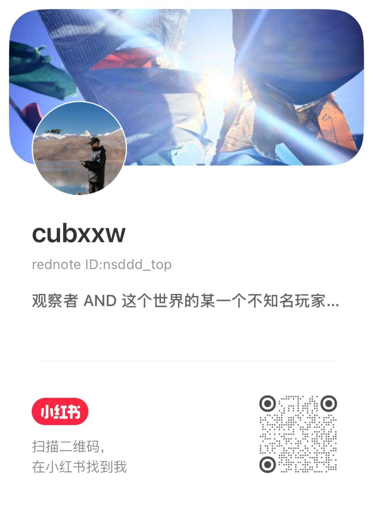

<h1 align="center">写给 AI 时代的长期主义者</h1>

<p align="center">
  <b>这里不收藏知识。这里公开一个人如何把 AI 变成能力，把经历变成判断，把写作变成长期复利。</b>
</p>

<p align="center">
  <a href="https://cubxxw.com/zh/"><strong>进入博客</strong></a>
  &nbsp;·&nbsp;
  <a href="#从这里开始">开始阅读</a>
  &nbsp;·&nbsp;
  <a href="https://cubxxw.com/zh/index.xml">订阅 RSS</a>
</p>

<!-- 👋 交个朋友 · Let's connect — 双平台扫码 / copyable ID, mirrors the on-site contact cards -->
<div align="center">
  <br>
  <table>
    <tr>
      <td align="center" width="50%">
        <br>
        <b>💬 微信 · WeChat</b><br>
        <sub>微信号 / ID：<code>cubxxwAI</code></sub><br>
        <sub>聊 AI、开源与远程生活，欢迎进社群 🚀</sub>
      </td>
      <td align="center" width="50%">
        <br>
        <b>📕 小红书 · RedNote</b><br>
        <sub>小红书号 / ID：<code>nsddd_top</code></sub><br>
        <sub>看我记录 AI、开源与旅居的日常 ✍️</sub>
      </td>
    </tr>
  </table>
  <sub>👋 <b>交个朋友 · Let's connect</b> — 扫码添加，或搜索 ID 找到我 / scan or search the ID to reach me</sub>
  <br><br>
</div>

## 这不是一个知识仓库

知识正在变得无限、即时，并且越来越便宜。再多整理一份概念、转述一次共识，价值都很有限。

真正稀缺的，是知识经过一个具体的人、一段真实经历和一次实际工作之后，留下的东西：做过什么，为什么这样做，哪里失败过，判断因此发生了怎样的变化。

> AI 可以重写一段文字，却无法替我经历一次失败、做出一个选择，或为一个长期判断付出代价。
>
> 这个仓库存下的，正是这些不可代写的部分。

[cubxxw.com](https://cubxxw.com/zh/) 是我的公开写作现场。这里没有“每天学一个新概念”的任务，也不追逐看起来正确的答案。文章只沉淀三类东西：亲自验证过的实践、可以复用的工作流，以及经得起回看的思考。

## 三条持续写下去的线

**01 / 把 AI 变成一套真正能工作的系统**

不止讨论模型和提示词，而是研究 Agent、上下文、记忆、评测、安全边界与自动化，怎样进入真实生产流程。这里保留架构选择，也保留失败现场。

**02 / 把信息变成一个人的能力**

信息不是知识，收藏也不是拥有。我持续拆解自己的知识管理、第二大脑、内容创作与个人工作流，关心的是它们如何穿过“信息—记录—知识—创作”，最后抵达行动。

**03 / 在机器越来越强的时候，继续成为一个具体的人**

技术之外，我写选择、关系、身份、风险、城市与远行。不是为了给人生总结规律，而是留下足够诚实的现场证据：我在哪里，我经历了什么，我如何被它改变。

技术文章会尽量给出可复现的路径，思考文章会交代推理过程，个人文章会保留现场。它们共同回答同一个问题：

> 当越来越多的能力可以外包给 AI，什么仍然必须由自己完成？

## 从这里开始

如果你第一次来到这里，这几篇文章最接近这个仓库的内核：

- [一个人带一队 Agent，把 120 多篇文章的博客重新组装了一遍](https://cubxxw.com/zh/ai-agent/posts/ai-native-blog-rebuild/) — 一次真实的大规模 Agent 协作现场，而不是自动化想象。
- [AI 知识工作流：从信息、记录、知识到创作](https://cubxxw.com/zh/ai-agent/posts/info-to-creation-the-framework/) — 我如何划分个人知识系统里四种完全不同的东西。
- [AI 工作流质量门禁：把软件工程的纪律搬进个人系统](https://cubxxw.com/zh/ai-agent/posts/engineering-discipline-ai-workflow/) — 让 AI 产出从“看起来不错”走向可验证、可恢复、可持续。
- [Agent Engineering 全景地图：98.4% 只是 Harness 的叙事锚点](https://cubxxw.com/zh/ai-agent/posts/agent-engineering-the-98-percent-harness/) — 模型之外，真正决定 Agent 上限的工程系统。
- [AI 解决问题以后，问题会搬到哪里](https://cubxxw.com/zh/growth/posts/2026-07-26-bottlenecks-after-ai/) — 当生产不再稀缺，判断、分发与责任如何成为新瓶颈。
- [当生成变得无限，真实经历开始升值](https://cubxxw.com/zh/growth/posts/2026-07-31-reality-becomes-scarce-after-ai/) — 为什么 AI 越擅长生成，“亲自活过”反而越有价值。

按主题继续阅读：

[AI Agent](https://cubxxw.com/zh/ai-agent/) ·
[工程实践](https://cubxxw.com/zh/engineering/) ·
[成长与思考](https://cubxxw.com/zh/growth/) ·
[全部文章](https://cubxxw.com/zh/articles/)

## 最近在写

下面只保留最近发布的 8 篇中文文章，由 GitHub Actions 从博客 RSS 自动更新。这个列表会变化，仓库也会继续生长。

<!-- BLOG-POST-LIST:START -->
- [2026年7月的一些思考笔记：工程、内容与现金流](https://cubxxw.com/zh/growth/posts/2026-07-thought-notes/)
- [你选择的计分板，最后会选择你：激励怎样改写一个组织](https://cubxxw.com/zh/growth/posts/2026-07-31-incentives-colonize-founders/)
- [自由的反面不是约束，是默认值替你活完一天](https://cubxxw.com/zh/growth/posts/2026-07-31-freedom-and-defaults/)
- [第二大脑保存的，是一个人的决策函数](https://cubxxw.com/zh/growth/posts/2026-07-31-second-brain-as-survival-strategy/)
- [当生成变得无限，真实经历开始升值](https://cubxxw.com/zh/growth/posts/2026-07-31-reality-becomes-scarce-after-ai/)
- [风险偏好不是喜欢危险：真正让人敢下注的是什么](https://cubxxw.com/zh/growth/posts/2026-07-31-risk-is-not-danger/)
- [观察者的代价：看得越明白，为什么反而越难进入生活](https://cubxxw.com/zh/growth/posts/2026-07-31-the-observer-cannot-enter-life/)
- [创造者缺的不是掌声，是一个准确的见证者](https://cubxxw.com/zh/growth/posts/2026-07-31-creators-need-accurate-witnesses/)
<!-- BLOG-POST-LIST:END -->

## 一套公开运行的内容系统

这个仓库不只是文章的最终展示层，也公开了内容如何被生产、校验与分发：

```text
现实问题 → 公开研究 → 亲自实践 → 结构化写作 → 双语发布 → 自动索引与分发 → 复盘
```

- 选题从明确的 [写作 Brief](_briefs/README.md) 开始，不让 AI 凭空决定“应该写什么”。
- 文章经过一套公开的 [编辑工作流](docs/blog-editorial-workflow.md)，把研究、写作、SEO / GEO、封面和发布拆成可验证的阶段。
- 最新内容通过 RSS 自动回到 README；站点索引、构建与发布也由自动化持续维护。
- 所有内容与系统都在真实使用中迭代。你看到的不只是方法，还有方法运行之后留下的结果。

这可能是这个仓库最值得复用的部分：不是某个工具的配置，而是一套让经验持续变成内容、让内容持续变成资产的机制。

## 如果它对你有用

如果你也在尝试用 AI 构建产品、重组个人工作流，或者想在高密度的信息里保住自己的判断，欢迎点亮右上角的 **Star**。

Star 不是对一个“完成品”的收藏。它更像是为未来留一个入口：我会继续把新的实践、失败、系统和思考放到这里，你也可以随时回来，看看一个真实的人如何与 AI 一起工作、创作和生活。

- 阅读：[cubxxw.com](https://cubxxw.com/zh/)
- 订阅：[中文 RSS](https://cubxxw.com/zh/index.xml) / [英文 RSS](https://cubxxw.com/index.xml)
- 认识我：[关于](https://cubxxw.com/zh/about/)

<details>
<summary><strong>在本地运行这个博客</strong></summary>

```bash
git clone --recurse-submodules https://github.com/cubxxw/blog.git
cd blog
make run
```

本地构建使用 `make envbuild`。

</details>

---

熊鑫伟（Xinwei Xiong / cubxxw）持续写作与维护。仓库采用 [CC0 1.0](LICENSE)：带走、修改、重组，或把它变成你自己的系统。
