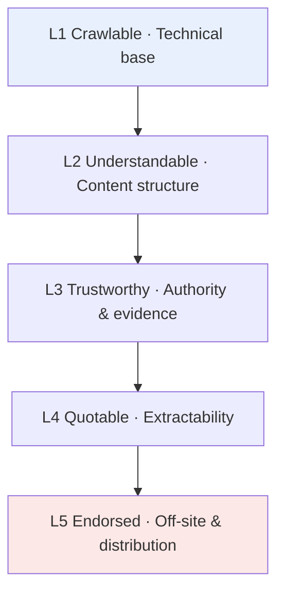

## The answer, first (this paragraph is GEO itself)

**GEO (Generative Engine Optimization) is the systematic optimization of your content, structure, and off-site reputation so that generative AI systems — ChatGPT, Perplexity, Google AI Overviews, Doubao, DeepSeek — can more easily understand, trust, and cite you when answering a user's question.**

It doesn't replace SEO; it layers on top of it. Classic SEO fights to rank high and get clicked. GEO fights so that when the AI hands the answer directly to the user, you're *in* that answer, credited as the source. ([Search Engine Land](https://searchengineland.com/mastering-generative-engine-optimization-in-2026-full-guide-469142), [Frase](https://www.frase.io/blog/what-is-generative-engine-optimization-geo))

The paragraph you just read is itself a GEO move: lead with the answer, give a complete, quotable definition in 40–100 words. Why that works is the rest of this article.

> This is the **pillar chapter (1 of 6)** of the *Generative Engine Optimization* series. It lays out the whole map; later chapters drill into each battlefield — mechanics, structured tactics, trust and endorsement, a deep case study on my own blog, and measurement.

---

## Why traffic "vanished" in 2026

Three numbers that wake you up:

- **In the first four months of 2026, 68.01% of US Google searches ended zero-click** — the user read and left without clicking anything. That was 60.45% in 2024: +12.5% in two years. ([Omnibound](https://www.omnibound.ai/blog/zero-click-search-statistics), [SparkToro](https://sparktoro.com/blog/in-2026-less-than-one-third-of-google-searches-still-send-a-click/))
- **AI Overviews now appear on ~20%–48% of queries, and when they do, organic click-through falls by nearly 60%**; zero-click jumps to 83% on those queries. ([Omnibound](https://www.omnibound.ai/blog/ai-seo-statistics))
- **Bain (Feb 2025): 80% of consumers now rely on AI-generated results for at least 40% of their searches**, and organic traffic has fallen an estimated 15%–25% across many sectors. ([Contently](https://contently.com/2026/04/27/ai-overview-traffic-impact/))

In short: the default deliverable of search is shifting from "a list of blue links" to "an answer the AI already wrote." Your article may be read, digested, and summarized to the user — while the user never visits you, unless the AI names you.

It's not all bad. The same research shows sites **cited in AI Overviews get 35% more organic clicks and 4–9x higher conversion**. AI referral traffic is growing fast and converts better. ([Omnibound](https://www.omnibound.ai/blog/ai-seo-statistics)) The cited party takes the spoils. GEO's core problem is exactly one thing: **how to become the one who gets named.**

### Evidence from my own blog

Before writing this, I dug through the Google Search Console data for [cubxxw.com](https://cubxxw.com) (old domain, last three months): **852 clicks, 878K impressions, 0.1% average CTR, average position 13.2 (page two).**

The painful part: the highest-impression queries were all irrelevant long questions (MBTI tests, medical trivia, local history) — thousands of impressions each, zero clicks. They diluted the whole site's CTR to 0.1%. The clicks that *did* land came from precise technical queries: `hugo blog`, `langgraph architecture`, `gpt researcher`, `go directives`.

That is the signature symptom of the GEO era: **you have massive impressions but you aren't being *chosen*.** Impressions mean standing in the crowd; a citation means being called on to speak.

---

## Why GEO exploded — and its dark side

### The hype: a new lane

By 2026, China's AI-search user base passed 1.3 billion; DeepSeek reached 1.28 billion cumulative visits and ByteDance's Doubao surpassed 120 million MAU. ([IT Home](https://www.ithome.com/0/964/402.htm)) The way people get information flipped — from "actively searching web pages" to "the AI just gives the answer." GEO became the consensus new frontier for marketing and content, and tools, agencies, whitepapers, even stock plays piled in.

### The mess: "AI poisoning" exposed on 3·15

But a new lane grows weeds. In March 2026, China's 3·15 gala exposed an **"AI poisoning" gray-market chain**: some GEO vendors mass-published fabricated articles across self-media to "feed" the models and manipulate recommendations. A completely nonexistent "Allo-9 smart band" climbed to the top of multiple AI recommendations on the back of 11 fake articles (8 "expert reviews," 2 "industry rankings," 1 "user review"). ([QbitAI](https://www.qbitai.com/2026/03/388387.html), [21jingji](https://www.21jingji.com/article/20260316/herald/8cf9afdb3bc8ba06b10b2f89aef3bc17.html))

This exposed two things: models still have dangerous gaps in judging source authority and truthfulness, and industry standards/regulation were briefly a vacuum. The good news: governance is catching up — a 14-company *China GEO Industry Initiative* (Nov 2025), an AIIA *AI Safety Commitment: GEO track* (Feb 2026), and AI-generated advertising named a regulatory priority. ([Sohu](https://www.sohu.com/a/997686348_460335))

### The takeaway: white-hat vs black-hat

Black-hat GEO (mass poisoning, fabricated content) may work briefly, but it's **high-risk, unstable, and increasingly penalized and regulated**. For a personal blog or a long-lived brand, the only sustainable path is white-hat and compounding: **win the citation with real, authoritative, clearly-structured, high-quality content.** That's the floor under every method below.

---

## Mechanics: how AI decides who to cite

To optimize, understand the machine. Modern AI search (Perplexity, AI Overviews, connected ChatGPT) is broadly a **RAG (retrieval-augmented generation)** pipeline:

There are three gates you can influence:

1. **Retrieval** — your content must be crawlable and indexed to even enter the candidate pool. The technical base decides eligibility.
2. **Re-ranking** — AI favors content that is **well-structured, data-backed, sourced, and easy to extract**. This is where GEO methodology does its real work.
3. **Citation** — among candidates, AI prefers the one that is **authoritative, trustworthy, and supplies machine-readable evidence.**

### The hardest evidence: the Princeton GEO study

The birth certificate of the term is the 2024 KDD paper *GEO: Generative Engine Optimization* (Aggarwal et al., Princeton et al.). Using the **GEO-bench** framework, **~10,000 queries across 9 datasets**, they systematically tested 9 content strategies for their effect on "visibility inside AI answers." ([Princeton](https://collaborate.princeton.edu/en/publications/geo-generative-engine-optimization/), [Stackmatix](https://www.stackmatix.com/blog/generative-engine-optimization-paper))

The core finding (memorize these three moves):

| Most effective tactic | Visibility lift |
|---|---|
| **Statistics Addition** | ~+25–40% |
| **Cite Sources** | ~+25–40% |
| **Quotation Addition** | ~+25–40% |
| Combined | overall visibility **+22%–41%** |

Translation: **AI loves content that carries machine-readable evidence.** Numbers, sources, quotations — exactly the parts an AI can lift directly and use to *back up* its answer. This rule is the bedrock of the whole methodology.

---

## The framework: GEO's five-layer model

Turning scattered tips into a model you can execute and self-audit. Five layers, bottom to top — **each lower layer is the prerequisite for the one above:**

### L1 · Crawlable (the entry ticket)

If AI crawlers can't fetch or parse you, nothing above matters.

- **Allow AI crawlers** in `robots.txt`: GPTBot, OAI-SearchBot, ChatGPT-User, ClaudeBot, PerplexityBot, Google-Extended — plus Baiduspider, Bytespider (Doubao), Sogou, YisouSpider for China. They are the trucks that carry you into AI answers.
- **Server-side rendering first**: many AI fetchers don't run JS. Heavy client-rendered content can look blank to them. Static sites (like Hugo) win here by default.
- **Structured data (Schema/JSON-LD)**: `Article`/`BlogPosting`, `Organization`, `Person`, `BreadcrumbList`, `FAQPage`, `HowTo` — tell AI precisely *what this is, who wrote it, what it covers*.
- **Sitemap & freshness**: submit `sitemap.xml`, keep key content updated with a visible "last updated" date — AI clearly favors fresh content. ([SEOTuners](https://seotuners.com/blog/generative-engine-optimization/generative-engine-optimization-best-practices/))

**A cool-headed take on `llms.txt` (2026 reality):** it's an over-hyped topic. Google says Search does *not* use `llms.txt`; John Mueller likened it to the discredited keywords meta tag; an Ahrefs study of 137K sites found **97% of `llms.txt` files are never read by AI crawlers**. **However** — Chrome's Lighthouse 13.3 moved `llms.txt` auditing into the default "Agentic Browsing" category, and it *is* genuinely read by **developer tooling** (Cursor, Claude Code, Copilot, MCP). ([Search Engine Journal](https://www.searchenginejournal.com/google-says-llms-txt-is-purely-speculative-for-now/577576/), [Ahrefs](https://ahrefs.com/blog/llmstxt-study/)) Verdict: **`llms.txt` does almost nothing for search ranking today, but helps AI dev tools read your docs, and it's cheap — keep it, but don't expect it to save you.**

### L2 · Understandable (let AI grasp it at a glance)

- **Answer-First**: open every article and section with a complete, quotable answer in 40–100 words, then expand. That block is often what gets lifted verbatim. (Every section here does this.)
- **Question-based headings**: write H2/H3 as the user's actual question — "What is GEO?", "How do I get ChatGPT to cite me?" AI pattern-matches headings to queries; question headings are cited far more often. It's the highest-ROI change to existing content. ([Search Engine Land](https://searchengineland.com/mastering-generative-engine-optimization-in-2026-full-guide-469142))
- **Clear semantics and entities**: spell out brand, person, domain, place — no vague references. Help AI build a stable entity→attribute map.

### L3 · Trustworthy (the moat)

This layer maps directly onto the Princeton finding and is the most-overlooked, highest-differentiation work:

- **Add statistics**: "According to [org], 202X data, +X%," with a real link.
- **Cite credible sources** for key claims (like the dense citations in this piece).
- **Add authoritative quotations and first-hand experience**: real author info, expert views, your own hands-on lessons. Research repeatedly shows **AI favors third-party endorsement over your own self-promotion.** ([2Point Agency](https://www.2pointagency.com/blog/generative-engine-optimization-strategies/))
- **E-E-A-T**: Experience, Expertise, Authoritativeness, Trust. A clear author page, About page, and consistent cross-platform identity are all trust signals.

### L4 · Quotable (make content into LEGO bricks)

Let AI "pull one block and use it":

- **Lists, tables, steps, comparisons** are more extractable than long prose.
- **Standalone answers**: each conclusion should stand without its context.
- **FAQ / HowTo schema** to expose Q&A and step structures for rich results and direct AI use.
- **TL;DR summaries** at the top (my blog does this via the `tldr` field — see the case study).

### L5 · Endorsed (the hidden RAG variable)

Much of AI's "trust" comes from **how you're talked about elsewhere:**

- **Third-party citations and digital PR**: press, industry mentions, quality backlinks.
- **Community discussion**: Reddit, Hacker News, Zhihu, V2EX, Juejin — AI training and retrieval both feed on these.
- **Cross-platform consistency**: keep identity and descriptions aligned across site, wiki, socials, GitHub to reinforce entity recognition.
- **Continuous monitoring and iteration**: test your citation rate across AIs with prompts and feed it back (see tools below).

---

## Case study: applying the five layers to cubxxw.com

Theory done — time for the real thing. I'll walk my own bilingual Hugo blog [cubxxw.com](https://cubxxw.com) through the model, layer by layer: **what's already right, what's still owed.**

### Already right (L1 technical base ≈ full marks)

In a recent real-browser test, the blog scored **Lighthouse SEO 100** and **Best Practices 100**. Against the model, L1 is where I've put in the work:

- **AI-era robots.txt**: explicitly welcomes GPTBot, OAI-SearchBot, ClaudeBot, PerplexityBot, Google-Extended, plus Baidu, ByteDance (Bytespider/Doubao), Sogou, Shenma. Treat AI as a new distribution channel and invite it in, rather than block it by default.
- **Four structured-data types**: articles emit `BlogPosting`, `WebSite` (with `SearchAction`), `Person` (with `sameAs` social graph), and `BreadcrumbList`.
- **Correct hreflang**: `en / zh / x-default`, so bilingual content is retrievable by AI in each language.
- **Multiple outlets**: `sitemap.xml` + `news-sitemap.xml` + `llms.txt` / `llms-full.txt` + JSON Feed + OPML. (I keep `llms.txt`, but per L1, I hold no illusions about it.)
- **A `tldr` front-matter field**: my articles carry a `tldr` array rendered as a bullet summary at the top — that *is* L2 "Answer-First" + L4 "extractability" in practice. The bullet list at the top of this post is exactly that.

### Still owed (L2–L5 are the real battlefield)

A perfect technical base doesn't win GEO — it's just the ticket. The real GSC data (avg position 13.2, CTR 0.1%) says I'm stuck at "impressions without being chosen." The gaps are the upper four layers:

- **L2 structure**: not every post is strictly Answer-First. Add a 40–100 word direct-answer opener to core technical posts (like this one).
- **L3 trust**: many technical notes have first-hand experience but lack the "evidence density" of statistics and external citations. Per Princeton, that's exactly the +25–40% visibility lever.
- **L4 quotable**: add `FAQPage` / `HowTo` schema to how-to / "what is" / comparison posts, exposing the Q&A structure I already wrote.
- **L5 endorsement**: I have identity on GitHub, Zhihu, Bilibili, but technical posts have thin off-site discussion and backlinks. Core posts need active distribution and discussion.

### A concrete play: separate the "core cluster" from the "noise"

The GSC data taught me a counterintuitive lesson: **don't be dazzled by 878K impressions.** The high-impression MBTI / medical / local-history queries are noise, not opportunity. What deserves doubling down is the technical cluster already earning clicks:

- **Hugo**: [My Hugo blog build](/engineering/posts/my-hugo/) (a standout 10.4% CTR — my benchmark), [Advanced Hugo tutorial](/engineering/posts/hugo-advanced-tutorial/)
- **AI tools & engineering**: [MarkItDown](/projects/markitdown/) (a 72K-impression traffic leader), [mem0](/projects/mem0/), [LangGraph](/projects/langgraph/), [GPT-Researcher](/projects/gpt-researcher/), [NotebookLM](/projects/notebooklm/)
- **Go & engineering practice**: [Automation tools & directives](/engineering/posts/directives-and-the-use-of-automation-tools/), [TDD](/projects/tdd/)

**Strategy: build topic clusters around these validated demands — one pillar post + several child posts + internal links** — to earn topical authority, instead of scattering shots at noise. That's exactly why I designed this GEO piece as "pillar + series": **use the article's structure itself to demonstrate GEO.**

---

## How to know whether GEO is working (measurement & tools)

The counterintuitive part: **the classic "rank + click" metrics fail**, because much of the value happens where the user never reaches your site. Use a different toolkit:

1. **Prompt testing (simplest and most direct)**: on ChatGPT, Perplexity, Doubao, DeepSeek, ask what real users would ask ("recommend open-source tools to convert docs to Markdown", "how to do SEO for a Hugo blog") and check whether you appear and are cited. Run a fixed prompt set periodically and track citation rate.
2. **AI referral traffic**: in GA4, watch traffic and conversions from `chatgpt.com`, `perplexity.ai`, `gemini.google.com`. Direct evidence AI is already sending you users.
3. **GSC cross-check**: GSC won't report "AI citations," but "high-impression, low-click" pages are often the ones whose answers AI lifted — a hint about which content needs Answer-First and schema.
4. **Dedicated GEO monitors**: **Profound** (enterprise; tracks 10+ engines incl. ChatGPT/Claude/Perplexity/AI Overviews/Gemini/Copilot/DeepSeek/Grok; $35M Series B from Sequoia) and **Peec AI** (Germany; prompt-level, multilingual) track cross-platform citation rate and share of voice at scale. ([Frase](https://www.frase.io/blog/the-10-best-ai-visibility-tools-in-2026), [Stackmatix](https://www.stackmatix.com/blog/geo-tools-guide)) A personal blog needn't pay, but knowing what they measure helps you roll your own.

**Mindset**: GEO results fluctuate with industry, competition, and model updates. It is **not one-and-done** — it's a measure-then-iterate loop, not a one-time project.

---

## Risk, ethics, and playing the long game

One-line stance: **don't poison the well.**

Black-hat GEO (mass fabricated articles, model manipulation) is, after 3·15, an openly high-risk zone. Platforms are patching gaps, regulators are tightening, the industry is writing rules. More importantly: **visibility built on falsehood collapses — with interest — the moment a model updates or you're caught, and it can drag your real reputation down with it.**

White-hat GEO is slow but compounds. Real first-hand experience, solid data and citations, clean structure, consistent cross-platform identity — these are signals to the AI *and* value to humans. **Make "worth citing" true, and GEO becomes a byproduct.**

---

## The 30 / 60 / 90-day checklist

Turn method into motion. Here's the table I set for myself — copy it and change the numbers:

**Days 1–30 · Foundation + immediate bleeding-stop**
- [ ] Verify `robots.txt` allows all major AI crawlers (global + China).
- [ ] Add an Answer-First opener (40–100 words) to your top 10 traffic posts.
- [ ] Add `FAQPage` / `HowTo` schema to 3–5 how-to / "what is" posts.
- [ ] Rewrite titles and descriptions of high-impression, low-CTR pages (with numbers / outcome promises).

**Days 31–60 · Add evidence + build trust (L3)**
- [ ] Add statistics + external citations to core posts (aim for Princeton's +25–40%).
- [ ] Polish author / About pages and cross-platform identity (entity signals).
- [ ] Build a fixed prompt set; test citation rate weekly on ChatGPT/Perplexity/Doubao.

**Days 61–90 · Build clusters + earn endorsement (L4/L5)**
- [ ] Build "pillar + child + internal-link" clusters around 2–3 validated topics (Hugo / AI tools / Go).
- [ ] Distribute core posts to Zhihu / Reddit / Hacker News / Juejin to seed discussion and backlinks.
- [ ] Review AI referral traffic and citation-rate curves; cut noise, double down on what works.

---

## FAQ

**Q: Will GEO replace SEO?**
A: No. GEO is a new layer on top of SEO. Strong organic rankings remain a prerequisite for Gemini / AI Overviews citations. They share the same content assets — additive, not a replacement. ([GenOptima](https://www.gen-optima.com/geo/generative-engine-optimization-best-practices-2026/))

**Q: Are GEO, AEO, and AI Search Optimization the same thing?**
A: Heavily overlapping. AEO (Answer Engine Optimization) stresses "answer engines," GEO stresses "generative engines," but the tactics (Answer-First, schema, authoritative evidence) are essentially identical. Don't fuss over naming; hold the core: make AI understand, trust, and cite you.

**Q: What's the single fastest win?**
A: Rewrite the opening of key posts to "Answer-First + question headings." Highest ROI, lowest cost change to existing content. ([Search Engine Land](https://searchengineland.com/mastering-generative-engine-optimization-in-2026-full-guide-469142))

**Q: Should I bother with `llms.txt`?**
A: You can — it's cheap — but hold no illusions. Near-useless for Google Search ranking today; useful for AI dev tools (Cursor, Claude Code, Copilot) reading your docs. A "do it in passing" item.

**Q: Does GEO matter for a personal blog?**
A: Very much. Personal blogs often hold scarce first-hand experience and real war stories — exactly the original signal AI loves to cite. You don't need a big budget; you need real, structured, quotable content.

---

## Closing, and what's next

Search is changing shape, but the underlying law isn't: **value flows to content genuinely worth trusting and citing.** GEO isn't a bag of tricks; it's the engineering of making good content machine-legible and machine-endorsable.

This is the pillar chapter of the *Generative Engine Optimization* series. Next, I'll drill into each layer and keep reviewing the real numbers from rebuilding my own blog:

- **Ch. 2 · Mechanics**: how AI retrieves, re-ranks, and cites — RAG and citation signals in depth.
- **Ch. 3 · Structured tactics**: Answer-First, schema, and the right way to do `llms.txt`, with code.
- **Ch. 4 · Trust & endorsement**: concrete plays for E-E-A-T and off-site distribution.
- **Ch. 5 · Deep blog review**: a full, data-driven GEO rebuild using GSC data.
- **Ch. 6 · Measurement & tools**: a low-cost "citation rate" monitoring setup.

If you run a personal blog, an open-source project, or brand content, follow along and let's turn GEO from a concept into motion.

---

*Sources and data: the Princeton GEO study (KDD 2024); zero-click and AI-traffic research from SparkToro / Omnibound / Bain; 2026 GEO and llms.txt analysis from Search Engine Land / Frase / Ahrefs; China's 3·15 coverage and GEO-governance reporting; and my own real measurements of cubxxw.com via Google Search Console and PageSpeed Insights. All links are cited inline.*
