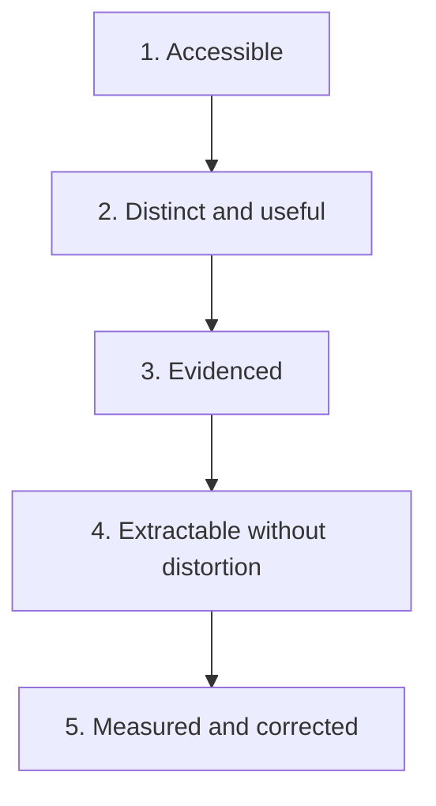

## The Short Answer

**Generative engine optimization (GEO) is a useful name for the work of making
content eligible, useful, well-supported, and attributable when an AI-assisted
search system builds an answer. It is not one ranking algorithm, and it is not
a bag of markup tricks.**

For Google, the official position is deliberately unexciting: AI Overviews and
AI Mode are rooted in the same core Search ranking and quality systems, and
there are no additional technical requirements or special optimizations for
inclusion. Other products have different retrieval stacks and crawler controls,
so a responsible GEO practice begins by naming the system rather than speaking
about “the AI” as if it were one machine.

I use GEO as an operating label for five questions:

1. Can the relevant system access the page?
2. Does the page contain something distinct and useful?
3. Can its claims be checked?
4. Can a passage be attributed without losing its meaning?
5. Can I measure what happened without inventing causality?

That is less exciting than “rewrite three headings and win AI search.” It is
also much closer to what the evidence can carry.

> This is chapter 1 of 6 in my GEO series. It provides the evidence boundary and
> operating model; later chapters can go deeper without turning early findings
> into universal laws.

## What Changed in Search—and What Did Not

Clicks are under pressure, but the numbers need a denominator and a date.

A [Pew Research Center study from March
2025](https://www.pewresearch.org/short-reads/2025/07/22/google-users-are-less-likely-to-click-on-links-when-an-ai-summary-appears-in-the-results/)
examined 68,879 Google searches from 900 consenting US adults. About 18% of
those searches produced an AI summary. Users clicked a traditional result after
8% of visits with a summary, compared with 15% without one. They clicked a link
inside the summary in only 1% of visits.

Those results support a narrow statement: in that sample and period, the
presence of an AI summary was associated with fewer outbound clicks. They do
not tell us that every query class, country, or later version of Google behaves
the same way.

[Bain's February 2025
analysis](https://www.bain.com/insights/goodbye-clicks-hello-ai-zero-click-search-redefines-marketing/)
reported a different survey: about 80% of respondents relied on zero-click
results for at least 40% of their searches, and Bain estimated a 15%–25%
reduction in organic traffic across affected contexts. The underlying
Bain–Dynata survey was conducted in December 2024 with 1,117 respondents.
Again, it is evidence of a broad change in user behavior, not a conversion
guarantee for sites that receive an AI citation.

What did not change is equally important. Search still needs to discover,
index, and assess pages. Google explicitly says its generative features use
core Search systems, including retrieval-augmented generation and query
fan-out. A page must be indexed and eligible to show a snippet. Helpful,
original, people-first content remains more important than a special “AI
format.”

The useful conclusion is not that links have stopped mattering. It is that a
publisher should distinguish at least three outcomes:

- visibility inside a generated answer;
- an attributed link or citation;
- a visit or conversion after that attribution.

They are related, but they are not interchangeable.

## What the Original GEO Paper Actually Demonstrated

The term was formalized in the KDD 2024 paper [*GEO: Generative Engine
Optimization*](https://arxiv.org/abs/2311.09735) by Aggarwal and colleagues.
The paper introduced GEO-bench, with 10,000 queries across multiple domains,
and evaluated nine ways of modifying source text.

The headline result is real: some strategies improved source **visibility by up
to 40%** in the authors' experimental generative engine. Adding citations,
quotations, or statistics often helped, and the effectiveness varied
substantially by domain.

The qualifications matter:

- Visibility was measured with constructs such as position-adjusted word count
  and a model-graded subjective impression. It was not simply “the probability
  that a current product cites this page.”
- The main engine retrieved sources and generated answers with
  `gpt-3.5-turbo`; production systems in 2026 do not share one fixed pipeline.
- The live Perplexity experiment used 200 examples and supplied source text
  through file uploads because the researchers could not choose the retrieved
  URLs. Quotation addition improved one visibility metric by 22%; statistics
  improved another by as much as 37%.
- The combination experiment also used a 200-example subset. Its best pair
  exceeded the best individual strategy by about 5.5%, while combinations
  involving cited sources averaged a 31.4% improvement in the selected metric.
- The authors did not evaluate effects on ordinary search rankings and warned
  that methods would need to adapt as engines and query distributions changed.

This is valuable early evidence. It is not permission to promise that adding
three quotations will raise a page's ChatGPT, Gemini, or Perplexity citation
rate by 40%.

My practical reading is modest: verifiable evidence and relevant quotations
can make a source more useful during synthesis, but the effect must be tested
by domain and product. The paper gives us hypotheses and an evaluation pattern,
not a timeless recipe.

## Crawler Controls Are Product Controls, Not Ranking Magic

The earlier version of this article put GPTBot, OAI-SearchBot,
ChatGPT-User, PerplexityBot, and Google-Extended in one list and called them
trucks carrying content into AI answers. That metaphor concealed important
policy choices.

### Google

Google Search uses Googlebot. `Google-Extended` is not a separate HTTP crawler;
it is a robots token controlling whether already-crawled content may be used
for some Gemini model training and grounding in Gemini Apps and Vertex AI.
[Google's crawler
documentation](https://developers.google.com/crawling/docs/crawlers-fetchers/google-common-crawlers)
states that it has no effect on Google Search and is not a Search ranking
signal.

### OpenAI

[OpenAI's publisher
guidance](https://help.openai.com/en/articles/12627856-publishers-and-developers-faq)
distinguishes search discovery from potential model training. A publisher that
wants content included in ChatGPT search summaries and snippets should not
block `OAI-SearchBot`. `GPTBot` is the control for pages a publisher wants to
exclude from potential training. Allowing one does not imply consenting to the
other.

### Perplexity

[Perplexity's crawler
documentation](https://docs.perplexity.ai/docs/resources/perplexity-crawlers)
describes `PerplexityBot` as the crawler used to surface and link websites in
search results. `Perplexity-User` supports fetches initiated by user requests
and generally ignores robots rules because the user requested the access.
Their purposes and enforcement behavior differ.

A correct `robots.txt` can preserve eligibility or express a policy. It cannot
make an unhelpful page authoritative, and allowing a training crawler does not
buy a citation.

## What Google Says You Do Not Need

Google's current [guide to generative AI features in
Search](https://developers.google.com/search/docs/fundamentals/ai-optimization-guide)
is unusually direct about several popular GEO claims:

- Google Search ignores `llms.txt`; it neither helps nor hurts visibility or
  ranking there.
- There is no special schema.org type required for AI Overviews or AI Mode.
- Structured data is not required for generative search.
- Pages do not need to be split into tiny “AI-readable chunks.”
- Publishers do not need to rewrite text into a special style for AI systems.
- Inauthentic off-site mentions and scaled pages designed to manipulate
  generative results remain spam, not a durable shortcut.

Structured data still has ordinary uses. Valid `Article`, `Person`, or
breadcrumb markup can support Search features and make site semantics easier
to maintain. It just should not be sold as a direct AI-citation switch.

The same restraint applies to FAQ and HowTo markup. Google [deprecated HowTo
rich results and restricted FAQ rich results](https://developers.google.com/search/blog/2023/08/howto-faq-changes)
to well-known government and health sites in 2023. A real FAQ can still help a
reader. Adding `FAQPage` to an ordinary personal blog does not create a
documented advantage in AI Overviews.

I keep an `llms.txt` only when I can name a consumer that documents using it.
“It is cheap” is not enough if the file becomes another artifact I must keep
accurate.

## A Five-Layer Working Model

The following model is my engineering checklist, not a list of proven ranking
factors:

```mermaid
flowchart TB
    L1["1. Accessible"] --> L2["2. Distinct and useful"]
    L2 --> L3["3. Evidenced"]
    L3 --> L4["4. Extractable without distortion"]
    L4 --> L5["5. Measured and corrected"]
```

### 1. Accessible

Use normal technical SEO: return a successful response, expose the main
content without authentication, avoid accidental `noindex`, publish a sitemap,
use stable canonical URLs, and make the page work for users on real devices.
Then choose crawler permissions separately for each product and purpose.

### 2. Distinct and useful

Google's strongest current recommendation is to publish non-commodity,
people-first work: original analysis, first-hand testing, or a point of view
that a generic summary cannot reproduce.

A clear opening and descriptive headings often help readers. I still use them.
I no longer call them universal citation factors or promise that question-form
headings are “cited far more often.” That claim needs a controlled test, not an
agency blog.

### 3. Evidenced

Separate three kinds of material:

- externally verifiable claims, linked to the closest primary source;
- measurements with collection date, scope, and method;
- experience or interpretation, labeled as such.

A statistic without its population and date is decoration. A citation that
does not support the adjacent sentence is worse than no citation because it
borrows authority without transferring evidence.

### 4. Extractable Without Distortion

Tables, lists, definitions, and short summaries can make complex material
easier for both people and software to navigate. The KDD study gives limited
experimental support to making evidence visible during synthesis.

Extractability should not become fragmentation. A passage is useful only if it
retains the conditions that make it true. “Up to 40% in one experimental
visibility metric” must not be shortened to “40% more citations.”

### 5. Measured and Corrected

Keep discovery, attribution, traffic, and business outcomes separate. Record a
baseline, make one class of change, and preserve enough context to explain a
later comparison. If an engine changes, treat the series as a new regime
rather than splicing it silently into the old one.

The fifth layer protects the first four from becoming ritual.

## Revisiting My Own Blog Without Inventing Causality

The original draft used a private Google Search Console snapshot from the old
domain: a rolling three-month view with 852 clicks, 878,000 impressions, 0.1%
average click-through, and average position 13.2. High-impression queries
included unrelated MBTI, medical, and local-history questions; more relevant
clicks came from technical searches around Hugo, LangGraph, GPT Researcher, and
Go directives.

That is useful first-party evidence about this site's query mix. It is not
evidence that an AI system copied those pages. Search Console impressions and
click-through do not reveal whether a model retrieved or cited a page. The
proper conclusion is narrower: the old site's visibility was broad, but much of
it did not match the audience I wanted to serve.

A one-run Lighthouse audit also returned SEO 100 and Best Practices 100. That
is a configuration smoke test, not a GEO score. It can catch technical
mistakes; it cannot prove authority, originality, citation selection, or user
value.

The stronger insight from the blog is editorial. A small set of technical pages
has repeatedly attracted relevant readers:

- [the Hugo build](/engineering/posts/my-hugo/) and [advanced Hugo
  notes](/engineering/posts/hugo-advanced-tutorial/);
- [MarkItDown](/projects/markitdown/), [mem0](/projects/mem0/),
  [LangGraph](/projects/langgraph/), [GPT Researcher](/ai-agent/posts/gpt-researcher/),
  and [NotebookLM](/projects/notebooklm/);
- [automation directives](/engineering/posts/directives-and-the-use-of-automation-tools/)
  and [TDD](/projects/tdd/).

My next step is not to manufacture dozens of query variants. It is to improve
the few clusters where I have direct experience, correct stale claims, link the
work coherently, and see whether readers and external systems find it useful.

## How to Measure GEO Without Fooling Yourself

### 1. Use Platform-Owned Reports

Google's 2026 guidance points publishers to the **Generative AI performance
report in Search Console** for Google Search and Discover. Use that report for
Google's own generative surfaces rather than inferring them from ordinary
high-impression pages.

For incoming visits, record referrers such as ChatGPT or Perplexity in analytics
and measure downstream behavior separately. A referral proves a visit, not the
exact answer or citation that caused it.

### 2. Audit Answers with Repeated Prompts

A fixed prompt set is useful, but one run is not a measurement. Store:

- the exact prompt and target intent;
- product, model or mode when visible, locale, account state, and date;
- several repetitions;
- whether the site was retrieved, cited, and accurately represented;
- the cited passage and whether it actually supports the generated claim.

Model and index changes create discontinuities. Report them instead of hiding
them inside an average.

### 3. Test Changes as Hypotheses

“Add a direct summary,” “replace secondary sources,” or “publish a first-hand
benchmark” are testable interventions. Change a bounded set of pages, preserve
the before state, and decide in advance which observation would count against
the hypothesis.

Third-party visibility tools can automate collection, but they do not have
access to proprietary ranking systems. Evaluate their sampling and
normalization before treating a share-of-voice chart as ground truth.

## A 30 / 60 / 90-Day Workflow

### Days 1–30: eligibility and evidence inventory

- [ ] Verify indexability, canonical URLs, sitemap coverage, and page rendering.
- [ ] Review crawler policy by purpose: Search, user fetch, or training.
- [ ] List the ten pages that already serve the intended audience.
- [ ] Mark unsupported statistics, stale product claims, and secondary citations.
- [ ] Capture a dated baseline from first-party platform reports.

### Days 31–60: improve the work itself

- [ ] Replace important secondary claims with primary sources.
- [ ] Add first-hand examples that a commodity summary cannot supply.
- [ ] Rewrite ambiguous passages so their conditions travel with the conclusion.
- [ ] Improve internal links among two or three genuine topic clusters.
- [ ] Create a small, versioned prompt audit with repeated runs.

### Days 61–90: expose and learn

- [ ] Publish the improved pages and record the release date.
- [ ] Share them where a real community can challenge the work—not to seed fake
      mentions.
- [ ] Review Search Console's generative report, verified citations, referrals,
      and reader behavior as separate series.
- [ ] Correct misquotations and stale claims.
- [ ] Stop any tactic that produces no interpretable evidence.

The schedule is not a promise of ranking. It is a way to make the experiment
auditable.

## Ethics: Make the Source Worth Citing

Fabricated reviews, synthetic consensus, and mass-produced pages are not a
clever GEO tier. They pollute the evidence that retrieval systems and people
depend on. They also violate the spirit—and often the letter—of platform spam
and advertising rules.

The durable alternative is slower: publish experience that happened, state the
limits, link the primary evidence, correct mistakes, and earn independent
discussion without manufacturing it.

My standard is now simple: if a passage would become misleading when lifted
into an answer, the passage is not ready. Optimization begins by making the
source true enough to survive extraction.

## FAQ

### Does GEO Replace SEO?

No. For Google Search, official guidance treats generative search optimization
as SEO because AI features rely on core Search systems. Across the wider market,
GEO remains a useful umbrella for product-specific discovery, attribution, and
measurement work.

### Should Every Article Start with a 40–100 Word Answer?

Not as a ranking ritual. A concise opening can help a reader and make the
article's scope explicit. Use it when the question has a direct answer; do not
flatten an essay or an uncertain investigation merely to create an extractable
block.

### Should a Personal Blog Publish `llms.txt`?

Only for a known consumer whose documentation says it reads the file. Google
Search ignores it. Keep it accurate if you publish it, and do not count it as
ranking work.

### Does Structured Data Improve AI Citation Rate?

There is no general evidence for that claim. Use supported structured data for
ordinary Search features and maintainable semantics. Google says no special
schema is required for its generative Search features.

### What Is the Fastest Useful Change?

Correct the most important unsupported claim on a page and replace it with
first-party evidence or an honest statement of uncertainty. That improves the
work even if no engine changes its answer.

## Closing

GEO is young enough that confidence often travels faster than evidence. The
original version of this guide made that mistake: it combined one promising
paper, several marketing summaries, private analytics, and product folklore
into a certainty the sources did not justify.

The correction is not to abandon the subject. It is to practice the discipline
the subject claims to reward: make pages accessible, publish something
distinct, show the evidence, preserve the limits, and measure each outcome
without pretending it proves the next one.

Search interfaces will keep changing. A source that remains useful after the
interface changes is the only optimization I trust to compound.

## Primary Sources

1. [Google: optimizing for generative AI features in Search](https://developers.google.com/search/docs/fundamentals/ai-optimization-guide)
2. [Google: AI features and your website](https://developers.google.com/search/docs/appearance/ai-features)
3. [Google: common crawlers and Google-Extended](https://developers.google.com/crawling/docs/crawlers-fetchers/google-common-crawlers)
4. [OpenAI: publishers and developers FAQ](https://help.openai.com/en/articles/12627856-publishers-and-developers-faq)
5. [Perplexity crawler documentation](https://docs.perplexity.ai/docs/resources/perplexity-crawlers)
6. [Pew Research Center: clicks when Google AI summaries appear](https://www.pewresearch.org/short-reads/2025/07/22/google-users-are-less-likely-to-click-on-links-when-an-ai-summary-appears-in-the-results/)
7. [Bain: zero-click search and AI summaries](https://www.bain.com/insights/goodbye-clicks-hello-ai-zero-click-search-redefines-marketing/)
8. [Aggarwal et al.: GEO, KDD 2024](https://arxiv.org/abs/2311.09735)
9. [Google: changes to FAQ and HowTo rich results](https://developers.google.com/search/blog/2023/08/howto-faq-changes)
