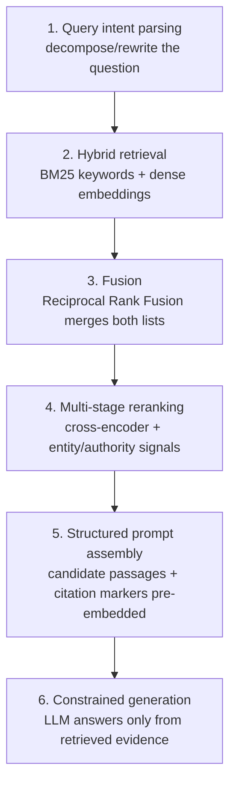

## The answer first: you're winning three gates, not one ranking

**AI search runs on RAG (Retrieval-Augmented Generation). A question comes in; the system first *retrieves* a set of candidate content, then *re-ranks* it by score, then has the LLM *generate* an answer and *cite* sources. GEO means clearing three gates: get retrieved (enter the candidate pool), score high in re-ranking (land near the top), and get chosen as a citation at generation (get named).**

Those three gates reward different signals. Most failed GEO efforts optimize only the first gate (be crawlable) and ignore the other two. This chapter dismantles the pipeline to the component level — and you'll see the real unit of optimization isn't "an article," it's "each paragraph."

> This is **Chapter 2 (Mechanics)** of the *Generative Engine Optimization* series. Chapter 1 (the [pillar](/ai-agent/posts/geo-generative-engine-optimization-guide/)) laid out the five-layer model and the whole map; this one explains the most critical part — how AI picks — so the later how-to chapters make sense.

---

## 1. Taking RAG apart: Perplexity's six stages

A Perplexity answer comes from a roughly six-stage RAG pipeline — a useful template for understanding all AI search: ([ZipTie](https://ziptie.dev/blog/how-perplexity-ai-answers-work/), [AuthorityTech](https://authoritytech.io/blog/how-perplexity-selects-sources-algorithm-2026))

Details you must remember:

- **Hybrid retrieval = keyword + semantic, in parallel.** One lane is **BM25** (classic lexical matching — reads the *words*); the other is **dense embedding vector search** (reads the *meaning*). The two are merged via **RRF (Reciprocal Rank Fusion)** by each item's rank. ([ZipTie](https://ziptie.dev/blog/how-perplexity-ai-answers-work/)) Implication: you need to hit the keyword *and* be semantically relevant — cover both.
- **Re-ranking is a three-layer sieve**: BM25+vector recall → cross-encoder precision rerank → ML rerank with entity and authority signals. Each layer culls candidates — **a passage must pass semantic relevance, freshness, structural quality, authority, and engagement checks before it earns a citation.** ([AuthorityTech](https://authoritytech.io/blog/how-perplexity-selects-sources-algorithm-2026))
- **Citations are pre-embedded, not retrofitted.** Before generation, Perplexity packs candidate passages, source URLs, publish dates, and citation markers into the structured prompt — **the citation slot is assigned during context assembly**, not pasted on after the model writes. ([ZipTie](https://ziptie.dev/blog/how-perplexity-ai-answers-work/)) Implication: whether your content becomes "the passage packed into the prompt" is the whole game.

---

## 2. Shift #1: the retrieval unit is the passage, not the page

The single most important line in this piece deserves its own section: **AI retrieves chunks (passages), not your whole article.** The system splits pages into blocks, computes a vector for each, and finds the blocks nearest the question in "vector space." ([Mersel AI](https://www.mersel.ai/blog/how-ai-search-algorithms-read-and-rank-content))

This inverts several SEO intuitions:

- **Every section must stand alone.** If a paragraph only makes sense after reading the previous three, it's broken when lifted as a chunk — and AI won't use it.
- **Passage length has a sweet spot.** AI Overviews favor **134–167 word passages**, and **62% of featured content lands between 100–300 words.** ([Stackmatix](https://www.stackmatix.com/blog/how-google-selects-ai-overview-sources)) Too short lacks substance; too long is hard to extract.
- **One idea per paragraph.** A semantically single-purpose chunk has a "cleaner" vector and matches more precisely. Split "what / why / how" into separate paragraphs.
- **Headings are signposts for chunks.** Clear H2/H3s help the system segment and understand each block.

> In writing terms: **treat your article as a box of LEGO, not a single slab of poured concrete.** Every brick must be liftable on its own. The section you're reading is one such chunk.

---

## 3. Shift #2: query fan-out means the head term isn't the only battlefield

Google has publicly confirmed that AI Overviews rely on **query fan-out**: the system splits one question into a batch of related sub-queries, retrieves them **in parallel**, and synthesizes the results. ([Search Engine Land](https://searchengineland.com/guide/how-to-optimize-for-ai-overviews), [Stackmatix](https://www.stackmatix.com/blog/how-google-selects-ai-overview-sources))

A startling corollary: **a page ranked #40 for the main query can still be pulled into an AI Overview if it precisely nails a sub-query.** And as Gemini 3 does more aggressive query expansion, fan-out's influence on source selection keeps growing. ([Stackmatix](https://www.stackmatix.com/blog/how-google-selects-ai-overview-sources))

Direct guidance for GEO:

- **Cover the "neighborhood" of a question, not just the head keyword.** A post on "Hugo blog SEO" should also cover "how to add a sitemap in Hugo," "how to configure structured data in Hugo," "Hugo image lazy-loading" — each sub-question is a ticket into fan-out.
- **FAQs, sub-headings, related entities** map naturally onto fan-out. Writing the follow-up questions users ask as explicit sections claims multiple sub-queries.
- **Depth > count.** Better to cover one topic exhaustively across its sub-question neighborhood than to publish ten shallow posts (echoing the "topic cluster" point from Chapter 1).

---

## 4. Shift #3: vector semantics — why "plain language" works

Classic SEO is **lexical matching**: you must contain the exact words the user typed. AI retrieval is **semantic matching**: content is encoded into vectors (hundreds/thousands of numbers — a "meaning coordinate"), and the system finds the passages nearest in *meaning*, not nearest in spelling. ([Mersel AI](https://www.mersel.ai/blog/how-ai-search-algorithms-read-and-rank-content))

This explains several things:

- **Why question headings work**: the user's question is also encoded into a vector; a heading like "What is GEO?" sits near the query "what is generative engine optimization" in vector space.
- **Why synonyms and natural phrasing matter**: you don't need to stuff one exact keyword; covering the natural ways a concept is expressed widens your semantic hit surface.
- **Why keyword stuffing fails (or hurts)**: mechanical repetition doesn't move the vector closer to meaning; it just reads like spam and lowers quality signals.

**But note**: the BM25 lexical lane still exists in hybrid retrieval. So the optimum is — **write the concept clearly in natural language (feed the vector) while naturally including core terms (feed BM25)** — don't drop either lane.

---

## 5. Retrieved ≠ cited: what the final gate weighs

Entering the candidate pool — even ranking high — doesn't mean you'll be written into the answer. **Citation is a separate gate**, weighing six dimensions together: ([Wellows](https://wellows.com/blog/google-ai-overviews-ranking-factors/))

> **Topical authority, E-E-A-T, content comprehensiveness, structured formatting, page-level trust, and site-level authority** — all working together; a gap in any one gets you culled at the last step.

Some quantified rules that tell you where to spend effort:

- **Content scoring 8.5/10+ on semantic completeness is 4.2x more likely to be cited.** ([Stackmatix](https://www.stackmatix.com/blog/how-google-selects-ai-overview-sources)) "Complete" = that passage fully answers a question, no loose ends.
- **Content with recent statistics, peer-reviewed sources, and Tier-1 citations is 89% more likely to be selected.** ([Stackmatix](https://www.stackmatix.com/blog/how-google-selects-ai-overview-sources)) This matches Chapter 1's Princeton finding (stats/citations/quotes = +22–41% visibility) exactly — **machine-readable evidence is the hard currency of the citation gate.**
- **The ranking moat is eroding**: the share of AI Overview citations coming from top-10 pages has **dropped from 76% to 38%.** ([ALM Corp](https://almcorp.com/blog/google-ai-overview-citations-drop-top-ranking-pages-2026/)) AI is increasingly willing to extract answers from lower-ranked pages with high-quality passages — huge news for solid-content blogs whose rankings haven't caught up.

---

## 6. Five battlefields, different temperaments (same principle)

The principle is always RAG, but each platform has a different "taste," so the emphasis shifts:

| Platform | Retrieval source | Temperament & emphasis |
|---|---|---|
| **Google AI Overviews** | Google index + query fan-out | Classic SEO base still a prerequisite; but passage quality/topical authority weigh more, and the top 10 no longer monopolize citations |
| **Perplexity** | Live web + own retrieval | The most retrieval- and citation-heavy; nearly every sentence sourced. Structure, evidence density, freshness pay the most |
| **ChatGPT Search** | Bing index + OpenAI's own | Balances retrieval and model memory; clear entities and authority endorsement matter |
| **Gemini** | Google ecosystem | Same lineage as AI Overviews; more aggressive fan-out |
| **Doubao / DeepSeek / Kimi** | Own indexes + China corpora | Chinese corpora and domestic-platform endorsement (Zhihu / WeChat / Bilibili) matter more; `robots` must allow Bytespider et al. |

**Commonality beats difference**: on every platform, "self-contained high-quality passages + machine-readable evidence + authority signals" wins. The difference is mainly **distribution** (China favors Zhihu/WeChat; the West favors Reddit/official docs) — saved for Chapter 4, "Trust & Endorsement."

---

## 7. Turning mechanics into action: the chunk-level checklist

Understanding the machine has to land on how each paragraph is written. This table compresses the chapter into an executable checklist:

- [ ] **Self-contained**: can each section be understood out of context?
- [ ] **Length sweet spot**: is the core answer paragraph within 100–300 words?
- [ ] **One idea per paragraph**: does this block make exactly one clear point?
- [ ] **Evidence density**: at least one number / source / quotation?
- [ ] **Question headings**: are H2/H3s the user's actual questions?
- [ ] **Sub-question coverage**: does each common follow-up get its own section (feeding fan-out)?
- [ ] **Natural language + terms**: plain language for the vector *and* core terms for BM25?
- [ ] **Clear entities**: brand/person/tool names spelled out, no vague references?

---

## 8. Back to my blog: which chunks are friendly, which aren't

Held against my own posts, the mechanics immediately expose problems:

- **A friendly example**: [My Hugo blog build](/engineering/posts/my-hugo/) earns a 10.4% CTR precisely because it's naturally a series of independently usable operational paragraphs — each step self-contained, with a command, single-purpose, easy to retrieve *and* cite.
- **An unfriendly example**: some of my long "thought-notes" posts have paragraphs that lean hard on context and lack numbers or sources — broken when lifted as a chunk. That's exactly why they racked up huge impressions (lexical coincidence) but near-zero citations or clicks (paragraphs don't survive being pulled out).

**The fix is clear**: give each section of core technical posts a "self-contained conclusion + one piece of evidence," and break long posts into LEGO. That's not a rewrite — it's "re-layout + add evidence," extremely high ROI. Chapter 3 (Structured Tactics) does exactly this hands-on — Answer-First paragraphs, FAQ/HowTo schema, and the concrete code for `tldr` and internal links.

---

## 9. FAQ

**Q: If I don't rank high, am I out of the AI-citation game?**
A: The opposite. The share of AI Overview citations from top-10 pages fell from 76% to 38%, and RAG often extracts from positions 4–20 or lower based on **passage quality**. Ranking is a bonus, not an entry ticket. ([ALM Corp](https://almcorp.com/blog/google-ai-overview-citations-drop-top-ranking-pages-2026/))

**Q: How long should an article be?**
A: The article should comprehensively cover the topic, but **the passage is what gets cited** — the core answer paragraph's sweet spot is 100–300 words. Strategy: deep and complete overall (feeding topical authority + fan-out), with short, self-contained paragraphs inside (feeding chunk retrieval).

**Q: Do keywords still matter in the vector era?**
A: Yes, but not exclusively. The BM25 lexical lane is still in hybrid retrieval. The optimum is natural-language clarity + naturally included core terms — no mechanical stuffing.

**Q: How do I exploit query fan-out?**
A: Write the sub-questions users ask about a topic as their own sections with question headings. Each sub-question is a ticket into parallel fan-out retrieval.

---

## Summary and what's next

The core of this chapter, in three lines: **AI retrieves passages, not pages; query fan-out makes sub-questions and long tails just as valuable; citations are earned by machine-readable evidence and topical authority, not ranking alone.** Etch these three into your writing habits and your content graduates from "readable" to "worth citing."

- **Previous**: [GEO Pillar — the five-layer model and the whole map](/ai-agent/posts/geo-generative-engine-optimization-guide/)
- **Next (Chapter 3 · Structured Tactics)**: how to write Answer-First paragraphs, add FAQPage/HowTo schema, and do `llms.txt` and `tldr` right — turning this chapter's mechanics into copy-paste code and templates.

---

*Mechanics and data sources: Perplexity RAG pipeline analyses (ZipTie, AuthorityTech), Google AI Overviews source-selection research (Search Engine Land, Stackmatix, Wellows, ALM Corp), AI retrieval explainers (Mersel AI), and my own observations of real GSC data for cubxxw.com. Links cited inline.*
