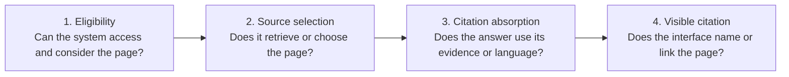

## The answer first: there is no universal citation algorithm

AI search does not expose one shared pipeline that publishers can reverse-engineer into a recipe.

Google documents retrieval-augmented generation and query fan-out for AI Overviews and AI Mode. Perplexity documents real-time web search, synthesis, and source links. OpenAI says ChatGPT search uses third-party search providers and content supplied directly by partners. None of those statements proves that the products share the same index, chunker, lexical retriever, vector store, reranker, prompt assembly, or citation policy.

That distinction changes how I think about GEO:

> Do not optimize for an imagined secret pipeline. Build content that is eligible, useful, inspectable, and measurable across the systems you actually care about.

This is **Chapter 2 (Mechanics)** of the *Generative Engine Optimization* series. [Chapter 1](/ai-agent/posts/geo-generative-engine-optimization-guide/) introduced the larger map. This chapter builds a narrower model that says exactly where the evidence ends and the inference begins.

## What the platforms actually disclose

### Google: RAG, query fan-out, and the existing search foundation

Google's [Search Central documentation](https://developers.google.com/search/docs/appearance/ai-features) says AI Overviews and AI Mode may use **query fan-out**: models issue several related searches across subtopics and data sources, then find supporting pages while generating a response.

Google's newer [guide to generative AI features](https://developers.google.com/search/docs/fundamentals/ai-optimization-guide) is more explicit about two points:

1. Its AI search features use retrieval-augmented generation grounded in pages from the core Search index.
2. The ordinary search foundation still matters. A supporting page must be indexed and eligible to appear with a snippet.

That official guidance also removes several attractive myths. Google says there is no additional technical requirement, no special schema, and no AI-specific text file needed to appear. It warns against creating pages for every possible fan-out query merely to manipulate rankings. People-first content, crawlability, internal links, textual accessibility, page experience, and matching structured data remain the durable work.

Query fan-out is real. “Write a thin page for every fan-out phrase” is not the consequence.

### Perplexity: live search, synthesis, and citations

Perplexity's [official help center](https://www.perplexity.ai/help-center/en/articles/10352895-how-does-perplexity-work) describes a simpler observable sequence: interpret the question, search the web in real time, synthesize information, and provide citations that link to sources. Its [Pro Search documentation](https://www.perplexity.ai/help-center/en/articles/10352903-what-is-pro-search) adds multiple searches, broader source reading, synthesis, and interactive refinement.

Those pages do **not** document a fixed combination of BM25, dense embeddings, Reciprocal Rank Fusion, cross-encoders, “authority ML,” or citation slots assigned before generation. Those are plausible components in modern retrieval systems, but describing them as Perplexity's proven architecture crosses the line from engineering model to invented product fact.

The useful conclusion is modest: Perplexity exposes source links and encourages verification. The links make an answer auditable; they do not make every sentence entailed by its citation.

### ChatGPT search: third-party providers and partner content

OpenAI's [ChatGPT search announcement](https://openai.com/index/introducing-chatgpt-search/) says the product uses third-party search providers as well as content provided directly by partners. It gives users a Sources panel and lets publishers choose whether they appear in ChatGPT search.

The page does not establish that the current system is simply “Bing plus OpenAI's own index.” Search infrastructure and model behavior can change. A durable article should state the documented interface and publisher controls, not freeze a rumored backend into a comparison table.

### What remains unknown

For all three products, essential details remain private or variable:

- how queries are rewritten for a particular request;
- whether lexical, semantic, graph, or other retrieval methods are combined;
- the unit used for initial retrieval and later evidence extraction;
- how freshness, location, personalization, safety, authority, and diversity interact;
- when a source contributes to an answer but receives no visible citation;
- how model, index, experiment, account, and region changes alter results.

This uncertainty is not a gap to fill with confident guesses. It is part of the system we have to measure.

## A four-stage model that is useful without pretending to be the backend

I use four outcomes when auditing my own content:


```mermaid
flowchart LR
    A["1. Eligibility<br/>Can the system access and consider the page?"] --> B["2. Source selection<br/>Does it retrieve or choose the page?"]
    B --> C["3. Citation absorption<br/>Does the answer use its evidence or language?"]
    C --> D["4. Visible citation<br/>Does the interface name or link the page?"]
```

This is a **measurement model**, not a claim about an internal four-stage service.

### 1. Eligibility

For Google, eligibility has an official floor: the page must be indexed and eligible for a search snippet. Across platforms, practical checks include:

- crawlers are not blocked by `robots.txt`, authentication, CDN rules, or accidental `noindex`;
- important content exists in accessible text, not only inside an image or client-side interaction;
- canonical URLs and redirects are coherent;
- internal links make the page discoverable;
- dates, authorship, and source links are visible to readers.

Eligibility is necessary and never sufficient.

### 2. Source selection

Selection asks whether the system chooses the page as a candidate for a particular prompt. Google confirms that fan-out can issue related searches, so a page may be useful for a supporting subtopic rather than the literal head query.

That does not justify the old claim that “a result at position 40 will be cited.” Position, query, locale, intent, freshness, and the set of alternative pages all matter, and no universal threshold is documented. The testable question is:

> For which prompt variants, dates, regions, and platforms is this URL selected?

### 3. Citation absorption

A selected page may materially influence the answer without receiving a visible link. Conversely, a cited page may be listed while contributing little language or evidence.

A 2026 paper, [*From Citation Selection to Citation Absorption*](https://arxiv.org/abs/2604.25707), proposes measuring those outcomes separately across ChatGPT, Google, and Perplexity. Its public dataset is useful because it turns a fuzzy question — “did AI notice this page?” — into two inspectable ones:

- **selection**: was the page cited or chosen by the search layer?
- **absorption**: how much did the final answer actually use the page's language, facts, structure, or evidence?

The paper reports cross-platform differences. That is another reason not to treat one platform's behavior as a universal law.

### 4. Visible citation

A visible citation is what a publisher can most easily observe, but it is still not a complete quality signal. The peer-reviewed study [*Evaluating Verifiability in Generative Search Engines*](https://aclanthology.org/2023.findings-emnlp.467/) found citations that existed yet failed to support the sentence beside them. Its 2023 product measurements should not be treated as current platform scores; the durable contribution is its separation of citation recall from citation precision.

For content work, the immediate lesson is not “add more links until a model rewards you.” It is:

- make factual claims narrow enough to verify;
- cite original sources rather than chains of summaries;
- state dates and measurement conditions;
- distinguish observation, inference, and recommendation;
- preserve limitations near the claim they limit.

Good evidence is useful even when an answer engine never cites it. That is why it survives algorithm changes.

## Pages, passages, and the myth of a universal chunk length

AI systems often work with excerpts or passages somewhere in retrieval and synthesis. Google says its systems retrieve pages and review specific information from them. It does not publish a universal chunker or a preferred word count for citation.

The previous version of this article claimed a 134–167-word “sweet spot,” that 62% of selected passages sit between 100 and 300 words, and that every section is independently embedded. I could not trace those numbers to a primary methodology strong enough to support a prescription. They are gone.

There is still a human and machine-readable reason to write self-contained sections:

- a descriptive heading tells readers what question is being answered;
- the first paragraph can state the answer before expanding it;
- pronouns have clear referents;
- a number includes its unit, date, population, and source;
- caveats stay beside the claim rather than three screens later;
- tables retain headers and do not hide essential meaning in styling.

Call that **extractable clarity**, not chunk optimization.

The LEGO metaphor still helps: each section should be useful when lifted into a quotation, but the whole model still needs to stand. A box of individually polished bricks is not automatically a good house.

## What research supports — and what it does not

The original KDD 2024 [GEO paper](https://arxiv.org/abs/2311.09735) introduced GEO-bench and reported visibility improvements of up to 40% in its evaluated generative-engine setting. Adding citations, quotations, or statistics helped in some domains; keyword stuffing performed poorly.

That is meaningful evidence, with boundaries:

- “up to 40%” is a maximum in a benchmark, not an expected lift for every website;
- visibility metrics are not identical to clicks, trust, conversion, or durable ranking;
- the best intervention varied by domain;
- answer engines, indexes, and models have changed since the experiment;
- a method that helps a controlled source compete may not repair a page that is ineligible or irrelevant.

A newer controlled study, [*What Gets Cited*](https://arxiv.org/abs/2605.25517), found topical relevance and source position were the largest drivers in its two-document RAG testbed. Recent timestamps and explicit price information helped in that setting; completeness and trust cues had smaller gains, while formatting-only edits had little effect.

Again, this is a testbed, not a disclosure of Google or Perplexity ranking logic. Its value is methodological: change one factor, counterbalance position, repeat trials, and report uncertainty. That is far stronger than recycling a percentage from a marketing post with no inspectable sample.

## A repeatable GEO measurement protocol

If the systems are black boxes, the honest response is not surrender. It is experimental discipline.

### 1. Define the outcome

Choose one primary outcome per test:

- URL appears as a visible citation;
- domain appears, regardless of URL;
- the answer contains a specific supported fact from the page;
- the answer uses a distinctive phrase or structure from the page;
- a cited passage actually entails the attached claim;
- a user clicks and completes a meaningful action.

Do not combine them into one “AI visibility score” until each component is visible.

### 2. Freeze a prompt set

Create prompts from real reader tasks:

```text
10 head questions
10 diagnostic or how-to questions
10 comparison questions
10 long-tail questions from support, Search Console, or community discussions
```

Record the exact wording. Add paraphrases deliberately rather than changing them ad hoc.

### 3. Record the environment

For every run, retain:

```text
platform and product mode
date and local time
country / language
signed-in or signed-out state
subscription tier
visible model, if the product exposes it
fresh conversation or follow-up
prompt text
answer, citations, and screenshots
```

Without this metadata, two runs may look comparable while belonging to different experiments.

### 4. Repeat

One answer is an anecdote. Run each prompt several times across multiple days. Report:

- citation rate with numerator and denominator;
- domain and URL diversity;
- citation entailment checked by a human rubric;
- absorption or factual contribution where measurable;
- variance across prompt paraphrases;
- changes after an edit, compared with an unchanged control group.

The goal is not to manufacture statistical certainty from a small blog. It is to stop confusing one lucky screenshot with a durable mechanism.

### 5. Change one thing at a time

Useful interventions include:

- replacing a secondary citation with the original source;
- adding date, scope, units, and methodology to a number;
- rewriting one section answer-first;
- exposing content previously trapped in an image;
- repairing internal links or crawl controls;
- adding missing counterevidence or a limitation.

If title, structure, sources, schema, and wording all change together, a result cannot tell you what mattered.

### 6. Preserve failures

Keep examples where:

- the page was cited but did not support the answer;
- an uncited answer copied a distinctive fact;
- a competitor was selected because it covered a condition you omitted;
- the result changed by region or paraphrase;
- the system answered from stale information.

Those failures are a better editorial backlog than a generic “GEO checklist.”

## The practical writing checklist

This is the checklist I am willing to defend in 2026:

- [ ] **People-first purpose**: does the page solve a real reader task rather than target an imagined fan-out query?
- [ ] **Search eligibility**: is it indexable, snippet-eligible, crawlable, canonical, and internally linked?
- [ ] **Answer-first sections**: can a reader find the direct answer before the expansion?
- [ ] **Extractable evidence**: do numbers include units, dates, scope, methodology, and original sources?
- [ ] **Claim-sized citations**: does each source support the entire nearby claim?
- [ ] **Visible uncertainty**: are limitations and disagreements close to the conclusion?
- [ ] **Accessible text**: is essential information available outside images, video, or interaction?
- [ ] **Current facts**: are prices, APIs, policies, and product names tied to a review date?
- [ ] **Structured data integrity**: does markup match visible content instead of inventing it?
- [ ] **Measurement plan**: is there a fixed prompt set and a date to repeat the test?

There is no checkbox for “exactly 167 words.” There is no citation-density quota. Evidence must improve the reader's ability to verify the page, not decorate it for a crawler.

## Back to my blog: observation is not causation

My [Hugo build article](/engineering/posts/my-hugo/) has historically shown a 10.4% Search Console CTR in one snapshot. Its operational sections are easy to scan and quote, which makes extractable clarity a reasonable editorial hypothesis.

That CTR does **not** prove the article was cited by an answer engine, nor that paragraph structure caused the click rate. To make the example useful, I would need to record the Search Console date range, query mix, device and country distribution, rank position, AI citations observed in a fixed prompt set, and changes after a controlled edit.

That correction is more than statistical housekeeping. It protects the author's voice from turning into marketing voice. Personal observation becomes valuable when the boundary around it is visible.

## FAQ

### If a page does not rank in the top ten, is it excluded?

No universal exclusion rule is documented. Google says AI features can surface a wider set of helpful links through fan-out, but it also says these systems are rooted in core Search ranking and quality systems. Treat strong SEO as the foundation, not a guarantee or an obsolete ritual.

### How long should an answer section be?

Long enough to answer the question with its necessary evidence and limitations; short enough that a reader can locate the claim. No official cross-platform word-count optimum exists. Measure comprehension and extraction on your own corpus.

### Do keywords still matter?

Use the terms readers and the field use, naturally. Google says its systems understand relevance even without an exact query match, while ordinary search fundamentals still apply. That supports precise language, not keyword stuffing.

### How should I respond to query fan-out?

Cover the real subquestions a reader needs to complete the task. Do not publish separate thin pages for speculative fan-out phrases. Google explicitly warns that scaled content created to manipulate AI responses can violate spam policy.

### Does a citation prove the answer is correct?

No. Open it. Check whether the cited passage supports the whole sentence, whether the source is original, and whether its date and conditions match the claim.

## What survives the next model update

The old version of this article tried to make a black box feel controllable with six stages, magic paragraph lengths, and platform “temperaments.” That certainty was satisfying and brittle.

The model I trust now is less glamorous:

```text
eligible → selected → absorbed → visibly cited → useful to a person
```

Each arrow can fail. Each failure can be measured. None is repaired by a single formatting trick.

The durable GEO advantage is not knowing a secret reranker. It is publishing work whose evidence is easy to inspect, whose uncertainty is honestly preserved, and whose performance is measured without turning correlation into folklore.

That sounds less like gaming an engine.

It sounds more like earning the right to be cited.

- **Previous**: [GEO Pillar — the five-layer model and the whole map](/ai-agent/posts/geo-generative-engine-optimization-guide/)
- **Next**: [Structured Content Tactics](/ai-agent/posts/geo-structured-content-tactics/)
