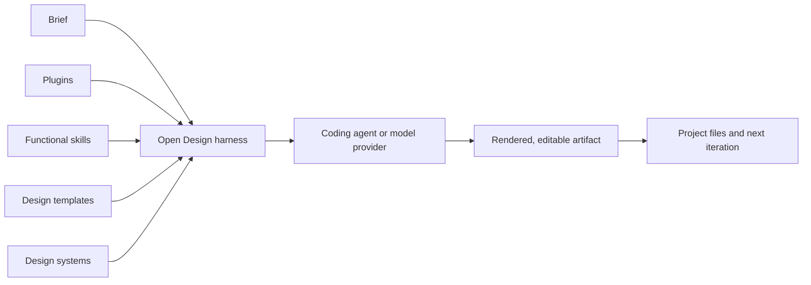

Open Design is easy to misread. The name also belongs to the older open-design movement around shared product blueprints, but this article is about [`nexu-io/open-design`](https://github.com/nexu-io/open-design): an open-source workspace that turns coding agents into a design production system.

It is not a model, and it is not simply an image generator. It is a **harness**. The harness gives an agent a controlled vocabulary, reusable workflows, visual constraints, an artifact loop, and a place to inspect the result. That distinction matters because the quality ceiling still comes from the model and the operator; Open Design improves the path between intention and output.

> This is a versioned reading of [release 0.16.1](https://github.com/nexu-io/open-design/tree/open-design-v0.16.1), checked against the project's current [README](https://github.com/nexu-io/open-design/blob/main/README.md), [QUICKSTART](https://github.com/nexu-io/open-design/blob/main/QUICKSTART.md), [AGENTS.md](https://github.com/nexu-io/open-design/blob/main/AGENTS.md), and [privacy policy](https://github.com/nexu-io/open-design/blob/main/PRIVACY.md) on July 31, 2026. Catalogs and provider support change faster than architectural ideas, so verify dynamic details in the runtime you actually install.

## The useful mental model

A coding agent can already write HTML, CSS, React, SVG, or slide markup. Its weakness is not syntax. Its weakness is continuity: without a stable brief and reusable visual rules, it tends to rediscover the design on every turn.

Open Design puts persistent structure around that capability:

1. choose an execution path;
2. choose reusable design knowledge;
3. ask the agent to create or revise an artifact;
4. inspect the rendered result;
5. keep the files and continue in ordinary development tools.

The product's strongest idea is therefore not “AI can design.” It is more modest and more durable: **taste can be made partially inspectable, portable, and composable when it is stored as files.**

## Four planes, not one prompt

Release 0.16.1 exposes four resource planes. They overlap in everyday language, but they serve different purposes:

| Plane | What it carries | The question it answers |
|---|---|---|
| **Plugins** | Packaged integrations and executable extensions | What can the workspace connect to or run? |
| **Functional skills** | Repeatable procedures for a class of work | How should the agent perform this task? |
| **Design templates** | Starting structures for a deliverable | What shape should the first artifact take? |
| **Design systems** | Visual tokens, rules, and brand constraints | What should the result consistently feel like? |



This separation is more important than the number of items in any catalog. A landing-page template can define sections without defining a brand. A design system can define typography and spacing without prescribing the research workflow. A functional skill can specify how to critique a screen without supplying the screen's initial structure. A plugin can add a capability without deciding how every project must use it.

Keeping those concerns separate makes the system easier to reason about. It also makes replacement cheap: change the design system without rewriting the workflow, or swap the template without discarding the brand.

### Why I no longer quote catalog totals

The project is moving quickly, and its README, packaged release, remote catalog, and runtime UI may not show identical totals at the same moment. A number copied from `main` can be false for 0.16.1 before the article is indexed.

The reliable rule is:

- use the [0.16.1 tree](https://github.com/nexu-io/open-design/tree/open-design-v0.16.1) when reproducing this article;
- use the catalog loaded by your running instance when choosing a resource;
- treat README totals as a discovery signal, not an API guarantee.

Version pinning is not pedantry here. It is the difference between describing a product and describing a moving advertisement.

## Execution paths: local is a topology, not a promise

Open Design can work with locally installed agent CLIs, with Open Design Cloud, or with configured model providers. BYOK support includes multiple providers and OpenAI-compatible endpoints. That makes the harness model-flexible, but it does not make all execution local.

The important boundary is the selected path:

| Path | What can remain local | What can leave the machine |
|---|---|---|
| Local agent using a local model | Workspace state, artifact files, and model traffic | Nothing by design, subject to the agent and model configuration |
| Local agent using a hosted model | Workspace state and artifact files | Prompts, selected context, and model output go to that agent's provider |
| BYOK or OpenAI-compatible remote endpoint | Workspace state and artifact files | Requests go to the configured endpoint |
| Open Design Cloud | Local files not uploaded by the workflow | Data required by the enabled cloud features |

This is why “local-first” should not be rewritten as “data never leaves your machine.” A local daemon can still call a remote model. A local CLI can still send context to its vendor. Open Design cannot cancel the remote provider's retention rules, quotas, regional routing, billing, or rate limits.

BYOK is valuable because it gives the operator a choice of provider and account. It is not a mechanism for bypassing provider policy.

## Privacy and telemetry: three separate questions

The project's [privacy policy](https://github.com/nexu-io/open-design/blob/main/PRIVACY.md) is more precise than a blanket “zero telemetry” claim. Evaluate three channels independently:

1. **Local runtime state.** Projects, configuration, and other runtime data use the application's data-root contract. `OD_DATA_DIR` selects the root, which the runtime exposes internally as `RUNTIME_DATA_DIR`. Do not build automation around an assumed `.od` path; the resolved root is the contract that matters.
2. **Model traffic.** If the chosen agent or provider is remote, the request crosses that provider boundary. Read the provider's own privacy and retention terms.
3. **Open Design telemetry.** Product analytics can be opted out of. Sanitized safety and reliability telemetry remains enabled so the maintainers can detect failures and abuse without collecting raw project content as ordinary analytics.

These channels answer different questions. Turning off product analytics does not turn a hosted model into a local one. Conversely, using a local model does not imply that every optional product event is disabled.

My practical rule is to classify the project before choosing a path:

- for public prototypes, remote models are usually an acceptable speed trade;
- for client material, review exactly which files the agent may read;
- for regulated or unreleased data, prefer a local model and verify the complete request path rather than trusting the word “local.”

Privacy comes from topology and configuration, not from adjectives.

## Local models and the SSRF boundary

The daemon protects outbound proxy requests against server-side request forgery. Private and internal destinations are blocked by default. This is a sensible default for a tool that accepts configurable endpoints, but it means a local Ollama or LM Studio URL may also be rejected at first.

If you intentionally use a trusted internal model host, add only that host through `OD_ALLOWED_INTERNAL_HOSTS`. Avoid broad private-network allowances. The safe sequence is:

1. confirm the exact hostname and port of the local model service;
2. allow that host explicitly;
3. keep the service bound as narrowly as practical;
4. test from a non-sensitive project before granting the agent wider file access.

An SSRF guard is not evidence that credentials can never leak or that a preview is harmless. It is one control at one boundary. Provider permissions, agent tool permissions, project scope, and generated browser code remain separate boundaries.

## What a design system contributes

The design-system plane is the part I find most reusable. A model given only “make it elegant” falls back to statistical defaults: oversized gradients, interchangeable cards, and typography that looks plausible without expressing a position.

A useful design system replaces adjectives with decisions:

```markdown
## Typography
Use a compact grotesk for navigation and a text face with visible stroke contrast
for long reading. Headlines may be large, but never consume the entire first screen.

## Color
Use warm paper as the field, ink as the default, and oxidized copper as the only
accent. Reserve the accent for state changes and primary actions.

## Composition
Prefer one asymmetric tension per screen. Do not make every section a centered
stack. Empty space must separate ideas, not decorate the viewport.
```

This is deliberately more opinionated than a token dump. Tokens make choices repeatable; prose explains why the choices belong together. The agent needs both.

The deeper lesson is that a `DESIGN.md`-style artifact is not a substitute for judgment. It is compressed judgment. If the source has no point of view, encoding it faithfully only produces consistent blandness.

## A disciplined first run

For installation and commands, follow the versioned [QUICKSTART](https://github.com/nexu-io/open-design/blob/open-design-v0.16.1/QUICKSTART.md) rather than copying shell snippets from an undated article. Once the runtime is healthy, keep the first experiment small:

1. create a disposable project with no confidential files;
2. confirm which agent or provider will receive the prompt;
3. choose one functional skill, one template, and one design system;
4. ask for a single-page artifact with a concrete audience and decision;
5. inspect the HTML, dependencies, links, and browser behavior before trusting the preview;
6. revise one variable at a time so you can tell which plane changed the result;
7. move the accepted artifact into normal version control.

A productive brief names constraints rather than moods:

```text
Create a one-page release note for a developer tool.
Audience: maintainers evaluating a migration.
Decision: whether to adopt version 2 this quarter.
Keep the comparison visible without scrolling.
Use the selected design system, but prioritize technical readability.
No stock imagery, invented testimonials, or unsupported performance claims.
```

The final sentence does more for quality than adding “beautiful” five times.

## Where it fits—and where it does not

Open Design is a good fit when you already use coding agents, want artifacts that remain editable as files, and need to reuse design decisions across prototypes. It is also useful for studying how agent products can separate capability, procedure, structure, and taste.

It is a weaker fit when you need:

- mature multiplayer canvas collaboration;
- a guarantee that no request reaches a remote service without auditing the full provider path;
- finished brand judgment from an empty brief;
- pixel-perfect production code without review;
- stable catalog counts across `main`, a release tag, and cloud delivery.

Generated code is still untrusted code. Preview it in isolation, inspect dependencies, test accessibility, and review the result before deployment. A harness can narrow randomness; it cannot transfer responsibility away from the person shipping the artifact.

## My conclusion

The most interesting part of Open Design is not that it competes with a named design product. Comparisons expire. Its more durable contribution is architectural: it treats design work as four composable planes that can be inspected, versioned, and replaced independently.

That approach matches a broader lesson in agent engineering. Models are becoming abundant; coherent context is still scarce. The useful system is the one that preserves decisions between prompts without hardening every decision into code.

Open Design 0.16.1 is not a closed design department in a box. It is a workbench. A workbench does not supply taste, but it gives taste somewhere to live.

## Version-pinned references

- [Open Design 0.16.1 source tree](https://github.com/nexu-io/open-design/tree/open-design-v0.16.1)
- [0.16.1 QUICKSTART](https://github.com/nexu-io/open-design/blob/open-design-v0.16.1/QUICKSTART.md)
- [Current official README](https://github.com/nexu-io/open-design/blob/main/README.md)
- [Current repository guidance for agents](https://github.com/nexu-io/open-design/blob/main/AGENTS.md)
- [Current privacy policy](https://github.com/nexu-io/open-design/blob/main/PRIVACY.md)
