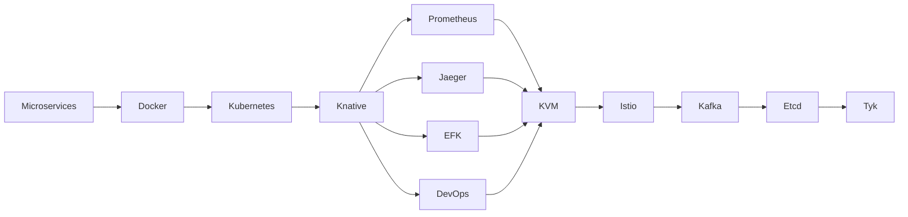

## **Requirements**

<aside>
🔥 We need to further study and advance in kubernetes, reading source code is a necessary path.

</aside>

**👀   More importantly, it's the collection of kubernetes resources.**

---

***⚠️   All resources use external links, book resources may not have links, others are personal experiences and summaries. Please contact for removal if there's copyright infringement.***

<aside>
🚧 ⚠️ **Note: This article will be permanently stored in notion and will be continuously updated, providing a write channel. If you have better resources, welcome to add them on notion ~**

</aside>

[CloudNative Learning Path](https://nsddd.notion.site/CloudNative-2f278e98ed274999829333272415c72d)

**About kubernetes:**

- [Official Website](https://kubernetes.io/)
- [GitHub](https://github.com/kubernetes/kubernetes)
- [Community-maintained kubernetes learning resources collection](https://github.com/kubernauts/Kubernetes-Learning-Resources)
- [Must-read Google large-scale cluster manager Borg for Kubernetes source code](https://blog.opskumu.com/borg.html)
- [etcd: Comprehensive interpretation from application scenarios to implementation principles](https://www.cnblogs.com/sunsky303/p/14371768.html) and [ZooKeeper typical application scenarios overview](https://blog.51cto.com/nileader/1040007)

---

**About CNCF contributions, you need to sign CLA**

- [Kubernetes CLA signing process](https://github.com/kubernetes/community/blob/master/CLA.md)
- [Official developer guide markdown files](https://github.com/kubernetes/community/tree/master/contributors/devel)
- [Kubernetes owners introduction md](https://github.com/kubernetes/community/blob/master/contributors/guide/owners.md)

**Some resources I wrote:**

- [Cloud Native Learning](https://docker.nsddd.top/)
- [golang Learning](https://go.nsddd.top/)

> All collected in awesome repository, covering 📚 Beginner's Growth Manual🚀 CS series, Cloud Native series, Blockchain series, web3 series🔥, Golang series💡...... Visit GitHub👀 https://github.com/cubxxw/awesome-cs-cloudnative-blockchain ⏬⏬⏬
> 

---

[GitHub - cubxxw/awesome-cs-cloudnative-blockchain: 📚 Beginner's Growth Manual🚀  CS series, Cloud Native series, Blockchain series, web3 series🔥, Golang series💡......](https://github.com/cubxxw/awesome-cs-cloudnative-blockchain)

## **What's Best to Have**

1. If we're talking about the first step, you must understand docker container underlying principles and Linux kernel basics.
2. Understand the architecture first, then reading will be much faster.
3. Learn to use it - you can never understand its design philosophy without using it.
4. Read source code with questions, otherwise it will be boring. You must read with questions, otherwise it gets boring and you'll get lost in details.
5. Reading source code requires accumulation, like having read many basic package source codes such as net/http grpc-go etc.
6. Try debugging, try practicing, try understanding and analyzing product concepts, and learn to design yourself.

## Recommended Learning Order for Kubernetes Engineers

**Recommended learning resources:**

1. Microservices: [《Building Microservices》](https://book.douban.com/subject/26772677/)
2. Docker: [《Docker Technology Introduction and Practice》(3rd Edition)](https://book.douban.com/subject/30329430/)、[《Docker Containers and Container Cloud》(2nd Edition)](https://book.douban.com/subject/26894736/)
3. Kubernetes: [《Kubernetes Authoritative Guide: From Docker to Kubernetes Full Practice》(5th Edition)](https://book.douban.com/subject/35458432/)、[《Container Cloud Platform Practice Based on Kubernetes》](https://book.douban.com/subject/30333237/)
4. Knative: [Knative Documentation](https://knative.dev/docs/)
5. Prometheus: [Prometheus Documentation](https://prometheus.io/docs/introduction/overview/)
6. Jaeger: [Jaeger Documentation](https://www.jaegertracing.io/docs/1.26/)
7. KVM: [《KVM Virtualization Technology: Practice and Principle Analysis》](https://book.douban.com/subject/25743939/)
8. Istio: [《Cloud Native Service Mesh Istio: Principles, Practice, Architecture and Source Code Analysis》](https://book.douban.com/subject/34438220/)
9. Kafka: [《Apache Kafka in Action》](https://book.douban.com/subject/30221096/)、[《Apache Kafka Source Code Analysis》](https://book.douban.com/subject/27038473/)
10. Etcd: [etcd Practical Course](https://time.geekbang.org/column/intro/391)
11. Tyk: [Tyk Open Source](https://tyk.io/docs/apim/open-source/)
12. Consul: [Consul Documentation](https://www.consul.io/docs)
13. Cilium: [Cilium Documentation](https://docs.cilium.io/)
14. OpenShift: [《Open Source Container Cloud OpenShift: Building Enterprise Application Cloud Platform Based on Kubernetes》](https://book.douban.com/subject/27088186/)

## **Basic Knowledge**

**Basic concepts:**

We need to know kubernetes basic concepts, which we might have explained before.

For example, what are Build-in API Groups and API Objects, what they do;

**Some very important tool libraries:**

Like **gengo**, including informer mechanism;

- Cobra: Command line, docker, Kubernetes, sealos, sealer, ks all have it~
- [go-restful](https://github.com/emicklei/go-restful): REST requires developers to explicitly use HTTP methods in a way consistent with protocol definition. This basic REST design principle establishes one-to-one mapping between Create, Read, Update, Delete (CRUD) operations and HTTP methods.
- etcd: Database using raft consensus mechanism like fabric, deeply explained and applied in k3s.

**Restful basics:**

Simply understand Restful concepts, it's best if you've done Restful Service

**Familiar with some common design patterns:**

- Reference: https://www.yuque.com/aceld/lfhu8y/rg6nsf

**Familiar with common algorithms, familiar with operating systems (especially Linux basics), familiar with some network protocols and principles.**

> Kubernetes has many complex parts, especially networking and storage. Hope to become ***××domain expert*** in the future
> 

[Learning paths for various directions of Kubernetes](https://www.notion.so/Kubernetes-49d69cea67d54f07a4daee049b529c16?pvs=21)

## **Reading Methods (Similar for other open source projects)**

- First overall, then local (don't get stuck in details)
- Deep dive into local learning
- Be patient, read more code~

### **Staged approach**

1. **First stage** First understand k8s, what it is, what it can do, architecture, core resource objects, design philosophy, development history etc.
2. **Second stage** Start using k8s, create pods, deploy, jobs and other resources yourself. Be able to develop components based on k8s, like implementing a controller to listen to pod creation/deletion etc. [See mountain as mountain]
3. **Third stage** Start reading source code, understand underlying implementation. This process will give deeper understanding of k8s. Like what's the complete journey of creating a pod, how k8s gc mechanism is actually implemented, how namespace deletion deletes all resources before deleting itself. [See mountain not as mountain] Recommended source code reading approach: theory + practice combination.
    1. Theory: Various jumps through ide to read source code
    2. Practice: Add logs at [key code] locations yourself, understand source code by checking log output (repo also introduces how to build a K8s cluster with binaries)
4. **Fourth stage** Further deepen k8s understanding during troubleshooting

## **Book Recommendations**

- The Go Programming Language (bought it, suggest having some other language foundation && Go language foundation before reading)
- Programming Kubernetes (I bought this too, emmm, particularly perfect book, author has own explanations, is a master)
- Kubernetes Programming
- Kubernetes Source Code Analysis (I bought this!!!!!!!, not recommended, too much copying little substance)
- The Docker Book
- Computer Systems: A Programmer's Perspective / Modern Operating Systems
- Docker Containers and Container Cloud (haven't started reading yet)
- Kubernetes: The Definitive Guide (proficient use, comprehensive scenarios)
- Docker Development Guide (haven't started reading yet)
- [Go Language Advanced Path](https://golang.coding3min.com/)
- [eBPF](https://lib.jimmysong.io/what-is-ebpf/)
- [Kubernetes Hardening Guide](https://lib.jimmysong.io/kubernetes-hardening-guidance/)
- [Cloud Native Infrastructure](https://lib.jimmysong.io/cloud-native-infra/)
- [Kubernetes Basic Tutorial](https://lib.jimmysong.io/kubernetes-handbook/)
- [Migrating to Cloud Native Applications](https://lib.jimmysong.io/migrating-to-cloud-native-application-architectures/the-rise-of-cloud-native/)
- [Kubernetes Chinese Guide/Cloud Native Application Architecture Practice Manual](https://jimmysong.io/kubernetes-handbook/)

## **Video Resources**

- [Zhang Hailong kubernetes development journey](https://space.bilibili.com/1748865719?share_from=space&share_medium=iphone&share_plat=ios&share_session_id=160FA9F0-624A-411F-AD29-CE83BBBA3D35&share_source=WEIXIN&share_tag=s_i&timestamp=1669727398&unique_k=ulDpC8O)
- [bilibili search client-go kubernetes must-know](https://search.bilibili.com/all?keyword=client-go&from_source=webtop_search&spm_id_from=333.999&search_source=5)
- [Socket Coal Power deep understanding of k8s networking](https://space.bilibili.com/547971176?share_from=space&share_medium=iphone&share_plat=ios&share_session_id=DE3B8DC0-6E79-4FCC-A128-21D5FB84D251&share_source=WEIXIN&share_tag=s_i&timestamp=1669727447&unique_k=TjDCl4U)
- GeekTime Cloud Native Training Camp Course (15 sessions)

## **Website Resources**

- [Implementing a k8s CNI network plugin from scratch](https://mp.weixin.qq.com/s/K6ynL_9nSTLCTy0_2xCobg)
- [Kubernetes Deep Dive: Code Generation for CustomResources](https://cloud.redhat.com/blog/kubernetes-deep-dive-code-generation-customresources)
- Istio (Service Mesh recommended https://academy.tetrate.io/courses/take/istio-fundamentals-zh/lessons/26470007-1-0)
- kubernetes official documentation~
- Kubernetes Chinese documentation https://www.coderdocument.com/docs/kubernetes/v1.14/index.html
- helm Chinese documentation https://www.coderdocument.com/docs/helm/v2/index.html
- prometheus Chinese documentation https://www.coderdocument.com/docs/prometheus/v2.14/introduction/overview.html

## **YouTube Selected Videos**

- [Tutorial: Building and Running Kubernetes from Source Code and Submitting Your First PR](https://www.youtube.com/watch?v=Q91iZywBzew)
- [Kubernetes Source Code Reading: APIServer server chain by Daniel Guo](https://www.youtube.com/watch?v=Jbm0W9Dd4k4)
- [How to Understand Large Codebases in Open Source](https://www.youtube.com/watch?v=ytbEmcxM4yQ)
- [How to Understand Large Codebases in Open Source?](https://www.youtube.com/watch?v=kA1T0zDPtQo)
- [Kubernetes Source Code Reading](https://www.youtube.com/watch?v=toIncOqOBTA)

## **GitHub Selected Repositories**

- [Go Development Journey](https://github.com/JackyZhangFuDan/K8sSourceCodeDeepDive/)
- [Kubernetes Source Code Reading](https://github.com/derekguo001/understanding-kubernetes)
- [Cloud Native, Containerization (Docker), Container Orchestration (k8s), Service Mesh (Istio), Serverless, Microservices, CI/CD, DevOps related content summary.](https://github.com/dtsola/best-practices-for-cloud-native)
- [Kubernetes Chinese Guide/Cloud Native Application Architecture Practice Manual](https://jimmysong.io/kubernetes-handbook/)

## **Data Statistics and Collection**

<aside>
💡 Data statistics and source code statistics from CNCF, Kubernetes and other CloudNative

</aside>

- Expand
    
    <aside>
    ☎️ **CNCF Data and Source Code Statistics**
    
    ### **CNCF Data**
    
    - Website: [kubernetes.io](https://kubernetes.io/)
    - Repository: [github.com/kubernetes/kubernetes](https://github.com/kubernetes/kubernetes) 94,767
    - Crunchbase: [crunchbase.com/organization/cloud-native-computing-foundation](https://www.crunchbase.com/organization/cloud-native-computing-foundation)
    - LinkedIn: [linkedin.com/company/cloud-native-computing-foundation](https://www.linkedin.com/company/cloud-native-computing-foundation)
    - Twitter: [@kubernetesio](https://twitter.com/kubernetesio)
    - First commit: [9 years ago](https://github.com/kubernetes/kubernetes/commit/2c4b3a562ce34cddc3f8218a2c4d11c7310e6d56%22)
    - Contributors: [500+](https://github.com/kubernetes/kubernetes/graphs/contributors)
    - Latest tweet: [2 months ago](https://twitter.com/kubernetesio)
    - Accepted: 2016-03-10
    - Graduated: 2018-03-06
    - Headquarters: [San Francisco, California](https://landscape.cncf.io/?grouping=headquarters&headquarters=san-francisco-california)
    - Incubating: 7 years ago
    - Development stats: https://k8s.devstats.cncf.io/
    - Artwork: https://github.com/cncf/artwork/blob/master/examples/graduated.md#kubernetes-logos
    - stackoverflow: https://stackoverflow.com/questions/tagged/kubernetes
    - Blog: http://blog.kubernetes.io/
    - Mailing list: https://groups.google.com/forum/#!forum/kubernetes-dev
    - slack: http://slack.k8s.io/
    - YouTube: https://www.youtube.com/channel/UCZ2bu0qutTOM0tHYa_jkIwg
    
    ### **Source Code Statistics**
    
    `Kubernetes` code is particularly large, using cloc statistics **(⏱️ 2023-03-17)**:
    
    !http://sm.nsddd.top/sm202303172221221.png
    
    ### **Other Source Code Statistics**
    
    **⚠️ Data as of March 17, 2023**
    
    - Istio : SUN: 514910 (GO: 339739)
    - Kind : 21060
    - Minikube: 178446
    - sealos: 116277
    </aside>
    

# Passerby Suggestions

<aside>
💡 [Click edit in notion](https://www.notion.so/CloudNative-Kubernetes-2f278e98ed274999829333272415c72d?pvs=21), enter `/page` to create a new page

</aside>

[Steps to Learn Kubernetes](https://www.notion.so/Kubernetes-47fe7c27f8e64162bc8eed96d898dcb4?pvs=21)

[One Person's Explanation in GSoC](https://www.notion.so/GSoC-4b67cf1622fd4ea78e518d3df14907e2?pvs=21)