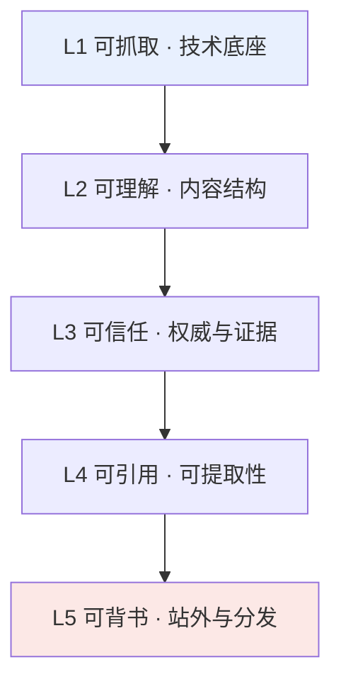

## 一句话先给答案（这就是 GEO 本身）

**GEO（Generative Engine Optimization，生成式引擎优化）是指：通过内容、结构与站外信誉的系统性优化，让 ChatGPT、Perplexity、Google AI Overviews、豆包、DeepSeek 等生成式 AI 在回答用户问题时，更容易理解、信任并引用你的内容。**

它不取代 SEO，而是叠加在 SEO 之上的一层。传统 SEO 争的是"在结果页排到前面、被点击"；GEO 争的是"当 AI 直接把答案端给用户时，答案里有你、并注明来源是你"。([Search Engine Land](https://searchengineland.com/mastering-generative-engine-optimization-in-2026-full-guide-469142)、[Frase](https://www.frase.io/blog/what-is-generative-engine-optimization-geo))

你正在读的这一段，就是一次 GEO 实践：开门见山、40–100 字给出可被直接摘录的完整定义。为什么这么写，后文会拆开讲。

> 这是「GEO 生成式引擎优化」系列的**支柱篇（第 1/6 篇）**，负责把整张地图铺开。后续每一篇会钻进一个具体战场——原理、结构化实战、信任与背书、本博客深度复盘、度量与工具。

---

## 二、为什么流量在 2026 年"凭空消失"了

先看三个把人打醒的数字：

- **2026 年前四个月，美国 68.01% 的 Google 搜索以"零点击"结束**——用户看完就走，一个链接都没点。这个数字 2024 年还是 60.45%，两年涨了 12.5%。([Omnibound](https://www.omnibound.ai/blog/zero-click-search-statistics)、[SparkToro](https://sparktoro.com/blog/in-2026-less-than-one-third-of-google-searches-still-send-a-click/))
- **AI Overviews（Google 的 AI 概览）已经出现在约 20%–48% 的查询里，一旦出现，自然结果的点击率下降近 60%**；当 AI Overviews 出现时，零点击率飙到 83%。([Omnibound](https://www.omnibound.ai/blog/ai-seo-statistics))
- **贝恩（Bain）2025 年 2 月的研究：80% 的消费者至少 40% 的搜索已经依赖 AI 生成结果**，多个行业的自然流量因此下滑 15%–25%。([Contently](https://contently.com/2026/04/27/ai-overview-traffic-impact/))

换句话说：**搜索的默认交付物，正在从"一串蓝色链接"变成"一段 AI 写好的答案"。** 你辛苦写的文章，可能被 AI 读过、消化过、总结给用户了，但用户从没来过你的站——除非 AI 在答案里点了你的名。

这不全是坏消息。同一批研究也显示：**被 AI Overviews 引用的网站，自然点击反而多了 35%，转化率高出 4–9 倍。** AI 带来的转介流量（referral）增长很快，且质量更高。([Omnibound](https://www.omnibound.ai/blog/ai-seo-statistics)) 也就是说，被引用者拿走了大部分红利。GEO 要解决的核心问题只有一个：**如何成为那个"被点名"的人。**

### 用我自己的博客数据佐证

在写这篇之前，我刚把 [cubxxw.com](https://cubxxw.com) 的 Google Search Console 数据翻了个底朝天（老域名近三个月）：**852 次点击，87.8 万次曝光，平均点击率 0.1%，平均排名 13.2（第二页）。**

最扎心的是：曝光最高的那批关键词，全是和博客主题毫无关系的长问句（MBTI 测试、脑震荡、地方历史……），单词曝光两三千次、点击是 0。它们把整站 CTR 稀释到了 0.1%。而真正带来点击的，是精准的技术词：`hugo 博客`、`langgraph 架构`、`gpt researcher`、`go directives`。

这正是 GEO 时代的典型症状：**你有海量曝光，却没有"被选中"。** 曝光是站在人群里，被引用才是被点名发言。

---

## 三、GEO 为什么突然火，以及它的"阴暗面"

### 热度：一条新赛道

2026 年国内 AI 搜索用户规模突破 13 亿，DeepSeek 累计访问 12.8 亿、字节豆包月活超 1.2 亿。([IT之家](https://www.ithome.com/0/964/402.htm)) 用户获取信息的路径被彻底改写——从"主动检索网页"变成"AI 直接给答案"。于是 GEO 成了营销与内容行业公认的新蓝海，工具、服务商、白皮书、甚至概念股，一拥而上。

### 乱象：315 曝光的"AI 投毒"

但新赛道也长杂草。2026 年 3·15 晚会曝光了 **"AI 投毒"灰产链**：部分 GEO 服务商通过自媒体批量发布虚构软文"投喂"大模型，操纵推荐结果。一个完全不存在的"Allo-9 智能手环"，靠 11 篇虚构软文（8 篇"专家测评"、2 篇"行业排名"、1 篇"用户测评"）就在多个 AI 推荐里排到了前面。([量子位](https://www.qbitai.com/2026/03/388387.html)、[21经济网](https://www.21jingji.com/article/20260316/herald/8cf9afdb3bc8ba06b10b2f89aef3bc17.html))

这暴露了两件事：一是**大模型对内容来源的权威性/真实性判断仍有高危漏洞**；二是**行业标准与监管一度处于真空**。好在治理在跟上——2025 年 11 月 14 家企业发起《中国 GEO 行业发展倡议》，2026 年 2 月中国人工智能产业发展联盟（AIIA）发起《人工智能安全承诺：GEO 专项》，市场监管总局也把 AI 生成广告列入整治重点。([搜狐](https://www.sohu.com/a/997686348_460335))

### 结论：白帽 vs 黑帽的分野

黑帽 GEO（批量投毒、虚构内容）短期或许有效，但**风险高、不稳定、且正在被平台惩罚和监管收紧**。对个人博客和长期品牌来说，唯一可持续的是白帽长效路线：**用真实、权威、结构清晰的高质量内容，去赢得 AI 的引用。** 这也是本文之后所有方法的底线。

---

## 四、原理：AI 是怎么决定"引用谁"的

要优化，先得懂机制。现代 AI 搜索（无论 Perplexity、AI Overviews 还是带联网的 ChatGPT）大致是一套 **RAG（检索增强生成）** 流程：

这条链里，有三个你能施加影响的关口：

1. **检索（Retrieval）**：你的内容得先能被抓到、被索引。技术底座（可抓取、结构化）决定你有没有资格进候选池。
2. **重排（Ranking）**：AI 会偏爱**结构清晰、有数据、有来源、易于摘录**的内容。这是 GEO 方法论发力的主战场。
3. **引用（Citation）**：在多个来源里，AI 更愿意点名**权威、可信、且提供了"可机读证据"**的那个。

### 最硬的实证：普林斯顿 GEO 研究

GEO 这个词的"出生证明"，是普林斯顿等机构 2024 年发表于 KDD 的论文《GEO: Generative Engine Optimization》(Aggarwal et al.)。他们用 **GEO-bench** 框架、约 **1 万条查询、9 个数据集**，系统测试了 9 种内容改写策略对"在 AI 答案中可见度"的影响。([Princeton](https://collaborate.princeton.edu/en/publications/geo-generative-engine-optimization/)、[Stackmatix](https://www.stackmatix.com/blog/generative-engine-optimization-paper))

核心结论（记住这三个词，后面全靠它）：

| 最有效的优化手法 | 可见度提升 |
|---|---|
| **Statistics Addition**（加入统计数据） | 约 +25%~40% |
| **Cite Sources**（引用可信来源） | 约 +25%~40% |
| **Quotation Addition**（加入权威引语） | 约 +25%~40% |
| 综合运用 | 整体可见度提升 **22%–41%** |

一句话翻译：**AI 偏爱"带着可机读证据"的内容。** 数字、出处、引语——这些恰恰是 AI 在生成答案时最方便直接搬运、也最能给答案"背书"的零件。这条规律，是本文整个方法论的地基。

---

## 五、方法论框架：GEO 的五层模型

把零散技巧整理成一个能落地、能自查的框架。我把 GEO 拆成五层，从底到顶，**下层是上层的前提**：

### L1 · 可抓取（技术底座 —— 入场券）

如果 AI 爬虫抓不到、解析不了，后面全白搭。要点：

- **放行 AI 爬虫**：在 `robots.txt` 里显式允许 GPTBot、OAI-SearchBot、ChatGPT-User、ClaudeBot、PerplexityBot、Google-Extended，以及国内的 Baiduspider、Bytespider（豆包）、Sogou、YisouSpider。它们是你进入 AI 答案的"运货车"。
- **服务端渲染（SSR）优先**：很多 AI 抓取器不执行 JS。重度前端渲染的内容，在爬虫眼里可能是一片空白。静态站（如 Hugo）在这点上天然占优。
- **结构化数据（Schema/JSON-LD）**：`Article`/`BlogPosting`、`Organization`、`Person`、`BreadcrumbList`、`FAQPage`、`HowTo`，帮 AI 精确理解"这是什么、谁写的、讲什么"。
- **Sitemap 与新鲜度**：提交 `sitemap.xml`，重要内容保持更新并标注"最后更新时间"——AI 明显偏爱新鲜内容。([SEOTuners](https://seotuners.com/blog/generative-engine-optimization/generative-engine-optimization-best-practices/))

**关于 `llms.txt` 的冷静判断（2026 现状）**：这是个被高估的话题。Google 官方明确表态 Search 不使用 `llms.txt`，John Mueller 把它类比为早已作废的 keywords meta 标签；Ahrefs 对 13.7 万站点的研究发现 **97% 的 `llms.txt` 从没被 AI 爬虫读过**。**但**——Chrome 的 Lighthouse 13.3 已把 `llms.txt` 审计移入默认的"Agentic Browsing"类别，而它在**开发者工具链**（Cursor、Claude Code、Copilot、MCP）里确实被真实读取。([Search Engine Journal](https://www.searchenginejournal.com/google-says-llms-txt-is-purely-speculative-for-now/577576/)、[Ahrefs](https://ahrefs.com/blog/llmstxt-study/)) 结论：**`llms.txt` 现在对"搜索排名"几乎无用，但对"AI 工具/代理读你的文档"有用，成本又低，放着无妨，别指望它救命。**

### L2 · 可理解（内容结构 —— 让 AI 一眼看懂）

- **Answer-First / 开门见山**：每篇、每个小节的开头，先用 40–100 字给出可被直接摘录的完整答案，再展开。那段话往往就是被 AI 一字不差搬走的内容。（本文每一节都在这么做。）
- **问题式标题**：把 H2/H3 写成用户会问的原话——"GEO 是什么？""怎么让 ChatGPT 引用我？"AI 会把标题和查询做模式匹配，问题式标题的被引概率显著更高。这是对存量文章 ROI 最高的一处改动。([Search Engine Land](https://searchengineland.com/mastering-generative-engine-optimization-in-2026-full-guide-469142))
- **语义清晰、实体明确**：品牌名、人名、专业领域、地点写清楚，别用模糊指代。帮 AI 建立"实体—属性"的稳定认知。

### L3 · 可信任（权威与证据 —— GEO 的护城河）

这一层直接对应普林斯顿研究的结论，是最容易被忽视、也最能拉开差距的地方：

- **加统计数据**："根据某机构 202X 年数据，增长 X%"，并附真实链接。
- **引用可信来源**：给关键论断标注出处（就像本文密集的引用链接）。
- **加权威引语与一手经验**：真实作者信息、专家观点、你的第一手实践与踩坑。研究一再显示：**AI 更偏爱"第三方背书"胜过你自卖自夸的内容。** ([2Point Agency](https://www.2pointagency.com/blog/generative-engine-optimization-strategies/))
- **E-E-A-T**：经验（Experience）、专业（Expertise）、权威（Authoritativeness）、可信（Trust）。清晰的作者页、About 页、跨平台一致的身份信息，都是信任信号。

### L4 · 可引用（可提取性 —— 把内容做成"乐高零件"）

让 AI 能"抠出一块就用"：

- **列表、表格、步骤、对比**：结构化呈现比大段散文更容易被摘录。
- **独立答案块（standalone answer）**：每个小结论都能脱离上下文单独成立。
- **FAQ / HowTo schema**：把"问答"和"操作步骤"结构化，争取 SERP 富媒体与 AI 直接调用。
- **TL;DR 摘要**：文章头部放要点清单（我的博客用 `tldr` 字段实现，见下文案例）。

### L5 · 可背书（站外与分发 —— RAG 的隐藏变量）

AI 的"信任"很大程度来自**你在别处被怎么谈论**：

- **第三方引用与数字 PR**：媒体报道、行业提及、优质外链。
- **社区讨论**：Reddit、知乎、Hacker News、V2EX、掘金——AI 训练与检索都在吃这些语料。
- **多平台一致性**：官网、百科、社交、GitHub 的身份与描述保持一致，强化实体识别。
- **持续监控与迭代**：用提示词在各 AI 上测试自己的被引率，反哺内容（见第七节工具）。

---

## 六、以我的博客为例：把五层模型落到 cubxxw.com

理论讲完，上真家伙。我用自己的技术博客 [cubxxw.com](https://cubxxw.com)（Hugo + Netlify，中英双语）做一次逐层对照——**哪些已经做对、哪些还欠着**。

### 已经做对的（L1 技术底座基本满分）

在最近一次真实浏览器实测里，博客的 Lighthouse SEO 跑到了 **100 分**、Best Practices **100 分**。对照五层模型，L1 这层我确实下过功夫：

- **robots.txt 面向 AI 时代**：显式欢迎 GPTBot、OAI-SearchBot、ClaudeBot、PerplexityBot、Google-Extended，以及百度、字节（Bytespider/豆包）、搜狗、神马等国内爬虫。把 AI 当"新流量渠道"主动迎进来，而不是默认拦在门外。
- **四类结构化数据**：文章页同时输出 `BlogPosting`、`WebSite`（含站内搜索 `SearchAction`）、`Person`（含 `sameAs` 社交矩阵）、`BreadcrumbList`。
- **hreflang 正确**：`en / zh / x-default` 齐全，中英双语内容各自可被对应语言的 AI 检索。
- **多重出口**：`sitemap.xml` + `news-sitemap.xml` + `llms.txt` / `llms-full.txt` + JSON Feed + OPML。（`llms.txt` 我保留着，但按第五节的判断，不对它抱幻想。）
- **`tldr` 前置摘要字段**：我的文章 frontmatter 里有 `tldr` 数组，正文顶部渲染成要点清单——这本身就是 L2「Answer-First」+ L4「可提取性」的落地。你现在看到的这篇开头那串要点，就是它。

### 还欠着的（L2–L5 才是真战场）

技术底座满分，不代表 GEO 就赢了——它只是入场券。真实的 GSC 数据（平均排名 13.2、CTR 0.1%）说明：**我卡在"有曝光、没被选中"。** 对照模型，缺口在上面四层：

- **L2 结构**：不是每篇都严格「Answer-First」。要给核心技术文章的开头补 40–100 字的直接答案段（像本文这样）。
- **L3 信任**：很多技术笔记有一手经验，但缺少统计数据与外部引用的"证据密度"。按普林斯顿的结论，这正是 +25%~40% 可见度的来源。
- **L4 可引用**：需要给 How-to / "是什么" / 对比类文章补 **FAQPage / HowTo schema**，把已经写好的问答结构暴露给 AI。
- **L5 背书**：我在 GitHub、知乎、B 站有身份，但技术文章的站外讨论与外链偏少。核心文章需要主动去社区分发、沉淀讨论。

### 一个具体打法：区分"核心集群"与"噪声"

GSC 数据给了我一个反直觉的教训：**别被 87 万曝光冲昏头。** 那些高曝光的 MBTI / 脑震荡 / 地方史查询是噪声，不是机会。真正该重仓的是已经在被点击的技术集群：

- **Hugo 建站**：[《我的 Hugo 博客搭建》](/zh/engineering/posts/my-hugo/)（CTR 高达 10.4%，是我的标杆）、[《Hugo 进阶教程》](/zh/engineering/posts/hugo-advanced-tutorial/)
- **AI 工具与工程**：[MarkItDown](/zh/projects/markitdown/)（7.2 万曝光的英文流量王）、[mem0](/zh/projects/mem0/)、[LangGraph](/zh/projects/langgraph/)、[GPT-Researcher](/zh/projects/gpt-researcher/)、[NotebookLM](/zh/projects/notebooklm/)
- **Go 与工程实践**：[《自动化工具与 directives》](/zh/engineering/posts/directives-and-the-use-of-automation-tools/)、[TDD](/zh/projects/tdd/)

**策略：围绕这几个已验证有需求的主题做"主题集群"——一篇支柱长文 + 若干子文章 + 相互内链**，形成主题权威（topical authority），而不是四处撒网追噪声词。这也是我把这篇 GEO 文章设计成"支柱 + 系列"的原因：**用文章结构本身去示范 GEO。**

---

## 七、怎么知道 GEO 到底有没有效（度量与工具）

GEO 最反直觉的一点：**传统的"排名 + 点击"指标会失灵**，因为很多价值发生在"用户没来你站"的地方。得换一套度量：

1. **提示词测试法（最朴素也最直接）**：在 ChatGPT、Perplexity、豆包、DeepSeek 上，用真实用户会问的话去问（如"推荐几个把文档转 Markdown 的开源工具""Hugo 博客怎么做 SEO"），看答案里**有没有你、引没引用你**。定期跑一批固定提示词，追踪被引率变化。
2. **AI 转介流量（referral）**：在 GA4 里看来自 `chatgpt.com`、`perplexity.ai`、`gemini.google.com` 等来源的流量与转化。这是 AI 已经在替你导流的直接证据。
3. **GSC 交叉验证**：虽然 GSC 不直接报"AI 引用"，但"高曝光低点击"的页面，往往正是被 AI 摘走答案的页面——反过来提示你哪些内容该做 Answer-First 与 schema。
4. **专业 GEO 监测工具**：如 **Profound**（企业级，监测 ChatGPT/Claude/Perplexity/AI Overviews/Gemini/Copilot/DeepSeek/Grok 等 10+ 引擎，红杉 3500 万美元 B 轮）、**Peec AI**（德国，prompt 级可见度追踪，多语言）等，能规模化追踪跨平台被引率与"声量份额（share of voice）"。([Frase](https://www.frase.io/blog/the-10-best-ai-visibility-tools-in-2026)、[Stackmatix](https://www.stackmatix.com/blog/geo-tools-guide)) 个人博客未必要付费，但了解它们量的是什么，能帮你自建土办法。

**核心心态**：GEO 的效果因行业、竞争、模型更新而波动，**不是一劳永逸**。它是"持续测量—迭代内容"的循环，不是一次性工程。

---

## 八、风险、伦理与长效主义

一句话立场：**别投毒。**

黑帽 GEO（批量虚构软文、操纵大模型）在 315 之后已经是明牌的高危区。平台在补漏洞、监管在收紧、行业在立规。更重要的是：**投毒得来的"可见度"建立在虚假之上，一旦模型更新或被识别，会连本带利地崩掉，还可能连累你的真实身份信誉。**

白帽 GEO 慢，但复利。真实的一手经验、扎实的数据与引用、清晰的结构、跨平台一致的身份——这些既是给 AI 的信号，也是给人的价值。**当你把"值得被引用"这件事本身做扎实，GEO 只是水到渠成的副产品。**

---

## 九、30 / 60 / 90 天落地清单

把方法变成动作。以下是我给自己排的表，你可以照抄改数字：

**第 1–30 天 · 打地基 + 立即止血**
- [ ] 核对 `robots.txt` 放行全部主流 AI 爬虫（国内外）。
- [ ] 给 Top 10 流量文章补「Answer-First」开头（40–100 字直接答案）。
- [ ] 给 3–5 篇 How-to / "是什么" 文章加 `FAQPage` / `HowTo` schema。
- [ ] 重写高曝光低 CTR 页面的标题与 description（含数字/结果承诺）。

**第 31–60 天 · 加证据 + 提信任（L3）**
- [ ] 给核心文章补统计数据 + 外部引用来源（对标普林斯顿的 +25%~40%）。
- [ ] 完善作者页 / About 页 / 跨平台身份一致性（实体信号）。
- [ ] 建立一份"固定提示词清单"，每周在 ChatGPT/Perplexity/豆包 上测被引率。

**第 61–90 天 · 做集群 + 铺背书（L4/L5）**
- [ ] 围绕 2–3 个已验证主题（如 Hugo / AI 工具 / Go）建"支柱 + 子文 + 内链"集群。
- [ ] 把核心文章主动分发到知乎 / Reddit / Hacker News / 掘金，沉淀外部讨论与外链。
- [ ] 复盘 AI 转介流量与被引率曲线，砍掉噪声、加码有效主题。

---

## 十、常见问题（FAQ）

**Q：GEO 会取代 SEO 吗？**
A：不会。GEO 是 SEO 之上的新增层。强自然排名仍是被 Gemini / AI Overviews 引用的前提。二者共用同一套内容资产，是"补充"而非"替代"。([GenOptima](https://www.gen-optima.com/geo/generative-engine-optimization-best-practices-2026/))

**Q：GEO、AEO、AI Search Optimization 是一回事吗？**
A：高度重叠。AEO（Answer Engine Optimization）更强调"回答引擎"，GEO 更强调"生成式引擎"，实践手法（Answer-First、schema、权威证据）基本一致。不必纠结命名，抓住"让 AI 理解、信任、引用你"这个内核即可。

**Q：最快见效的一件事是什么？**
A：把重点文章的开头改成「Answer-First + 问题式标题」。这是对存量内容 ROI 最高、成本最低的一处改动。([Search Engine Land](https://searchengineland.com/mastering-generative-engine-optimization-in-2026-full-guide-469142))

**Q：`llms.txt` 到底要不要做？**
A：可以做，成本低，但别抱幻想。对 Google Search 排名当前几乎无用；对 AI 开发者工具（Cursor、Claude Code、Copilot）读你的文档有用。属于"顺手就做、不做也不亏大"的项。

**Q：个人博客做 GEO 有意义吗？**
A：非常有。个人博客往往有稀缺的一手经验与真实踩坑——这正是 AI 偏爱引用的"原创信号"。你不需要大预算，需要的是真实、结构化、可被引用。

---

## 结语与系列预告

搜索的形态在变，但底层规律没变：**价值会流向那些真正值得被信任、被引用的内容。** GEO 不是一套投机取巧的黑话，而是"把好内容做得让机器也能读懂、也愿意背书"的工程。

这是「GEO 生成式引擎优化」系列的支柱篇。接下来我会分篇钻进每一层，并用我博客的真实改造数据持续复盘：

- **第 2 篇 · 原理**：AI 到底怎么检索、重排、引用——把 RAG 与被引信号讲透。
- **第 3 篇 · 结构化实战**：Answer-First、schema、`llms.txt` 的正确姿势与代码。
- **第 4 篇 · 信任与背书**：E-E-A-T 与站外分发的具体打法。
- **第 5 篇 · 本博客深度复盘**：用 GSC 数据驱动的一次 GEO 改造全过程。
- **第 6 篇 · 度量与工具**：搭一套低成本的"被引率"监测。

如果你在做个人博客、开源项目或品牌内容，欢迎顺着这个系列一起把 GEO 从概念做成动作。

---

*本文数据与结论来源：普林斯顿 GEO 研究（KDD 2024）、SparkToro / Omnibound / Bain 的零点击与 AI 流量研究、Search Engine Land / Frase / Ahrefs 的 2026 GEO 与 llms.txt 分析、央视 315 及国内 GEO 治理报道，以及我对 cubxxw.com 的 Google Search Console 与 PageSpeed Insights 真实实测。相关链接均已在文中标注。*
