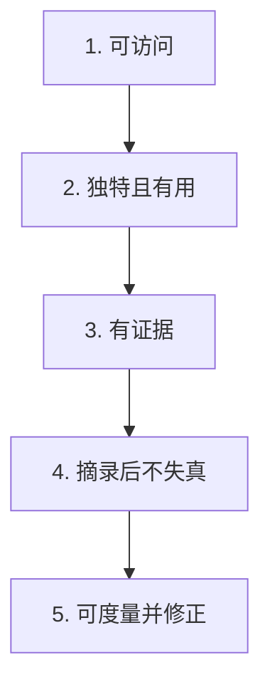

## 先给短答案

**生成式引擎优化（GEO）是一个工作标签：当 AI 辅助搜索生成答案时，让内容具备被访问、被理解、被选择和被正确归因的条件。它不是一个统一的排名算法，也不是一套特殊标记技巧。**

Google 的官方立场很克制：AI Overviews 与 AI Mode 建立在核心 Search
排名和质量系统上，没有额外技术门槛，也不需要特殊优化。其他产品使用不同的检索链路与 crawler 控制，因此，负责任的 GEO 实践应该先说清楚具体系统，而不是把所有产品笼统称为“AI”。

我现在用 GEO 审视五个问题：

1. 相关系统能否访问页面？
2. 页面是否提供了独特而有用的内容？
3. 关键结论能否核验？
4. 一段内容被摘录后，是否仍保留使它成立的条件？
5. 我能否度量实际发生的事，而不虚构因果关系？

这没有“改三个标题就赢得 AI 搜索”那么刺激，却更接近证据真正能够承担的结论。

> 这是「GEO 生成式引擎优化」系列第 1/6 篇，负责建立证据边界与工作模型。后续章节可以深入机制与实践，但不应把早期研究扩大成普遍定律。

## 搜索改变了什么，又没有改变什么

点击确实受到压力，但每个数字都必须带着分母和日期。

[Pew Research Center 的 2025 年 3 月研究](https://www.pewresearch.org/short-reads/2025/07/22/google-users-are-less-likely-to-click-on-links-when-an-ai-summary-appears-in-the-results/)
分析了 900 名同意分享浏览活动的美国成年人产生的 68,879 次 Google 搜索。其中约
18% 出现 AI summary；出现 summary 时，用户在 8% 的访问中点击传统结果，没有 summary
时则是 15%。用户点击 summary 内部来源链接的比例只有 1%。

这组数据支持一个有限结论：在该样本和时间段里，AI summary 的出现与更少的外部点击相关。它不能证明所有查询类型、国家与后续版本都遵循相同比例。

[Bain 在 2025 年 2 月发布的分析](https://www.bain.com/insights/goodbye-clicks-hello-ai-zero-click-search-redefines-marketing/)
来自另一组调查：约 80% 的受访者会在至少 40% 的搜索中依赖 zero-click result，Bain
估计相关场景的自然流量可能下降 15%–25%。其底层 Bain–Dynata 调查于 2024 年 12 月进行，样本量为 1,117。

它们证明用户行为正在改变，却不能推出“只要被 AI 引用，网站就会获得某个固定转化倍数”。旧稿里 68.01%、35% 和 4–9 倍等数字来自营销资料的二手汇总，我无法核验统一口径，因此不再保留。

没有改变的部分同样重要。搜索仍需发现、索引并评估页面。Google 明确说明，其生成式功能使用包括 RAG 与 query fan-out 在内的核心 Search 系统；页面必须已被索引，并且有资格显示 snippet。原创、有用、以人为先的内容，仍然比某种“AI 格式”重要。

至少要把四个结果分开：

- 内容出现在生成答案中的可见度；
- 页面获得明确归因或链接；
- 用户通过归因产生访问；
- 访问最终形成业务结果。

它们可能相关，却不能互相替代。

## GEO 原论文真正证明了什么

Aggarwal 等人的 KDD 2024 论文《[GEO: Generative Engine Optimization](https://arxiv.org/abs/2311.09735)》正式提出了这个术语。论文构建包含 10,000 条多领域查询的 GEO-bench，并测试了九类来源文本修改方法。

标题级结论是真实的：在作者构造的生成式引擎实验中，部分方法让来源**可见度最高提升约 40%**。加入引用、引语或统计数据经常有效，而且不同领域的效果差异明显。

但边界同样重要：

- visibility 使用 position-adjusted word count 与模型评分的 subjective impression 等指标衡量，不等于“当前产品引用此页面的概率”。
- 主实验通过检索来源并由 `gpt-3.5-turbo` 生成答案；2026 年的生产系统并不共享一条固定流水线。
- Perplexity 实验只有 200 个样本。研究者无法指定线上检索 URL，因此通过文件上传提供来源。quotation addition 在一个指标上提升 22%，statistics addition 在另一个指标上最高提升 37%。
- 组合实验同样只使用 200 个样本。最佳组合比最佳单一策略高约 5.5%；包含 cite sources 的组合在所选指标上平均提升 31.4%。
- 论文没有评估这些改写对普通搜索排名的影响，并明确提醒：生成引擎与查询分布变化后，方法也需要调整。

这是一组有价值的早期证据，但它没有授权我们承诺“增加三条权威引语，就能把 ChatGPT、Gemini 或 Perplexity 引用率提高 40%”。

我的实践结论更克制：可核验证据与相关引语可能让来源在答案合成阶段更有用，但效果必须按领域和产品重新测试。论文给出的是假设与评估方式，不是永不过期的配方。

## Crawler 是产品控制，不是排名魔法

旧稿把 GPTBot、OAI-SearchBot、ChatGPT-User、PerplexityBot 和
Google-Extended 放进同一张清单，称为把内容运进 AI 答案的卡车。这个比喻抹掉了重要的政策差异。

### Google

Google Search 使用 Googlebot。`Google-Extended` 不是独立 HTTP crawler，而是一个
robots token，用来控制已抓取内容能否用于部分 Gemini 模型训练，以及 Gemini Apps 与
Vertex AI 中的 grounding。[Google crawler 官方文档](https://developers.google.com/crawling/docs/crawlers-fetchers/google-common-crawlers)
明确说明，它不影响 Google Search，也不是 Search 排名信号。

### OpenAI

[OpenAI 发布者指南](https://help.openai.com/en/articles/12627856-publishers-and-developers-faq)
把搜索发现与潜在训练分开：希望内容进入 ChatGPT 搜索摘要和 snippet 的发布者，不应阻止
`OAI-SearchBot`；希望排除潜在训练使用的页面，则通过 `GPTBot` 表达政策。允许其中一个，不等于同意另一个。

### Perplexity

[Perplexity crawler 文档](https://docs.perplexity.ai/docs/resources/perplexity-crawlers)
把 `PerplexityBot` 定义为用于搜索结果索引与链接的 crawler；`Perplexity-User`
服务用户主动发起的页面访问，并因用户请求而通常不遵循 robots 规则。两者用途和执行方式不同。

正确的 `robots.txt` 可以保留准入资格，也可以表达发布政策。它不能让低质量页面自动获得权威；允许训练 crawler 也买不到一条引用。

## Google 明确说不需要什么

Google 当前的[生成式搜索优化指南](https://developers.google.com/search/docs/fundamentals/ai-optimization-guide)
直接澄清了几类常见 GEO 说法：

- Google Search 忽略 `llms.txt`；它既不提高，也不降低 Search 可见度与排名。
- AI Overviews 与 AI Mode 不需要特殊 Schema.org 类型。
- structured data 不是生成式搜索的必要条件。
- 不需要为了让 AI 理解而把文章拆成极小的“内容块”。
- 不需要把文字改成某种专供 AI 的句式。
- 伪造站外提及与为操纵生成结果批量制造页面，仍属于垃圾内容，而不是长效捷径。

Structured data 依然有普通用途。有效的 `Article`、`Person` 或面包屑标记，可以服务已有搜索功能，也有利于维护站点语义；它们只是不应被包装成直接打开 AI 引用的开关。

FAQ 和 HowTo 也需要同样的克制。Google 在 2023 年已经[弃用 HowTo rich result，并把 FAQ rich result 基本限制在权威政府和健康站点](https://developers.google.com/search/blog/2023/08/howto-faq-changes)。真实 FAQ 仍然可以帮助读者，但个人博客增加 `FAQPage` 并没有被证明能提高 AI Overview 引用率。

我只会在能说出明确消费者、且对方文档承诺读取时维护 `llms.txt`。“反正便宜”不是充分理由，因为它又增加了一份需要保持正确的内容资产。

## 一个五层工作模型

下面是我的工程检查表，不是经证明的排名因素清单：

```mermaid
flowchart TB
    L1["1. 可访问"] --> L2["2. 独特且有用"]
    L2 --> L3["3. 有证据"]
    L3 --> L4["4. 摘录后不失真"]
    L4 --> L5["5. 可度量并修正"]
```

### 第一层：可访问

先做好普通技术 SEO：返回成功状态，主要内容无需登录即可访问，避免意外 `noindex`，发布 sitemap，保持 canonical URL 稳定，并让真实设备上的页面可用。再按产品和用途分别决定 crawler 权限。

### 第二层：独特且有用

Google 当前最明确的建议，是创造 non-commodity、people-first 的内容：原创分析、亲手测试，或者普通摘要无法复制的经验与视角。

清楚的开头和描述性标题通常也帮助读者，我仍会使用。但我不再把它们称为普遍引用因素，也不再宣称问句标题“被引用得更多”。那需要受控实验，而不是 agency 博客的口号。

### 第三层：有证据

把内容分为三类：

- 外部可核验事实，链接到最接近的一手来源；
- 自己的测量，写清采集日期、范围和方法；
- 经验或解释，明确标成作者判断。

没有总体、时间和采集方式的数字只是装饰。不能支持相邻句子的引用更糟，因为它借来了权威，却没有传递证据。

### 第四层：摘录后不失真

表格、列表、定义和短摘要，可以让人和软件更容易浏览复杂材料；KDD 论文也为“让证据在合成阶段清晰可见”提供了有限实验支持。

可摘录不等于碎片化。一段文字只有保留使结论成立的条件，才真正可用。“某实验可见度指标最高约 40%”不能被缩成“引用增加 40%”。

### 第五层：可度量并修正

发现、归因、流量和业务结果必须分开记录。先保存基线，再改变一类因素，并留下足够上下文解释后续比较。引擎发生重大变化时，应把它视为新的数据阶段，而不是悄悄接在旧平均值后面。

第五层的任务，是防止前四层变成仪式。

## 不虚构因果地复盘我的博客

旧稿使用了老域名的一份私有 Google Search Console 快照：滚动三个月里有 852 次点击、878,000 次曝光、平均 CTR 0.1%、平均排名 13.2。高曝光查询里有不少与博客目标无关的 MBTI、医疗和地方历史问题；更相关的点击来自 Hugo、LangGraph、GPT Researcher 与 Go directives 等技术搜索。

这是一份关于本站查询构成的一手观察，不是 AI 系统搬运页面的证据。Search Console 的普通曝光与点击率不能说明模型是否检索或引用过页面。更准确的结论是：旧站可见范围很广，但其中相当一部分不属于我想服务的读者。

一次 Lighthouse 浏览器审计也曾得到 SEO 100 和 Best Practices 100。它只是一项配置冒烟测试，不是 GEO 分数；它能发现部分技术错误，不能证明权威、原创性、引用选择或用户价值。

更可靠的博客经验来自编辑选择：一小组技术页面持续吸引相关读者。

- Hugo：[博客搭建记录](/zh/engineering/posts/my-hugo/)与[进阶 Hugo 笔记](/zh/engineering/posts/hugo-advanced-tutorial/)
- AI 工具与工程：[MarkItDown](/zh/projects/markitdown/)、[mem0](/zh/projects/mem0/)、[LangGraph](/zh/projects/langgraph/)、[GPT Researcher](/zh/ai-agent/posts/gpt-researcher/)、[NotebookLM](/zh/projects/notebooklm/)
- 工程实践：[自动化指令](/zh/engineering/posts/directives-and-the-use-of-automation-tools/)与[TDD](/zh/projects/tdd/)

下一步不是为每个关键词变体制造新页面，而是继续改进真正有直接经验的少数主题，修正过时结论，建立清晰内链，再观察读者与外部系统是否确实觉得它有用。

## 怎样度量 GEO 而不欺骗自己

### 1. 优先使用平台自己的报告

Google 2026 指南要求发布者通过 Search Console 的 **Generative AI performance report**
观察 Google Search 与 Discover 中的生成式表现，不应再从普通高曝光页面间接猜测。

对于外部访问，可以在分析工具里分别记录 ChatGPT、Perplexity 等 referrer，并独立观察后续行为。referral 只能证明一次访问，不能还原具体答案和引用。

### 2. 用重复 prompt 审计答案

固定 prompt 集很有用，但一次运行不构成测量。至少保存：

- 完整 prompt 与目标意图；
- 产品、可见的模型或模式、地区、账户状态与日期；
- 多次重复结果；
- 本站是否被检索、是否被引用、是否被准确表达；
- 被引用的段落，以及它是否真的支持生成结论。

模型与索引变化会造成数据断点。应该报告断点，而不是把它藏进平均值。

### 3. 把改变写成可推翻的假设

“增加直接摘要”“替换二手来源”“发布亲手基准”都是可测试的干预。只修改有限页面，保存修改前状态，并提前说明什么结果会反对这条假设。

第三方 visibility 工具可以自动采集，却无法访问平台私有排名系统。使用之前要检查其抽样、重复次数与归一化方式，不能把 share-of-voice 图表当作真相。

## 30 / 60 / 90 天工作流

### 第 1–30 天：准入与证据盘点

- [ ] 检查索引、canonical URL、sitemap 覆盖与页面渲染。
- [ ] 按 Search、用户主动 fetch 和训练三种目的审查 crawler 政策。
- [ ] 找出已经服务目标读者的十篇核心页面。
- [ ] 标记无来源数字、过时产品说法和二手引用。
- [ ] 从平台一手报告保存带日期的基线。

### 第 31–60 天：先改善内容本身

- [ ] 把重要二手结论换成一手来源。
- [ ] 增加普通摘要无法复制的亲手经验。
- [ ] 重写含混段落，让结论被摘录时仍带着边界。
- [ ] 围绕两三个真实主题改善站内链接。
- [ ] 建立带版本、可重复运行的小型 prompt 审计集。

### 第 61–90 天：暴露并学习

- [ ] 发布改进后的页面并记录发布日期。
- [ ] 把内容交给真实社区质疑，而不是制造虚假提及。
- [ ] 分别审查生成式报告、已验证引用、referral 与读者行为。
- [ ] 修正错误引用和过时结论。
- [ ] 停止无法产生可解释证据的动作。

这份时间表不承诺排名，只负责让实验可以审计。

## 伦理：先让来源值得引用

虚构评测、合成共识和批量页面，不是更高级的 GEO，而是在污染检索系统和人共同依赖的证据。它也可能违反平台垃圾内容与广告规则。

更持久的路径很慢：写下真实发生的经验，说明限制，链接一手证据，主动纠错，并在不制造讨论的前提下获得独立讨论。

我现在的标准很简单：如果一句话被单独摘进答案就会误导，它还没有准备好发布。优化首先是让来源足够诚实，能够承受摘录。

## 常见问题

### GEO 会取代 SEO 吗？

不会。对 Google Search 而言，官方指南把生成式搜索优化仍视为 SEO，因为 AI 功能依赖核心 Search 系统。在更广泛的产品市场中，GEO 仍可作为管理不同产品发现、归因和度量工作的总称。

### 每篇文章都应该用 40–100 字直接回答开头吗？

不应把它当成排名仪式。简洁开头能帮助读者，也能明确文章范围；有直接答案时可以使用，面对探索性问题或个人叙事时，不必为了制造可摘录块而压平复杂性。

### 个人博客要维护 `llms.txt` 吗？

只有在能指出明确消费者，且对方文档声明读取它时才需要。Google Search 会忽略它。决定发布后应持续保持正确，也不要把它算作排名工作。

### Structured data 会提高 AI 引用率吗？

没有通用证据支持这条结论。为普通搜索功能与可维护语义使用受支持的 structured data 即可；Google 明确说明，其生成式搜索不需要特殊 Schema。

### 最快的有效改变是什么？

找出页面最重要却缺乏支持的结论，用一手证据替换，或者诚实写出不确定性。即使任何引擎都没有改变答案，这也已经改善了内容。

## 结语

GEO 还很年轻，信心却经常跑在证据前面。本文旧版就犯了这个错误：它把一篇有潜力的论文、若干营销汇总、私有分析数据和产品传闻拼成了来源无法支撑的确定性。

纠正错误并不意味着放弃这个主题，而是实践这个主题声称重视的纪律：让页面可访问，写出独特内容，展示证据，保留限制，再分别测量每种结果，不假装它们彼此构成因果。

搜索界面还会继续改变。界面改变以后仍对人有用的来源，才是我愿意相信会复利的优化。

## 一手资料

1. [Google：生成式 AI 搜索优化指南](https://developers.google.com/search/docs/fundamentals/ai-optimization-guide)
2. [Google：AI features 与网站](https://developers.google.com/search/docs/appearance/ai-features)
3. [Google：crawler 与 Google-Extended](https://developers.google.com/crawling/docs/crawlers-fetchers/google-common-crawlers)
4. [OpenAI：发布者与开发者 FAQ](https://help.openai.com/en/articles/12627856-publishers-and-developers-faq)
5. [Perplexity crawler 文档](https://docs.perplexity.ai/docs/resources/perplexity-crawlers)
6. [Pew：Google AI summary 出现时的点击行为](https://www.pewresearch.org/short-reads/2025/07/22/google-users-are-less-likely-to-click-on-links-when-an-ai-summary-appears-in-the-results/)
7. [Bain：zero-click 搜索与 AI summary](https://www.bain.com/insights/goodbye-clicks-hello-ai-zero-click-search-redefines-marketing/)
8. [Aggarwal 等：GEO，KDD 2024](https://arxiv.org/abs/2311.09735)
9. [Google：FAQ 与 HowTo rich result 调整](https://developers.google.com/search/blog/2023/08/howto-faq-changes)
