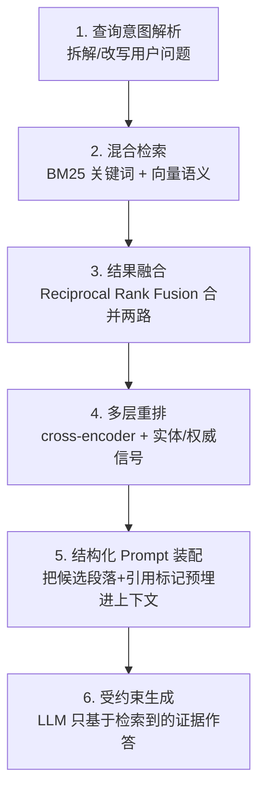

## 先给结论：你要赢的是"三关"，不是"一个排名"

**AI 搜索的底层是 RAG（Retrieval-Augmented Generation，检索增强生成）。一个问题进来，系统先去"检索"一批候选内容，再"重排"打分，最后让大模型"生成"答案并挑来源"引用"。GEO 要做的，就是让你的内容连闯三关：被检索到（进候选池）、在重排里被打高分（排到靠前）、在生成时被选为引用（被点名）。**

这三关的信号并不一样，很多人把 GEO 做失败，是因为只优化了第一关（能被抓到），却忽略了后两关。这一篇，我们把管线拆到零件级——你会看到，真正的优化对象不是"一篇文章"，而是"一个个段落"。

> 这是「GEO 生成式引擎优化」系列的**第 2 篇（原理篇）**。第 1 篇（[支柱篇](/zh/ai-agent/posts/geo-generative-engine-optimization-guide/)）铺开了五层模型与整张地图；这一篇负责把其中最关键的"AI 怎么选人"讲透，后面几篇才好谈怎么落地。

---

## 把 RAG 管线拆开：以 Perplexity 为例的六步

Perplexity 的回答，来自一条大致六步的 RAG 流水线，这也是理解所有 AI 搜索的通用模板：([ZipTie](https://ziptie.dev/blog/how-perplexity-ai-answers-work/)、[AuthorityTech](https://authoritytech.io/blog/how-perplexity-selects-sources-algorithm-2026))

几个必须记住的细节：

- **混合检索 = 关键词 + 语义双路**。一路是 **BM25**（老牌的词面匹配，认字），一路是 **dense embedding 向量检索**（认意思）。两路结果用 **RRF（Reciprocal Rank Fusion）** 按各自排名融合。([ZipTie](https://ziptie.dev/blog/how-perplexity-ai-answers-work/)) 含义：你既要**命中关键词**，也要**语义相关**，两头都占才稳。
- **重排是三层筛子**：BM25+向量召回 → cross-encoder 交叉编码器精排 → 带实体与权威信号的 ML 重排。每一层都在淘汰候选，**一个段落要连过语义相关、新鲜度、结构质量、权威、参与度好几道关卡，才可能拿到引用位。** ([AuthorityTech](https://authoritytech.io/blog/how-perplexity-selects-sources-algorithm-2026))
- **引用是"预埋"的，不是"事后补"的**。Perplexity 在生成之前，就把候选段落、来源 URL、发布日期、引用标记一起塞进结构化 prompt——**引用位在"装配上下文"时就分配好了**，不是模型写完再贴链接。([ZipTie](https://ziptie.dev/blog/how-perplexity-ai-answers-work/)) 含义：你的内容能不能成为"被装进 prompt 的那一段"，才是胜负手。

---

## 认知转变①：检索单元是"段落"，不是"整页"

这是整篇最重要的一句话，值得单独成节：**AI 检索的是 chunk（段落/片段），不是你的整篇文章。** 系统把网页切成一块块，为每块算向量，然后在"向量空间"里找与问题最近的那些块。([Mersel AI](https://www.mersel.ai/blog/how-ai-search-algorithms-read-and-rank-content))

这带来一整套和传统 SEO 不同的直觉：

- **每个小节都要能"脱离上下文单独成立"**。如果一段话必须读完前三段才懂，它作为 chunk 被抠出来时就是残缺的，AI 不敢用。
- **段落长度有"甜区"**。实测显示，AI Overviews 偏爱 **134–167 词**的段落，**62% 被选中的内容落在 100–300 词区间**。([Stackmatix](https://www.stackmatix.com/blog/how-google-selects-ai-overview-sources)) 太短没信息量，太长不好摘。
- **一段只讲一件事**。语义单一的 chunk，向量更"干净"、匹配更准。把"是什么/为什么/怎么做"拆成独立段落，比糊成一大坨强。
- **标题是 chunk 的路标**。清晰的 H2/H3 帮系统切块、也帮它判断这块讲什么。

> 落到写作上：**把文章当成一盒乐高，而不是一块整浇的混凝土。** 每一块都要能被单独拿起来用。你现在读的这一节，就是一个自足的 chunk。

---

## 认知转变②：查询扇出，主词不再是唯一战场

Google 已公开确认 AI Overviews 依赖 **"查询扇出（query fan-out）"**：系统把用户的一个问题，拆成一批相关子查询**并行检索**，再把多路结果综合成答案。([Search Engine Land](https://searchengineland.com/guide/how-to-optimize-for-ai-overviews)、[Stackmatix](https://www.stackmatix.com/blog/how-google-selects-ai-overview-sources))

一个惊人的推论：**一个页面即使在主查询里排到第 40 位，只要它精准命中了某个子查询，也可能被选进 AI Overview。** 而随着 Gemini 3 做更激进的查询扩展，扇出对来源选择的影响还在变大。([Stackmatix](https://www.stackmatix.com/blog/how-google-selects-ai-overview-sources))

对 GEO 的直接指导：

- **覆盖"问题的邻域"，而不只是主关键词**。一篇讲"Hugo 博客 SEO"的文章，应该顺带覆盖"Hugo 怎么加 sitemap""Hugo 结构化数据怎么配""Hugo 图片懒加载"等子问题——每个子问题都是一张进入扇出的门票。
- **FAQ、子标题、相关实体**天然适配扇出。把用户会追问的问题显式写成小节，等于主动认领多个子查询。
- **深度 > 数量**。与其写十篇浅文章，不如把一个主题写透，覆盖它的整片子问题邻域（这也呼应第 1 篇说的"主题集群"）。

---

## 认知转变③：向量语义匹配，为什么"说人话"有效

传统 SEO 是**词面匹配**：你得出现用户搜的那个词。AI 检索是**语义匹配**：内容被编码成向量（几百上千个数字组成的"意义坐标"），系统找的是**意思最近**的段落，而不是字面最像的。([Mersel AI](https://www.mersel.ai/blog/how-ai-search-algorithms-read-and-rank-content))

这解释了几件事：

- **问题式标题为什么有效**：用户的提问也被编码成向量，"GEO 是什么？"这样的标题，和"什么是生成式引擎优化"的查询在向量空间里离得近。
- **同义词与自然表达为什么重要**：你不必堆某个精确关键词，把概念的多种自然说法都覆盖到，反而扩大了语义命中面。
- **关键词堆砌为什么失效甚至有害**：机械重复不会让向量更"接近意义"，只会让文本读起来像垃圾，反而拉低质量信号。

**但注意**：混合检索里还留着 BM25 那一路词面匹配。所以最优解是——**用自然语言写清楚概念（喂向量），同时自然地包含核心术语（喂 BM25）**，两路都不落下。

---

## 被检索 ≠ 被引用：最后一关看什么

进了候选池、甚至排得靠前，也不等于会被写进答案。**引用是独立的一关**，它综合看六个维度：([Wellows](https://wellows.com/blog/google-ai-overviews-ranking-factors/))

> **话题权威（topical authority）、E-E-A-T、内容全面性、结构化格式、页面级信任、站点级权威**——六者共同作用，缺一块就容易在最后一步被刷掉。

几个能量化的规律，直接告诉你力气往哪使：

- **语义完整度 8.5/10 以上的内容，被引概率高 4.2 倍。** ([Stackmatix](https://www.stackmatix.com/blog/how-google-selects-ai-overview-sources)) "语义完整"= 这一段把一个问题回答完整了，不留悬念。
- **带近期统计数据、同行评审来源、一线权威引用的内容，被选中概率高 89%。** ([Stackmatix](https://www.stackmatix.com/blog/how-google-selects-ai-overview-sources)) 这与第 1 篇引用的普林斯顿结论（加统计/引用/引语 = +22~41% 可见度）完全一致——**"可机读证据"是引用阶段的硬通货。**
- **排名护城河正在瓦解**：AI Overviews 的引用里，来自搜索结果前十名页面的比例，已经**从 76% 掉到 38%**。([ALM Corp](https://almcorp.com/blog/google-ai-overview-citations-drop-top-ranking-pages-2026/)) 换句话说，**AI 越来越愿意从排名靠后但段落质量高的页面里抠答案**——这对内容扎实、排名还没上来的个人博客，是天大的好消息。

---

## 五大战场的机制差异（同一原理，不同脾气）

原理都是 RAG，但每个平台的"口味"不同，优化侧重也不同：

| 平台 | 检索来源 | 脾气与侧重 |
|---|---|---|
| **Google AI Overviews** | 绑定 Google 索引 + 查询扇出 | 传统 SEO 基础仍是前提；但段落质量/话题权威权重上升，前十名不再垄断引用 |
| **Perplexity** | 实时联网 + 自建检索 | 最"重检索、重引用"，几乎每句带出处；结构化、数据密度、新鲜度回报最高 |
| **ChatGPT Search** | Bing 索引 + OpenAI 自有 | 兼顾检索与模型记忆；实体清晰、权威背书重要 |
| **Gemini** | Google 生态 | 与 AI Overviews 同源，扇出更激进 |
| **豆包 / DeepSeek / Kimi** | 各自索引 + 国内语料 | 中文语料、国内平台（知乎/公众号/B站）的背书更关键；`robots` 需放行 Bytespider 等 |

**共性大于差异**：无论哪个平台，"自足的高质量段落 + 可机读证据 + 权威信号"都是通吃的。差异主要在**分发渠道**（国内要重视知乎/公众号，国外要重视 Reddit/官方文档）——这留到第 4 篇"信任与背书"细讲。

---

## 把原理翻译成动作：chunk 级自查清单

读懂机制，最终要落到每一段怎么写。下面这张表，是把本篇的原理压缩成的可执行清单：

- [ ] **段落自足**：每个小节能脱离上下文单独读懂了吗？
- [ ] **长度甜区**：核心答案段控制在 100–300 词（约 150–450 汉字）了吗？
- [ ] **一段一事**：这段是不是只讲了一个明确的点？
- [ ] **证据密度**：有没有至少一个数字 / 来源 / 引语？
- [ ] **问题式标题**：H2/H3 是用户会问的原话吗？
- [ ] **子问题覆盖**：主题下的常见追问，有没有各自成节（喂查询扇出）？
- [ ] **自然语言 + 术语并存**：既说人话喂向量，又含核心术语喂 BM25？
- [ ] **实体清晰**：品牌/人名/工具名写全，没用模糊指代？

---

## 回到本博客：哪些 chunk 友好，哪些不友好

拿我自己的文章对照，机制立刻照出问题：

- **友好的例子**：[《我的 Hugo 博客搭建》](/zh/engineering/posts/my-hugo/) 之所以有 10.4% 的高点击率，正因为它天然是"一个个可独立取用的操作段落"——每一步都自足、带命令、单一主题，既好被检索也好被引用。
- **不友好的例子**：我的一些"思考笔记"长文，段落之间强依赖上下文、缺数字与来源，作为 chunk 被抠出来时是残缺的——这也解释了为什么它们能蹭到海量曝光（词面碰上了），却几乎零引用零点击（段落经不起被单独拿出来用）。

**改造方向很清楚**：给核心技术文章的每个小节补一句"自足的结论 + 一个证据"，把长文拆成乐高块。这不是重写，是"重排版 + 补证据"，ROI 极高。下一篇（第 3 篇·结构化实战）就手把手做这件事——Answer-First 段落、FAQ/HowTo schema、`tldr` 与内链的具体写法和代码。

---

## 常见问题（FAQ）

**Q：我排名不高，是不是就没戏被 AI 引用？**
A：恰恰相反。AI Overviews 里来自前十名页面的引用占比已从 76% 跌到 38%，RAG 经常从第 4–20 位、甚至更靠后但**段落质量高**的页面里抠答案。排名是加分项，不是入场券。([ALM Corp](https://almcorp.com/blog/google-ai-overview-citations-drop-top-ranking-pages-2026/))

**Q：一篇文章多长合适？**
A：文章整体要"全面覆盖话题"，但**被引用的是其中的段落**，核心答案段的甜区是 100–300 词。策略是：整篇够深够全（喂话题权威 + 查询扇出），内部每段够短够自足（喂 chunk 检索）。

**Q：向量检索时代，关键词还重要吗？**
A：重要，但不是唯一。混合检索里 BM25 词面匹配那一路还在。最优解是自然语言讲清概念 + 自然包含核心术语，别做机械堆砌。

**Q：query fan-out 我该怎么利用？**
A：把主题下用户会追问的子问题，各自写成一个带问题式标题的小节。每个子问题都是一张进入扇出、被并行检索的门票。

---

## 小结与下一篇

这一篇的核心，浓缩成三句话：**AI 检索的是段落不是整页；查询扇出让子问题和长尾同样值钱；被引用靠的是可机读证据与话题权威，而不再只是排名。** 把这三条刻进写作习惯，你的内容就从"能被读到"升级为"值得被引用"。

- **上一篇**：[GEO 支柱篇 —— 五层模型与整张地图](/zh/ai-agent/posts/geo-generative-engine-optimization-guide/)
- **下一篇（第 3 篇·结构化实战）**：Answer-First 段落怎么写、FAQPage/HowTo schema 怎么加、`llms.txt` 与 `tldr` 的正确姿势——把这一篇的原理，变成可以复制粘贴的代码与模板。

---

*本文机制与数据来源：Perplexity RAG 管线分析（ZipTie、AuthorityTech）、Google AI Overviews 来源选择研究（Search Engine Land、Stackmatix、Wellows、ALM Corp）、AI 检索原理科普（Mersel AI），以及我对 cubxxw.com 的真实 GSC 数据观察。链接均在文中标注。*
