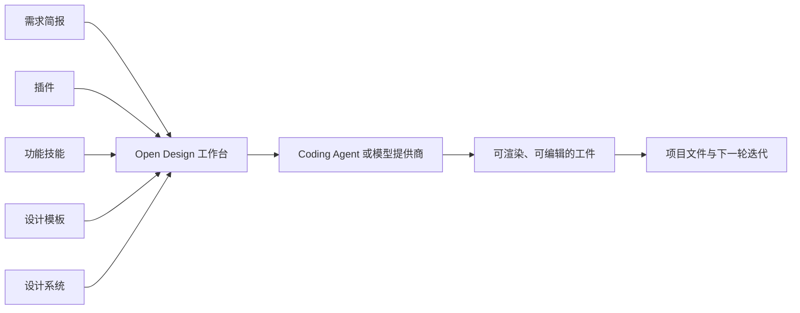

Open Design 很容易被名字带偏。这个词也指更早的开放式设计运动，但本文讨论的是 [`nexu-io/open-design`](https://github.com/nexu-io/open-design)：一个把 Coding Agent 组织成设计生产系统的开源工作区。

它不是模型，也不只是一个出图工具。更准确地说，它是一套 **harness——给能力加上边界、流程与反馈回路的工作台**。它为 Agent 准备可控的词汇、可复用的工作方法、视觉约束、工件迭代环，以及检查结果的地方。模型和操作者依然决定质量上限，Open Design 改善的是从意图走到成品的那段路。

> 本文固定在 [0.16.1 版本](https://github.com/nexu-io/open-design/tree/open-design-v0.16.1)，并于 2026 年 7 月 31 日对照项目当前的 [README](https://github.com/nexu-io/open-design/blob/main/README.md)、[QUICKSTART](https://github.com/nexu-io/open-design/blob/main/QUICKSTART.md)、[AGENTS.md](https://github.com/nexu-io/open-design/blob/main/AGENTS.md) 与[隐私政策](https://github.com/nexu-io/open-design/blob/main/PRIVACY.md)复核。目录和 provider 支持变化很快，动态细节请以实际安装版本为准。

## 一个更有用的理解方式

Coding Agent 本来就会写 HTML、CSS、React、SVG 或幻灯片代码。它真正欠缺的通常不是语法，而是连续性：没有稳定的 brief 与可复用的视觉规则，它会在每轮对话里重新发明一次设计。

Open Design 给这种能力套上一层可持续的结构：

1. 选择执行路径；
2. 选择可复用的设计知识；
3. 让 Agent 创建或修改一个工件；
4. 检查渲染结果；
5. 保留文件，回到普通开发工具里继续迭代。

所以，它最值得记住的观点并不是“AI 会设计”，而是一句更克制也更耐用的话：**当品味被写进文件，一部分品味就能被检查、携带和组合。**

## 四个平面，而不是一条万能提示词

0.16.1 把可用资源分成四个平面。日常表达里它们容易混在一起，职责却不同：

| 平面 | 承载的内容 | 回答的问题 |
|---|---|---|
| **插件（Plugins）** | 打包后的集成与可执行扩展 | 工作区能连接什么、运行什么？ |
| **功能技能（Functional skills）** | 某类任务可重复执行的步骤 | Agent 应该怎样完成这项任务？ |
| **设计模板（Design templates）** | 某种交付物的起始结构 | 第一个工件应该从什么形状开始？ |
| **设计系统（Design systems）** | 视觉 token、规则与品牌约束 | 结果应该持续呈现怎样的气质？ |



四者分开，比目录里究竟有多少项更重要。落地页模板可以规定页面分区，却不必规定品牌；设计系统可以限定字体与间距，却不必决定调研步骤；功能技能可以说明如何评审一个页面，却不负责提供页面的初始骨架；插件可以加入一种能力，却不必替所有项目决定用法。

关注点拆开以后，替换成本也随之降低：换设计系统无需重写工作流，换模板也不必丢掉品牌规则。对 Agent 产品而言，这种可替换性比“一个提示词包办一切”更接近工程。

### 为什么不再引用目录总数

项目迭代很快，README、已发布版本、远程目录与运行时界面未必在同一时刻显示相同数量。今天从 `main` 抄下来的数字，文章被搜索引擎收录时可能已经不适用于 0.16.1。

更可靠的规则是：

- 复现本文时，以 [0.16.1 源码树](https://github.com/nexu-io/open-design/tree/open-design-v0.16.1)为准；
- 选择资源时，以当前实例实际加载的目录为准；
- 把 README 上的数量当作发现线索，而不是稳定 API。

固定版本并非吹毛求疵。它是在描述一个产品，而不是转述一张不断移动的广告牌。

## 执行路径：本地是一种拓扑，不是一句承诺

Open Design 可以连接本机安装的 Agent CLI，也可以使用 Open Design Cloud，或者接入自行配置的模型提供商。BYOK 支持多个 provider，也支持兼容 OpenAI API 的端点。这使工作台不必绑定单一模型，但不代表每条执行路径都留在本机。

真正重要的是你选了哪条路径：

| 路径 | 可以留在本地的内容 | 可能离开本机的内容 |
|---|---|---|
| 本地 Agent + 本地模型 | 工作区状态、工件文件与模型流量 | 按设计无需外发，但仍取决于 Agent 和模型配置 |
| 本地 Agent + 托管模型 | 工作区状态与工件文件 | 提示词、选中的上下文和模型输出会进入 Agent 所用的 provider |
| BYOK 或远程 OpenAI-compatible 端点 | 工作区状态与工件文件 | 请求会发送到配置的端点 |
| Open Design Cloud | 未被工作流上传的本地文件 | 已启用云功能所需的数据 |

因此，“local-first”不能被改写成“数据永不离开电脑”。本地 daemon 仍然可能调用远程模型，本地 CLI 也可能把上下文发给自己的服务商。Open Design 无法替远程 provider 取消留存规则、区域路由、账单、配额或 rate limit。

BYOK 的价值是让操作者决定使用哪一个 provider、哪一个账户。它不是绕过服务商政策的捷径。

## 隐私与遥测：要分别问三个问题

项目的[隐私政策](https://github.com/nexu-io/open-design/blob/main/PRIVACY.md)比“零遥测”这种口号更精确。评估时应把三条通道分开：

1. **本地运行时状态。** 项目、配置及其他运行数据遵循应用的数据根目录约定。`OD_DATA_DIR` 用来选择根目录，运行时内部将其暴露为 `RUNTIME_DATA_DIR`。自动化脚本不应依赖某个想象中的 `.od` 固定路径；解析后的根目录才是契约。
2. **模型流量。** 如果选中的 Agent 或 provider 在远端，请求就会跨过对方的服务边界。隐私、留存与训练政策要阅读 provider 自己的条款。
3. **Open Design 遥测。** 产品分析可以选择退出；经过清理的安全与可靠性遥测仍然开启，用来发现故障和滥用，而不是把原始项目内容当作普通分析数据收集。

三者回答的是不同问题。关闭产品分析，不会把托管模型变成本地模型；反过来，使用本地模型，也不自动意味着所有可选的产品事件都已关闭。

我的做法是先给项目分类，再选择执行路径：

- 公开原型通常可以接受远程模型带来的速度；
- 客户材料需要明确检查 Agent 能读取哪些文件；
- 受监管或尚未公开的数据，优先考虑本地模型，并核验完整请求链路，而不是只相信“本地”两个字。

隐私来自拓扑与配置，不来自形容词。

## 本地模型与 SSRF 边界

daemon 会防御出站代理请求中的服务端请求伪造（SSRF），默认阻断私有和内部地址。对于允许配置任意端点的工具，这是合理的默认值，但也意味着本地 Ollama 或 LM Studio 地址第一次连接时可能被拒绝。

如果确实需要使用可信的内部模型主机，只把那个明确的主机加入 `OD_ALLOWED_INTERNAL_HOSTS`，不要笼统放开整个私网。更安全的顺序是：

1. 核对本地模型服务的准确主机名与端口；
2. 只允许这个主机；
3. 尽可能缩小服务监听范围；
4. 先在不含敏感资料的项目里测试，再扩大 Agent 的文件权限。

SSRF 防护不等于凭证永远不会泄露，也不能证明预览内容天然安全。它只守住一个边界。provider 权限、Agent 工具权限、项目范围和生成出来的浏览器代码，仍是彼此独立的边界。

## 设计系统究竟贡献了什么

四个平面里，我最看重设计系统。只对模型说“做得高级一点”，它往往会退回统计意义上的默认答案：巨大的渐变、可以互换的卡片，以及看似合理却没有立场的排版。

有用的设计系统会把形容词换成决定：

```markdown
## Typography
导航使用紧凑的 grotesk 字体；长文使用笔画对比明显的正文字体。
标题可以大，但不能占满整个首屏。

## Color
以暖纸色作底、墨色作正文，氧化铜色是唯一强调色。
强调色只用于状态变化和主要操作。

## Composition
每屏只保留一处不对称张力，不要把所有段落都做成居中堆叠。
留白用于分隔思想，不用于装饰视口。
```

这比一份 token 清单更有立场。Token 让选择可以重复，文字解释这些选择为何属于同一个整体；Agent 两者都需要。

更深一层看，类似 `DESIGN.md` 的文件不是判断力的替代品，而是被压缩后的判断力。源头若没有观点，再忠实的编码也只能得到稳定的平庸。

## 第一次运行，应该故意克制

安装与具体命令应跟随固定版本的 [QUICKSTART](https://github.com/nexu-io/open-design/blob/open-design-v0.16.1/QUICKSTART.md)，不要从一篇没有日期的文章里复制 shell 片段。运行时确认正常后，第一次实验保持小而清楚：

1. 创建一个不含机密文件的临时项目；
2. 确认哪一个 Agent 或 provider 会收到提示词；
3. 各选一个功能技能、设计模板和设计系统；
4. 用明确的受众与决策目标，只生成一个单页工件；
5. 信任预览以前，检查 HTML、依赖、链接与浏览器行为；
6. 每次只修改一个变量，才能知道结果受哪个平面影响；
7. 把接受的工件移入普通版本控制。

有效的 brief 说约束，不堆情绪词：

```text
为一个开发者工具制作单页版本说明。
受众：正在评估迁移的维护者。
决策：本季度是否采用版本 2。
无需滚动即可看到核心对比。
沿用已选设计系统，但把技术可读性放在首位。
不要使用图库图片、虚构证言或没有证据的性能结论。
```

最后一句对质量的帮助，通常大于重复五次“漂亮”。

## 它适合哪里，又不适合哪里

如果你已经在使用 Coding Agent，希望工件始终是可编辑文件，并且想让设计决定跨原型复用，Open Design 值得尝试。它也适合用来观察 Agent 产品如何分离能力、程序、结构与品味。

下面几种需求则不是它的强项：

- 成熟的多人实时画布协作；
- 不审计完整 provider 路径，却要求保证任何请求都不触达远程服务；
- 从空白 brief 自动得到成熟的品牌判断；
- 无需人工评审就能上线的像素级生产代码；
- 要求 `main`、固定 release 与云端交付始终拥有相同目录数量。

生成的代码仍是不可信代码。隔离预览、检查依赖、测试可访问性，并在部署前审查结果。Harness 可以收窄随机性，却不能把交付责任从人身上拿走。

## 我的结论

Open Design 最有意思的地方，不是它与某个知名设计产品的比较——这种比较很快会过期。更耐久的贡献是它的架构：把设计工作拆成四个可组合的平面，让每一层都能检查、版本化和独立替换。

这与 Agent 工程里更广泛的经验相合：模型正变得充裕，连贯的上下文仍然稀缺。真正有用的系统，会在两次提示之间保留决定，却不会急着把每个决定都焊死在代码里。

Open Design 0.16.1 不是一间装在盒子里的完整设计部，而是一张工作台。工作台不会替你提供品味，但它让品味终于有地方可以停留。

## 固定版本的参考资料

- [Open Design 0.16.1 源码树](https://github.com/nexu-io/open-design/tree/open-design-v0.16.1)
- [0.16.1 QUICKSTART](https://github.com/nexu-io/open-design/blob/open-design-v0.16.1/QUICKSTART.md)
- [当前官方 README](https://github.com/nexu-io/open-design/blob/main/README.md)
- [当前 Agent 仓库指引](https://github.com/nexu-io/open-design/blob/main/AGENTS.md)
- [当前隐私政策](https://github.com/nexu-io/open-design/blob/main/PRIVACY.md)
