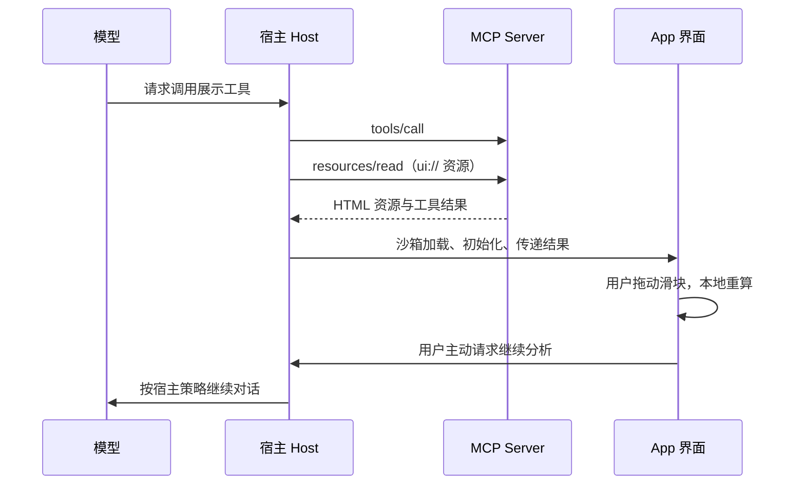

把下面的滑块从 32 拖到 48，会发生什么？

先保持默认的“大量工具结果”场景。窗口容量是 64，系统指令占 4，历史占 20，工具结果初始占 32。你只需要改变最后一项，看看剩余空间在哪里归零。



拖到 40，刚好装满；继续拖到 48，总需求变成 72，溢出 8。这里所有数字都是示意单位，不对应某个模型的真实 token 计数。即使你没有操作，这三组数也足够说明关系。

我在[《Context 不是 Prompt》](/zh/ai-agent/posts/context-engineering-the-new-foundation/#context-window)里已经用上了这个组件。原本需要在脑中完成的一次加法，现在可以在阅读现场试出来：工具返回更多内容，会挤占其他信息可用的空间。

这就是我想给博客增加的东西。读者读到一个关系，能顺手改一个条件，看看它还是否成立。

最初讨论这个想法时，我想到的是 Claude 里那些可以点击、切换的 Artifact，也想给自己的文章加入类似的呈现。但我给实现加了一条限制：**不额外维护后端。** AI 可以在写作时帮忙处理，发布出去的文章仍然是一组静态文件。

现在博客已经有上下文预算和 Agent 循环两类交互图解。沿着这两个小例子，可以往下拆出一条完整路径：作者选择要解释的关系，Agent 编写数据和程序，博客承载界面；如果操作还需要连接工具和对话，再进入 MCP Apps 的范围。

本文的博客实现以当前仓库为准，外部产品与协议说明核对于 **2026 年 9 月 24 日**。后面讨论的 MCP Apps 适配属于设计推演，当前博客没有接入 MCP 服务。

## 先找到一句值得让读者动手的解释

“给这篇文章加一点动画”，很容易把创作带向装饰。标题淡入、卡片移动、箭头闪烁，都能让页面显得忙碌，却未必让一个概念更清楚。

我更愿意从正文里挑一句话：读者理解它时，是否需要想象一个变化？

比如“工具输出会占用上下文”。它有一个明确的变化量：工具输出长度；有一个观察结果：剩余容量。这样的句子很适合做成滑块。

再比如“Agent 得到工具错误后，可以换一种行动继续”。读者需要分辨先后顺序：请求了什么、工具返回什么、下一步哪里变了。这更适合逐步播放。

如果要表达的是“系统由五个模块组成”，一张静态结构图可能就足够。若写的是一次经历和一个尚未想清楚的判断，文字也有自己的节奏，没必要把它改成选择题。

这种写法有很长的来路。Bret Victor 在 *Explorable Explanations* 中讨论过，让读者改变文章背后的假设并查看后果；他也强调，正文需要提供解释，不能把读者丢进一个沙盒，让人自己猜作者想说什么。[原文](https://worrydream.com/ExplorableExplanations/)

Nicky Case 的创作方法则从具体体验开始，再逐步进入抽象概念。对我来说，这个顺序很实用：先让人操作一个可理解的例子，再给刚才发生的事情一个名字。[创作方法原文](https://blog.ncase.me/how-i-make-an-explorable-explanation/)

交互文章并非 AI 出现后才有。AI 给我的机会，是把“这句话可以做成一个小实验”的想法，推进到代码、数据和页面。作者仍然要找到那句值得实验的话。

## 别人怎样把解释放进界面

我会把几类实践放在一起看，因为它们分别解决了创作、计算、发布和对话连接的问题。

**Red Blob Games 把图解拆成一条计算链。** 作者在制作笔记里给出的结构是：控件改变输入，算法得到输出，视图把输出画出来。这样，算法无需知道按钮长什么样，图形也不用承担全部业务逻辑。对博客最有用的借鉴，是先抽出可以独立验证的计算，再决定用条形图、SVG 还是其他形式表达。[Diagram structure](https://www.redblobgames.com/making-of/diagram-structure/)

**Observable Framework 把一部分工作提前到构建时。** 它的 data loader 可以在构建时读取、转换数据，产出静态文件，页面再读取这些文件。复杂的数据准备并不一定要在每个读者打开页面后重新做。这个思路适合基于某个日期的数据写文章：先保存经核对的数据快照，再让读者在快照上筛选、比较，同时明确快照时间。[Data loaders](https://observablehq.github.io/framework/data-loaders)

**Claude 把生成和修改界面放进对话。** 官方说明中的 custom visuals 使用 HTML，可以在回答里直接呈现，也能下载为 HTML 或 SVG。聊天里的部分点击还可以发送后续提示，因此“点一下有变化”可能包含本地交互，也可能把问题重新交给 Claude。[Custom visuals](https://support.claude.com/en/articles/13979539-custom-visuals-in-chat-and-cowork)

Artifacts 的范围更大。官方文档还描述了可调用 Claude、连接外部应用以及保存数据的 Artifact。因此，“创作者不用自己维护后端”和“运行时完全没有服务依赖”是两种不同情况；前者也可能由平台承担服务。[Artifacts 官方说明](https://support.claude.com/en/articles/9487310-what-are-artifacts-and-how-do-i-use-them)

**MCP Apps 则让工具可以提供自己的交互界面。** 它把 UI 资源与工具关联起来，由支持扩展的宿主加载和呈现。界面能展示工具结果，也能通过宿主请求进一步操作。它解决的是工具如何进入对话界面，和生成一份可下载的 HTML 有不同的职责。[MCP Apps 概览](https://modelcontextprotocol.io/extensions/apps/overview)

把这些实践放回自己的需求，选择就清楚一些：

| 我想交付什么 | 可以借鉴的方式 | 阅读或使用时依赖什么 |
|---|---|---|
| 对一个固定关系做实验 | Red Blob 式的输入、计算、视图分离 | 浏览器与确定性计算 |
| 探索一份经过整理的数据 | Observable 的构建时数据准备 | 静态数据快照及前端代码 |
| 在讨论中快速生成、修改界面 | Claude visuals / Artifacts | 取决于产物是否使用平台能力 |
| 在对话里操作工具结果并继续任务 | MCP Apps | 支持扩展的宿主、MCP 服务与授权 |

我的博客先选择了前两类能借鉴的部分：在创作阶段使用 AI，在发布阶段固定数据和实现，让每个读者得到同一份可检查的解释。

## 在生成页面之前，把这个小世界说清楚

上下文预算组件背后的计算很短：

```text
总需求 = 系统指令 + 历史 + 工具结果
剩余空间 = max(0, 容量 - 总需求)
溢出部分 = max(0, 总需求 - 容量)
```

真正影响解释是否准确的，是公式周围的约定。

容量固定吗？拖动工具结果时，历史会不会自动缩短？溢出后，图表是显示超出的部分，还是偷偷把所有色块重新缩放到 100%？这些选择会让读者得到不同的理解。

当前组件固定容量，不会自动压缩、删除历史，也不会让溢出凭空消失。因此，拖到 48 时，你能明确看到 8 的超额需求。这些行为可以在[计算函数](https://github.com/cubxxw/blog/blob/main/assets/js/components/model.mjs)中核对。

还有一条必须提前划出的边界：**容量计算不能预测回答质量。** 滑块越长，并不意味着我们已经模拟出模型会犯多少错误；空出更多空间，也不等于答案一定更好。这个实验只负责把容量关系解释清楚。

我会把这些约定一起交给写作 Agent。否则，它很容易补上看起来合理的效果：自动压缩动画、一个“回答质量分数”、随滑块变化的成功率。页面会更丰富，但那些新数字从哪里来，就变成了另一个问题。

这里可以形成一个很具体的分工：作者决定演示要支持哪一句解释，Agent 把已明确的规则落实为程序。遇到没有依据的部分，先保留空白。

## AI 参与创作，浏览器负责运行

前面的图解在你拖动时，没有向模型发送问题。

它的运作过程是：作者与 Agent 准备正文和数据；Hugo 构建出静态 HTML；浏览器加载一小段 JavaScript，根据滑块位置更新数字与图形。当前值只需要放在页面内存里，没有账户、数据库或每次点击产生的模型调用。

这也解释了为什么“不加后端”仍然能有交互。静态部署描述的是文件如何交付；浏览器拿到文件后，仍然能够执行计算、响应点击和更新页面。

我采用 Web Components 来封装这部分行为。它允许定义自己的 HTML 元素及其行为，适合把一个图解作为独立组件放进文章。Web Components 包含多种技术，这个实现使用自定义元素和普通 DOM，没有把 Shadow DOM 当成必选项。[MDN 文档](https://developer.mozilla.org/en-US/docs/Web/API/Web_components)、[博客组件源码](https://github.com/cubxxw/blog/blob/main/assets/js/components/context-budget.mjs)

在当前博客里，正文只需要这一行：

```go-html-template

```

`kind` 选择已有组件，`id` 是这篇页面里不重复的标识，`spec` 指向仓库中的演示数据。本文使用的就是 `data/interactive/context-window-v1.json`。具体字段和限制收在[交互组件指南](https://github.com/cubxxw/blog/blob/main/docs/interactive-articles.md)里。

这条 shortcode 依赖博客已经安装好的模板和组件，复制到一个空白 Hugo 站点不会自动生效。对自己的站点，可以让 Agent 先实现并验证一个组件，再逐篇复用；如果只想判断一个想法值不值得做，也可以先生成一个本地 HTML 原型，在浏览器里打开试试。

从对话中得到的 Artifact 同样需要经过这一步判断：它是否依赖特定平台、在线接口或外部资源，能否移到自己的站点。一个在聊天界面里跑起来的演示，还需要被整理成博客可以持续维护的资产。

这里也有一个容易误会的地方：自定义元素只是组织代码的方式，不提供运行未知代码的安全沙箱。当前方案使用经过检查、随站点发布的组件，没有把任意 AI 生成脚本直接当作文章内容执行。

## 一个 shortcode 后面，实际发生了什么

如果要照着实现，最值得看的文件并不多。下面这些路径都来自[当前博客仓库](https://github.com/cubxxw/blog)，职责分别落在内容、构建和浏览器三处。

```text
content/zh/ai-agent/posts/文章.md          正文与 shortcode
data/interactive/context-window-v1.json  场景、参数、双语文案、来源
layouts/shortcodes/interactive.html      校验引用，选择静态模板
layouts/partials/interactive/           静态图解、配置与资源输出
assets/js/components/model.mjs          不依赖 DOM 的计算与步进函数
assets/js/components/spec-schema.mjs    构建和浏览器共用的校验规则
assets/js/components/context-budget.mjs 状态、事件、DOM 更新
assets/css/components/                  图解样式
```

### 先约定数据，不让每篇文章重新生成组件

`context-window-v1.json` 中的计算部分长这样。这里只摘出相关字段，完整 spec 还必须有版本、类型、标识、双语文案和来源，不能拿这个片段直接替代完整文件。

```json
{
  "defaultScenario": "tool-heavy",
  "model": {
    "capacity": 64,
    "system": 4,
    "toolMin": 0,
    "toolMax": 48,
    "toolStep": 1
  },
  "scenarios": [
    { "id": "compact", "history": 8, "tools": 4 },
    { "id": "long-history", "history": 36, "tools": 16 },
    { "id": "tool-heavy", "history": 20, "tools": 32 }
  ]
}
```

数值模型与可见文案分开存放。翻译标题和观察提示时，公式不用跟着改；第二篇文章复用容量模型时，也不用生成第二份滑块代码。Agent 能修改的范围由文件和 schema 约束，错误类型、缺失语言或非法范围会被校验发现。[完整数据](https://github.com/cubxxw/blog/blob/main/data/interactive/context-window-v1.json)

这是一种有限的生成方式：给已经验证过的显示程序准备数据。只有新内容需要不同的计算或交互语义时，才增加组件类型。`agent-loop` 的事件序列和容量计算不同，所以它有自己的 `kind`；没必要为了统一，把所有内容都塞进一份任意 JSON，再交给通用页面生成器猜怎么画。

### 构建时就把能读的内容输出出来

shortcode 先检查 `kind` 是否在允许列表里、`spec` 是否对应本地数据、实例 ID 是否在页面中唯一，然后生成两份用途不同、来源相同的输出：

- 默认场景的静态 HTML，以及可展开的完整参考内容。
- 一个 `type="application/json"` 数据块，供浏览器增强交互时读取。

第一份让页面刚到达时就有解释。第二份让组件知道该用哪种语言、有哪些场景和参数。它们来自同一个 spec，但静态模板和浏览器仍有各自的渲染路径，因此测试还要核对两边计算出的默认值一致。[shortcode 实现](https://github.com/cubxxw/blog/blob/main/layouts/shortcodes/interactive.html)

数据嵌入 HTML 时还存在一个很具体的问题：即使 script 的类型是 JSON，内容中的结束标签也可能被 HTML 解析器识别。当前构建流程先进行 HTML 安全的 JSON 序列化，再输出数据块；浏览器使用 `JSON.parse` 读取，文本通过 `textContent` 显示。不能把模型给出的原始字符串直接标成“安全 HTML”。[配置输出](https://github.com/cubxxw/blog/blob/main/layouts/partials/interactive/config.html)

### 浏览器把一个静态图解升级成可操作的图解

组件挂载后读取配置，使用与构建阶段相同的 schema 再校验一次，绑定事件，完成第一次绘制，最后显示可操作控件。如果中间失败，就恢复静态内容。这样，一个脚本异常不至于让文章中间只剩空白。

滑块变化的实际路径可以缩成这样：

```text
input 事件
  → 将输入约束到合法范围和步长
  → 更新当前实例的滑块值
  → computeBudget(model, 当前场景的值)
  → 更新色块宽度、剩余量、溢出量和解释文字
```

比如在项目根目录运行下面的代码，就能绕开界面，直接复算本文的溢出结果。这调用的是仓库里的真实函数。

```bash
node --input-type=module <<'JS'
import { readFileSync } from 'node:fs';
import { computeBudget } from './assets/js/components/model.mjs';

const spec = JSON.parse(readFileSync(
  'data/interactive/context-window-v1.json', 'utf8'
));
const result = computeBudget(spec.model, { history: 20, tools: 48 });
console.log({
  used: result.used,
  remaining: result.remaining,
  overflow: result.overflow
});
// { used: 72, remaining: 0, overflow: 8 }
JS
```

这层拆分让我可以分别问两个问题：数字是否算对，以及数字是否被画对。AI 帮忙生成界面时，这种可分开检查的结构尤其有用。

状态保存在每个组件实例内部，查询元素也从实例根节点开始。同一篇文章放两个图解，它们不共享一个全局“当前步骤”。组件移出页面时释放事件监听和定时器，重新插入时恢复绑定；刷新页面则回到默认值。[组件与公共生命周期工具](https://github.com/cubxxw/blog/blob/main/assets/js/components/shared.mjs)

### 最后才决定这篇页面需要加载什么

shortcode 在渲染正文时登记使用的组件类型。正文处理完后，资源 partial 按类型输出一次 CSS 和 ESM 脚本，并做压缩与内容指纹。没有使用图解的文章不引入这些组件资源；同类型的多个实例也不重复加载脚本。这里是**按页面需要加载**，并非进入视口后才下载的懒加载。[资源装配实现](https://github.com/cubxxw/blog/blob/main/layouts/partials/interactive/assets.html)

这些细节共同决定了后续的创作成本。复用一个实例时，作者通常只动正文与数据；样式、计算、键盘操作和失败回退留在经过验证的组件里。

## 讲过程时，让读者停在某一步

容量适合拖动，过程适合暂停。

在[《Agent Engineering 全景地图》](/zh/ai-agent/posts/agent-engineering-the-98-percent-harness/#harness-agent-loop)里，我用了另一种图解。你可以切换“工具失败后恢复”，先走到工具报错，再看下一步的动作有没有改变；也可以切换“预算耗尽”，看序列如何结束。



这里的全部轨迹都由作者预先编写。决策说明是讲解文字，命令是不会执行的文本，切换场景也不会启动一个真实 Agent。读者控制的是观察过程：往前、往后、播放、暂停。

这种形式对教程有一个直接用途：**把需要注意的时刻交给读者掌握。** 看不懂工具结果时，可以停下来读；已经理解前半段，就继续到停止原因。它承担的是过程解释，不需要每次有人阅读都重新调用模型。

两种图解也有不同的能力。预算滑块会按照公式重新计算；循环图解播放的是已有序列。如果文章要讨论“改变重试策略后会怎样”，现有轨迹不能自动给出答案，需要补充有依据的对照场景，或者实现一个明确规则的模拟器。

我希望读者能够知道自己正在操作哪一种东西。计算器、预设回放、真实系统记录都可以有价值，但它们能支持的结论不同。标明这一点，比把演示做得像真的更重要。

## 界面设计要让读者看见变化的依据

回到页面本身，我把一个图解看作正文中可以操作的插图。它需要和上下文相连，初始画面就有值得看的结果，控件则紧贴它影响的对象。

当前预算图没有只靠红绿两种颜色区分结果。色块有纹理和文字，容量参照保持固定，超额需求另用溢出条呈现。读者把输入从 40 增到 48 时，图形尺度不跟着悄悄改变。这同时是视觉设计和计算表达的问题。[预算图样式](https://github.com/cubxxw/blog/blob/main/assets/css/components/context-budget.css)

Agent 图解采用“一个当前步骤，加一份完整轨迹参考”的结构。主区域专注当前事件，完整事件留在可展开区域。播放是用户主动启动的；离开视口或隐藏页面会暂停，不自动恢复。系统偏好减少动态效果时，保留手动步进，禁用自动播放。[循环组件实现](https://github.com/cubxxw/blog/blob/main/assets/js/components/agent-loop.mjs)

这些行为背后有几条可以复用的设计判断：

| 读者此刻需要什么 | 界面如何回应 | 实现要处理的事情 |
|---|---|---|
| 不操作也看懂例子 | 默认结果、单位与解释直接可见 | 构建时输出静态内容 |
| 知道哪个操作导致变化 | 控件靠近结果，保留固定参照 | 一次输入只更新约定的变量 |
| 仔细读某一步 | 上一步、下一步和暂停 | 显式保存步骤索引，有限序列到尾停止 |
| 比较全部场景 | 展开静态参考表或轨迹 | 参考内容独立于播放状态 |
| 顺畅继续阅读 | 不抢滚动、不自动播放、不突然跳高 | 同尺寸控件占位，资源失败时回退 |

Light DOM 让这些图解可以沿用博客的字体和主题变量，同时也要求 CSS 明确限定在组件根元素下面。如果把 UI 放入 iframe，它有独立文档，主题、尺寸、消息和可访问名称都要另行处理；安全边界还取决于同源关系、sandbox 和 CSP 配置。选择容器时，需要一起考虑这些实际工作。

对真实工具界面，还要在这套设计上增加等待、取消、权限拒绝、空结果和错误状态。这个要求正是从静态文章走到 MCP Apps 后最明显的变化。

## MCP Apps：让界面把操作交回工具与对话

假设我们把本文的预算图放进一个 Agent 对话：用户先请它解释上下文分配，随后在图里选择一组参数，再要求它分析这个选择。到这一步，界面需要和对话交换信息。

MCP Apps 提供了这种连接。这里要分清三个角色：**MCP Server 提供工具和 UI 资源，Host 负责对话与受控呈现，App 是被加载进去的前端界面。** 模型可以发起工具调用，但每次拖动滑块都让模型重新生成页面，并不是这套架构的必要条件。

### 工具如何找到自己的界面

假想一个名为 `show_context_budget` 的工具，它的声明可以带上这样的元数据。以下是协议结构示意，并非已经安装到本站的工具。

```json
{
  "name": "show_context_budget",
  "description": "打开上下文容量教学实验",
  "inputSchema": { "type": "object", "properties": {} },
  "_meta": {
    "ui": {
      "resourceUri": "ui://context-budget/view.html"
    }
  }
}
```

`ui://` 是 MCP 资源标识，不能当作普通网址填进浏览器的 iframe `src`。宿主通过 `resources/read` 获取对应 HTML；资源使用 `text/html;profile=mcp-app` 类型。工具执行结果与 UI 文件分开传递，界面可以重复用于不同结果。不支持该扩展的宿主仍需要有可用的文本工具结果。[MCP Apps 协议](https://github.com/modelcontextprotocol/ext-apps/blob/main/specification/2026-01-26/apps.mdx)

典型的数据流可以画成这样；宿主也可以提前获取 UI，因此它不必严格等待工具执行完才加载界面。



App 与宿主使用基于 `postMessage` 的 JSON-RPC 通信；工具服务和宿主之间则仍有自己的 MCP 连接。Web 宿主通常用沙箱 iframe 呈现 UI，并控制允许的外部资源与能力。前端并不因此获得任意访问宿主页面或执行工具的权力。[MCP Apps 架构说明](https://modelcontextprotocol.io/extensions/apps/overview)

### 同一个按钮，可以接向三种不同的处理

沿用预算图，我会把操作分成三个层次：

| 用户操作 | 处理位置 | 是否需要模型继续生成 |
|---|---|---|
| 把工具结果从 32 拖到 48 | App 内本地计算、更新图形 | 不需要 |
| 点击“读取另一份预算数据” | 经宿主调用服务工具 | 工具调用本身不要求模型推理 |
| 点击“请解释我当前的选择” | 将必要状态和用户问题交给宿主对话 | 由宿主决定如何继续 |

这不是三个皮肤不同的按钮。它们有不同的延迟、权限和失败方式。第一个应当立即反馈；第二个要显示等待与错误；第三个应让用户知道哪些信息会交回对话。

官方 SDK 用 `App` 封装这条连接：接收 `toolresult` 通知可以更新界面；`callServerTool()` 请求工具；`updateModelContext()` 提供后续轮次可用的状态，本身不触发即时模型回答；`sendMessage()` 把消息送入对话。宿主可能拒绝请求，界面需要处理返回错误。事件处理应在 `connect()` 前注册。[App API](https://apps.extensions.modelcontextprotocol.io/api/classes/app.App.html)

因此，我不会在每次滑块变化时都发起对话请求。一个更合适的设计是：本地计算持续更新，读者点“请解释”时，才提交当前参数、结果、单位和“教学示意”的限定。模型随后能知道读者看的究竟是哪一组条件。

不要指望模型自动看见 iframe 中的全部 DOM。也不要把整份页面 HTML 当成状态传回去。对这个例子，有用的交接数据是：

```json
{
  "scenarioId": "tool-heavy",
  "capacity": 64,
  "system": 4,
  "history": 20,
  "tools": 48,
  "used": 72,
  "remaining": 0,
  "overflow": 8,
  "units": "illustrative",
  "question": "为什么工具结果增加后会溢出？"
}
```

这是本文建议的业务数据结构，不是 MCP 要求的固定字段。接收端仍应校验参数并复算结果，不能因为数据来自一个可点击的界面就信任其中的数字。

### 真正实现时，还要补齐哪些文件

官方入门项目将 `server.ts`、前端 HTML 和前端模块分开。服务端用 `registerAppTool` 关联工具与资源，用 `registerAppResource` 提供 HTML；前端接入 `App`。示例用 Vite 的单文件打包把 CSS、JavaScript 合入 HTML，也可以在正确配置 CSP 后加载外部资源。最终要在支持 MCP Apps 的宿主中测试，普通浏览器打开 HTML 不能验证工具桥接是否工作。[官方构建教程](https://modelcontextprotocol.io/extensions/apps/build)

对我们的例子，我会保留 `computeBudget()` 和已验证的数据规则，再为不同运行环境增加入口：

```text
相同的计算模型与场景数据
    ├─ 博客入口：构建时注入数据 → 原生组件 → 浏览器内交互
    └─ MCP App 入口：宿主传入数据 → 校验与渲染 → 必要时回传选择
```

这是一条可以实施的复用路线，不代表把当前组件文件复制过去就完成适配。它还依赖 Hugo 预先生成的子节点、配置结构和博客主题变量。迁移到 App 时，必须提供相应的 HTML、样式与数据装配，并处理宿主主题、容器尺寸、取消和权限拒绝。

这也回答了最初“不加后端”的限制：**普通博客读者使用本文两个图解，不需要 MCP。** MCP Apps 需要 MCP 服务与支持它的宿主，服务可以按宿主能力本地运行，也可能远程部署。它可以不需要数据库，却不能被描述为只有一份静态页面就拥有完整的工具与对话连接。

如果以后要让同一个解释进入 Agent 产品，我会把 MCP App 作为另一种交付入口。博客继续保存任何人都能阅读、操作和引用的版本。

Web Components 与 MCP Apps 也不互相排斥：前者负责组织前端组件，后者规定界面怎样由工具交付、怎样与宿主通信。MCP App 的 HTML 里同样可以使用 Web Components。

## 把创作要求写成 Agent 能执行的任务

如果你已经有一段文章，想试着做第一个交互解释，可以把下面这段提示词与正文一起交给有文件编辑能力的 Agent。它是根据这次实现整理的建议用法，并非当时对话的逐字记录。

```text
我正在写一篇文章，读者是：〔填写读者〕。
下面这段内容希望读者理解：〔填写一个具体关系或过程〕。

请先阅读正文，找出最值得做成交互解释的一个位置。
说明读者可以改变或查看什么，以及观察结果支持正文中的哪句话。
如果静态图或普通文字更清楚，请直接说明。

实现前先列出最小模型：
- 输入、输出、公式或事件顺序；
- 默认状态与一两个必要的对照状态；
- 哪些来自真实来源，哪些是教学假设；
- 这个演示不能证明什么。
不要自行生成没有依据的质量分数、成功率或模型内部思考。

查看现有站点的组件和写作规范，优先复用语义合适的组件。
保持静态部署，不新增后端，不调用模型，不保存读者输入。
没有 JavaScript 时，仍然保留可读的解释或数据。
把计算模型、场景数据、状态更新和视图分开。
给出实际文件路径，标明复用了什么、增加了什么。
新增依赖或协议用法时，先核对官方文档，不凭记忆编造 API。

把演示放在对应段落附近，并写出前面的观察问题、后面的解释。
默认保持静止，支持键盘、手机操作和减少动态效果的偏好。
完成后核对默认值、边界值和错误状态，报告验证结果。
检查静态结果与交互结果一致，多个实例互不干扰。
交付本地可预览的文章和必要文件，等待我审阅后再发布。

正文：
〔粘贴正文〕
```

如果从零开始写文章，也不必先要求 Agent 设计一个完整应用。先给它一个读者问题：例如“工具返回很长的结果，为什么会挤占历史的空间？”再要求它写出解释，并判断一个可操作例子能否让关系更清楚。

在我的仓库里，复用还可以更具体：请 Agent 读取 `docs/interactive-articles.md`，查看已有 spec，语义相同就使用现成的 `kind`；需要新的数字和文案时，另建一个数据文件，保持文件名与 spec 的 `id` 一致，再用页面唯一的 shortcode ID 引入。不要为了新文章的默认值，顺手修改所有旧文章共享的示例。

如果已有两类组件都不适合，先回到解释目标。确实需要新的行为，再把组件、数据约束、静态显示和验证一起补齐。组件数量增长得慢一些，后面的文章才不必每篇维护一套小应用。

## 做出来以后，作者还要亲自核对什么

我会先检查“它在解释什么”，再看界面是否好看。

拿本文开头的例子，三次手算就能核对关键关系：工具结果为 32 时剩余 8，为 40 时剩余 0，为 48 时溢出 8。然后再切换场景，确认历史值随场景变化，滑块改变的仍然只有工具结果。

过程图解要核对另一件事：每一步的输入和结果是否接得上，停止时究竟完成了什么。一个工具返回成功，只说明那次调用成功；文章如果要声称任务完成，还需要相应的完成证据。

这些检查，不能由“按钮都可以点击”替代。反过来，解释正确也不代表交付完成：窄屏能否阅读、键盘能否操作、脚本加载失败后还剩下什么，都影响读者能否接触到解释。

当前博客采用同一份数据生成静态内容，再由组件增强交互；静态说明和完整参考内容不依赖播放才能阅读。添加实例后运行 `npm run interactive:check`，检查受影响页面；改变共享组件行为时，还要运行 `npm run interactive:test`。具体约束和检查入口都在[组件指南](https://github.com/cubxxw/blog/blob/main/docs/interactive-articles.md)中。

“已经上线”也有一个清楚的限度。页面正常工作，说明实现能用；读者是否因此理解得更好，还需要真实阅读反馈。我不会从一个滑块的存在推导出学习效果提升了多少。

如果制作 MCP App，还要单独验证宿主连接：工具结果到达后能否正确渲染，取消与拒绝是否可见，重复请求时旧响应会不会覆盖新结果，传回对话的是否确实是当前选择。本文没有实现或运行这部分适配，博客图解的测试通过也不能替代 MCP 宿主测试。

## 留给下一篇文章的，是一套可复用的判断

做完组件后，我还希望写作流程能够记住这种可能性。否则，每写一篇文章，都要重新提醒 Agent：“这一段能不能做个交互？”

现在仓库中的三个 Skills 已经有了相应分工：`blog` 提供交互选择与实现规则，`write-blog-from-brief` 在写作时主动考虑是否适合操作或分步演示，`translate-and-format-blog` 翻译可见文字，并保持公式、数值假设和事件顺序一致。这些规则可以在[博客技能](https://github.com/cubxxw/blog/blob/main/.agents/skills/blog/SKILL.md)、[文章写作技能](https://github.com/cubxxw/blog/blob/main/.claude/skills/write-blog-from-brief/SKILL.md)和[翻译技能](https://github.com/cubxxw/blog/blob/main/.claude/skills/translate-and-format-blog/SKILL.md)中查看。

我想保留下来的要求很简单：写到变化和过程时，多考虑一种表达手段；只有它真的帮助解释时，才放进文章。

这一点也改变了我理解 AI 辅助写作的方式。除了请它寻找资料、组织段落、修改文字，还可以请它把文中的一个关系做成读者能操作的东西。作者需要为那个关系提供依据，为简化模型划出边界，并在演示之后继续承担解释。

你的第一篇交互文章，完全可以只做一处。找一段你反复解释、读者仍可能需要在脑中模拟的内容，让 Agent 把其中一个变化呈现出来。接着，自己动手把条件推到边界：看它是否还在诚实地解释你原来想说的那句话。

## 参考资料

- [Bret Victor：Explorable Explanations](https://worrydream.com/ExplorableExplanations/)
- [Nicky Case：How I Make Explorable Explanations](https://blog.ncase.me/how-i-make-an-explorable-explanation/)
- [Red Blob Games：Diagram structure](https://www.redblobgames.com/making-of/diagram-structure/)
- [Observable Framework：Data loaders](https://observablehq.github.io/framework/data-loaders)
- [Claude：Custom visuals in chat and Cowork](https://support.claude.com/en/articles/13979539-custom-visuals-in-chat-and-cowork)
- [Claude：What are artifacts and how do I use them?](https://support.claude.com/en/articles/9487310-what-are-artifacts-and-how-do-i-use-them)
- [MDN：Web Components](https://developer.mozilla.org/en-US/docs/Web/API/Web_components)
- [MCP Apps：概览与架构](https://modelcontextprotocol.io/extensions/apps/overview)
- [MCP Apps：协议规范](https://github.com/modelcontextprotocol/ext-apps/blob/main/specification/2026-01-26/apps.mdx)
- [MCP Apps：App SDK API](https://apps.extensions.modelcontextprotocol.io/api/classes/app.App.html)
- [MCP Apps：官方构建教程](https://modelcontextprotocol.io/extensions/apps/build)
- [本文博客：Context 不是 Prompt——上下文预算图解](/zh/ai-agent/posts/context-engineering-the-new-foundation/#context-window)
- [本文博客：Agent Engineering 全景地图——Agent 循环图解](/zh/ai-agent/posts/agent-engineering-the-98-percent-harness/#harness-agent-loop)
- [博客源码：交互组件的计算与序列模型](https://github.com/cubxxw/blog/blob/main/assets/js/components/model.mjs)
- [博客源码：上下文预算 Web Component](https://github.com/cubxxw/blog/blob/main/assets/js/components/context-budget.mjs)
- [博客源码：上下文预算完整数据](https://github.com/cubxxw/blog/blob/main/data/interactive/context-window-v1.json)
- [博客源码：interactive shortcode](https://github.com/cubxxw/blog/blob/main/layouts/shortcodes/interactive.html)
- [博客源码：配置安全序列化输出](https://github.com/cubxxw/blog/blob/main/layouts/partials/interactive/config.html)
- [博客源码：组件公共工具](https://github.com/cubxxw/blog/blob/main/assets/js/components/shared.mjs)
- [博客源码：按页装配组件资源](https://github.com/cubxxw/blog/blob/main/layouts/partials/interactive/assets.html)
- [博客源码：预算图样式](https://github.com/cubxxw/blog/blob/main/assets/css/components/context-budget.css)
- [博客源码：Agent 循环组件](https://github.com/cubxxw/blog/blob/main/assets/js/components/agent-loop.mjs)
- [博客仓库](https://github.com/cubxxw/blog)
- [博客文档：交互文章组件指南](https://github.com/cubxxw/blog/blob/main/docs/interactive-articles.md)
- [博客技能：blog](https://github.com/cubxxw/blog/blob/main/.agents/skills/blog/SKILL.md)
- [博客技能：write-blog-from-brief](https://github.com/cubxxw/blog/blob/main/.claude/skills/write-blog-from-brief/SKILL.md)
- [博客技能：translate-and-format-blog](https://github.com/cubxxw/blog/blob/main/.claude/skills/translate-and-format-blog/SKILL.md)
