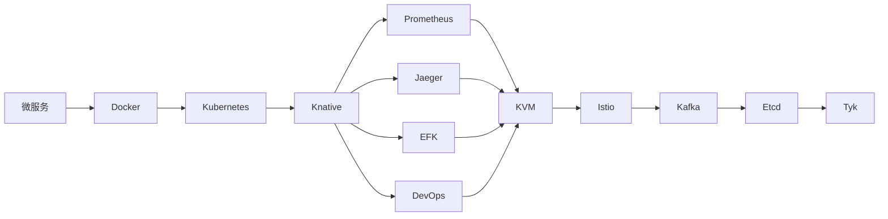

## **需求**

<aside>
🔥 我们需要对 kubernetes 进一步的学习和深造，看源码是必须的道路。

</aside>

**👀   与其重要的，是对 kubernetes 资源的收集。**

---

***⚠️   所有资源均是采用外链连接，书本资源或不放连接，其他均为自己感受和总结。如有侵权请联系删除。***

<aside>
🚧 ⚠️ **注意，这篇文章将永久保存在 notion，将会不断地更新下去，提供了可写通道，如果你有更好的资源，欢迎补充在notion上 ~**

</aside>

[CloudNative 学习途径](https://nsddd.notion.site/CloudNative-2f278e98ed274999829333272415c72d)

**关于kubernetes：**

- [官网](https://kubernetes.io/)
- [GitHub](https://github.com/kubernetes/kubernetes)
- [社区维护的 kubernetes 学习资源合集](https://github.com/kubernauts/Kubernetes-Learning-Resources)
- [Kubernetes源码必读的 Google 大规模集群管理器 Borg](https://blog.opskumu.com/borg.html)
- [etcd：从应用场景到实现原理的全方位解读](https://www.cnblogs.com/sunsky303/p/14371768.html) 和 [ZooKeeper典型应用场景一览](https://blog.51cto.com/nileader/1040007)

---

**关于 CNCF 的贡献，你需要签署 CLA**

- [Kubernetes CLA 的签署流程](https://github.com/kubernetes/community/blob/master/CLA.md)
- [官方开发者向导 markdown 文件](https://github.com/kubernetes/community/tree/master/contributors/devel)
- [Kubernetes ownes 所有者md介绍](https://github.com/kubernetes/community/blob/master/contributors/guide/owners.md)

**自己写作的一些资源：**

- [云原生学习](https://docker.nsddd.top/)
- [golang 学习](https://go.nsddd.top/)

> 都收纳到 awesome 仓库中，覆盖 📚 菜鸟成长手册🚀 CS系列 、云原生系列、区块链系列、web3系列🔥、Golang系列💡...... 访问 GitHub👀 https://github.com/cubxxw/awesome-cs-cloudnative-blockchain ⏬⏬⏬
> 

---

[GitHub - cubxxw/awesome-cs-cloudnative-blockchain: 📚 菜鸟成长手册🚀  CS系列 、云原生系列、区块链系列、web3系列🔥、Golang系列💡......](https://github.com/cubxxw/awesome-cs-cloudnative-blockchain)

## **最好需要什么**

1. 如果说第一步的话，那必须要了解 docker 容器底层原理和 Linux 内核基础相关。
2. 先理解理解完架构了，读起来就比较快了。
3. 学会使用它，不会使用，永远无法理解它的设计理念。
4. 读源码还得带着问题去读，不然会很枯燥。一定要带着问题去读，不然就会很枯燥，然后陷入细节中去
5. 读源码还得有一定积累量，比如你已经读过很多基础包的源码比如 net/http grpc-go 等等
6. 要尝试着调试，要尝试着练习，要尝试着理解和分析产品理念，更要学会自己设计。

## Kubernetes 工程师的学习顺序推荐

**推荐的学习资源整理：**

1. 微服务：[《微服务设计》](https://book.douban.com/subject/26772677/)
2. Docker：[《Docker 技术入门与实战》（第 3 版）](https://book.douban.com/subject/30329430/)、[《Docker 容器与容器云》（第 2 版）](https://book.douban.com/subject/26894736/)
3. Kubernetes：[《Kubernetes 权威指南：从 Docker 到 Kubernetes 实践全接触》（第 5 版）](https://book.douban.com/subject/35458432/)、[《基于 Kubernetes 的容器云平台实战》](https://book.douban.com/subject/30333237/)
4. Knative: [Knative Documentation](https://knative.dev/docs/)
5. Prometheus: [Prometheus Documentation](https://prometheus.io/docs/introduction/overview/)
6. Jaeger: [Jaeger Documentation](https://www.jaegertracing.io/docs/1.26/)
7. KVM：[《KVM 虚拟化技术 : 实战与原理解析》](https://book.douban.com/subject/25743939/)
8. Istio：[《云原生服务网格 Istio：原理、实践、架构与源码解析》](https://book.douban.com/subject/34438220/)
9. Kafka：[《Apache Kafka 实战》](https://book.douban.com/subject/30221096/)、[《Apache Kafka 源码剖析》](https://book.douban.com/subject/27038473/)
10. Etcd：[etcd 实战课](https://time.geekbang.org/column/intro/391)
11. Tyk: [Tyk Open Source](https://tyk.io/docs/apim/open-source/)
12. Consul: [Consul Documentation](https://www.consul.io/docs)
13. Cilium: [Cilium Documentation](https://docs.cilium.io/)
14. OpenShift：[《开源容器云 OpenShift：构建基于 Kubernetes 的企业应用云平台》](https://book.douban.com/subject/27088186/)

## **基础知识**

**基础概念：**

我们需要知道 kubernetes 的基础概念，我们或许在前面有讲解过。

比如 Build-in 的 API Groups 和 API Objects 有什么，做什么用；

**有一些很重要的工具库：**

如 **gengo** ，包括 informer 机制；

- Cobra：命令行阿，docker、Kubernetes、sealos、sealer、ks 都具备的~
- [go-restful](https://github.com/emicklei/go-restful)：REST 要求开发人员以与协议定义一致的方式显式使用 HTTP 方法。这个基本的 REST 设计原则在创建、读取、更新和删除 (CRUD) 操作和 HTTP 方法之间建立了一对一的映射。
- etcd：和 fabric 一样采用 raft 共识机制的数据库，在 k3s 中很深的讲解和应用。

**Restful 基础：**

简单了解 Restful 概念，如果做过 Restful Service 那么最好了

**熟悉一些常见的设计模式：**

- 参考：https://www.yuque.com/aceld/lfhu8y/rg6nsf

**熟悉常用的算法，熟悉操作系统（尤其是 Linux 的基础知识），熟悉网络的一些协议和原理。**

> Kubernetes 有很多复杂的地方，尤其是网络和存储，希望以后可以成为 ***××领域专家***
> 

[Kubernetes 的各个方向的学习路径](https://www.notion.so/Kubernetes-49d69cea67d54f07a4daee049b529c16?pvs=21)

## **阅读方法（其他开源项目类似）**

- 先整体，后局部（不钻牛角尖）
- 深入局部中的学习中去
- 耐心，多看代码~

### **阶段型方法**

1. **第一阶段** 先了解k8s，是什么，能做什么，架构，核心资源对象，设计理念，发展历程等等
2. **第二阶段** 开始使用k8s, 自己创建pod, deploy, job等资源。能够基于k8s开发一下组件，比如实现一个controller监听pod的创建删除等。【看山是山】
3. **第三阶段** 开始阅读源码，了解底层实现。这个过程会对k8s有一个更深的理解。比如创建一个pod的完成历程是什么样的，k8s gc 机制到底是怎么实现的。namespaces删除的时候怎么做到删除所有资源后在删除的。【看山不是山】 这里推荐源码阅读方式：理论+实践结合。
    1. 理论：通过 ide 之间各种跳转阅读源码
    2. 实践：自己动手在[关键代码]处增加日志，通过查看日志输出理解源码 （repo也介绍了如何二进制搭建一套K8s集群）
4. **第四阶段** 再排查问题中进一步深入k8s的理解

## **书籍推荐**

- Go语言程序设计语言 （买了，建议有一些其他语言基础 && Go语言基础再看最好）
- 深入解刨 Kubernetes （这个我也买了，emmm，特别完美的一本书，作者有自己的讲解，是个大佬）
- kubernetes 编程
- kubernetes 源码刨析（这个我买了！！！！！！，不推荐，copy 多干货少）
- 第一本 docker 书
- 深入理解计算机系统 / 现代操作系统
- docker 容器与容器云 （还没开始看）
- Kubernetes 权威指南（熟练使用、贯穿场景）
- docker 开发指南 （还没开始看）
- [Go语言精进之路](https://golang.coding3min.com/)
- [eBPF](https://lib.jimmysong.io/what-is-ebpf/)
- [Kubernetes 加固指南](https://lib.jimmysong.io/kubernetes-hardening-guidance/)
- [云原生基础架构](https://lib.jimmysong.io/cloud-native-infra/)
- [Kubernetes 基础教程](https://lib.jimmysong.io/kubernetes-handbook/)
- [迁移到云原生应用程序](https://lib.jimmysong.io/migrating-to-cloud-native-application-architectures/the-rise-of-cloud-native/)
- [Kubernetes 中文指南/云原生应用架构实战手册](https://jimmysong.io/kubernetes-handbook/)

## **视频资源**

- [张海龙 kubernetes 开发之旅](https://space.bilibili.com/1748865719?share_from=space&share_medium=iphone&share_plat=ios&share_session_id=160FA9F0-624A-411F-AD29-CE83BBBA3D35&share_source=WEIXIN&share_tag=s_i&timestamp=1669727398&unique_k=ulDpC8O)
- [bilibili 搜索 client-go kubernetes必会](https://search.bilibili.com/all?keyword=client-go&from_source=webtop_search&spm_id_from=333.999&search_source=5)
- [插座煤电 深入理解 k8s 网络](https://space.bilibili.com/547971176?share_from=space&share_medium=iphone&share_plat=ios&share_session_id=DE3B8DC0-6E79-4FCC-A128-21D5FB84D251&share_source=WEIXIN&share_tag=s_i&timestamp=1669727447&unique_k=TjDCl4U)
- 极客时间 云原生 训练营课程（十五节）

## **网站资源**

- [从 0 实现一个 k8s 的 CNI 网络插件](https://mp.weixin.qq.com/s/K6ynL_9nSTLCTy0_2xCobg)
- [Kubernetes Deep Dive：CustomResources 的代码生成](https://cloud.redhat.com/blog/kubernetes-deep-dive-code-generation-customresources)
- Istio （服务网格 推荐 https://academy.tetrate.io/courses/take/istio-fundamentals-zh/lessons/26470007-1-0）
- kubernetes 官方文档~
- Kubernetes 中文文档 https://www.coderdocument.com/docs/kubernetes/v1.14/index.html
- helm 中文文档 https://www.coderdocument.com/docs/helm/v2/index.html
- prometheus 中文文档 https://www.coderdocument.com/docs/prometheus/v2.14/introduction/overview.html

## **youtube 精选视频**

- [教程：从源代码构建和运行 Kubernetes 并提交您的第一个 PR](https://www.youtube.com/watch?v=Q91iZywBzew)
- [Kubernetes源码解读: APIServer之server chain by Daniel Guo](https://www.youtube.com/watch?v=Jbm0W9Dd4k4)
- [如何理解开源中的大型代码库](https://www.youtube.com/watch?v=ytbEmcxM4yQ)
- [如何理解开源中的大型代码库？](https://www.youtube.com/watch?v=kA1T0zDPtQo)
- [Kubernetes 源码阅读](https://www.youtube.com/watch?v=toIncOqOBTA)

## **GitHub 精选仓库**

- [go 开发之旅](https://github.com/JackyZhangFuDan/K8sSourceCodeDeepDive/)
- [kubernetes 源码解读](https://github.com/derekguo001/understanding-kubernetes)
- [云原生（Cloud Native）、容器化（Docker）、容器编排（k8s）、服务网格（Istio）、无服务器（Serverless）、微服务、CI/CD、DevOps相关内容总结。](https://github.com/dtsola/best-practices-for-cloud-native)
- [Kubernetes 中文指南/云原生应用架构实战手册](https://jimmysong.io/kubernetes-handbook/)

## **数据统计和收集**

<aside>
💡 来自 CNCF、Kubernetes 和其他的 CloudNative 的数据统计和源码统计

</aside>

- 展开
    
    <aside>
    ☎️ **CNCF 数据 和 源码统计**
    
    ### **CNCF 数据**
    
    - 网站：[kubernetes.io](https://kubernetes.io/)
    - 资料库：[github.com/kubernetes/kubernetes](https://github.com/kubernetes/kubernetes) 94,767
    - Crunchbase：[crunchbase.com/organization/cloud-native-computing-foundation](https://www.crunchbase.com/organization/cloud-native-computing-foundation)
    - 领英：[linkedin.com/company/cloud-native-computing-foundation](https://www.linkedin.com/company/cloud-native-computing-foundation)
    - 推特：[@kubernetesio](https://twitter.com/kubernetesio)
    - 第一次提交：[9年前](https://github.com/kubernetes/kubernetes/commit/2c4b3a562ce34cddc3f8218a2c4d11c7310e6d56%22)
    - 贡献者：[500+](https://github.com/kubernetes/kubernetes/graphs/contributors)
    - 最新推文：[2个月前](https://twitter.com/kubernetesio)
    - 公认: 2016-03-10
    - 已毕业：2018-03-06
    - 总部：[加利福尼亚州旧金山](https://landscape.cncf.io/?grouping=headquarters&headquarters=san-francisco-california)
    - 孵化：7 年前
    - 开发统计：https://k8s.devstats.cncf.io/
    - 艺术品： https://github.com/cncf/artwork/blob/master/examples/graduated.md#kubernetes-logos
    - stackoverflow：https://stackoverflow.com/questions/tagged/kubernetes
    - 博客：http://blog.kubernetes.io/
    - 邮件列表：https://groups.google.com/forum/#!forum/kubernetes-dev
    - slack：http://slack.k8s.io/
    - YouTube： https://www.youtube.com/channel/UCZ2bu0qutTOM0tHYa_jkIwg
    
    ### **源码统计**
    
    `Kubernetes` 代码特别庞大，使用 cloc 统计 **（⏱️ 2023-03-17）**：
    
    !http://sm.nsddd.top/sm202303172221221.png
    
    ### **其他源码统计**
    
    **⚠️ 数据截止到 2023 年 3 月 17 日**
    
    - Istio : SUN：514910 （GO：339739）
    - Kind : 21060
    - Minikube: 178446
    - sealos: 116277
    </aside>
    

# 路人建议

<aside>
💡 [在 notion 中点击编辑](https://www.notion.so/CloudNative-Kubernetes-2f278e98ed274999829333272415c72d?pvs=21)，输入 `/page` 即可创建一个新的页面

</aside>

[学习 Kubernetes 的步骤](https://www.notion.so/Kubernetes-47fe7c27f8e64162bc8eed96d898dcb4?pvs=21)

[GSoC 中一个人的讲解](https://www.notion.so/GSoC-4b67cf1622fd4ea78e518d3df14907e2?pvs=21)
