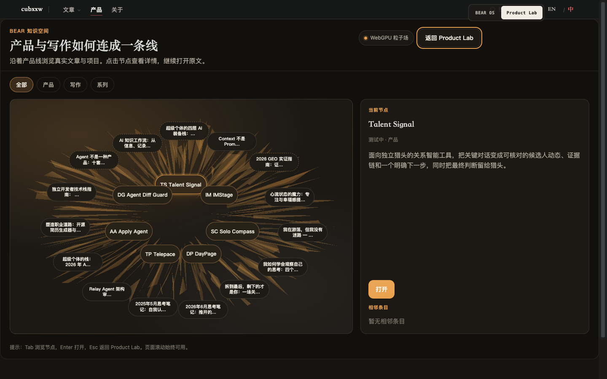
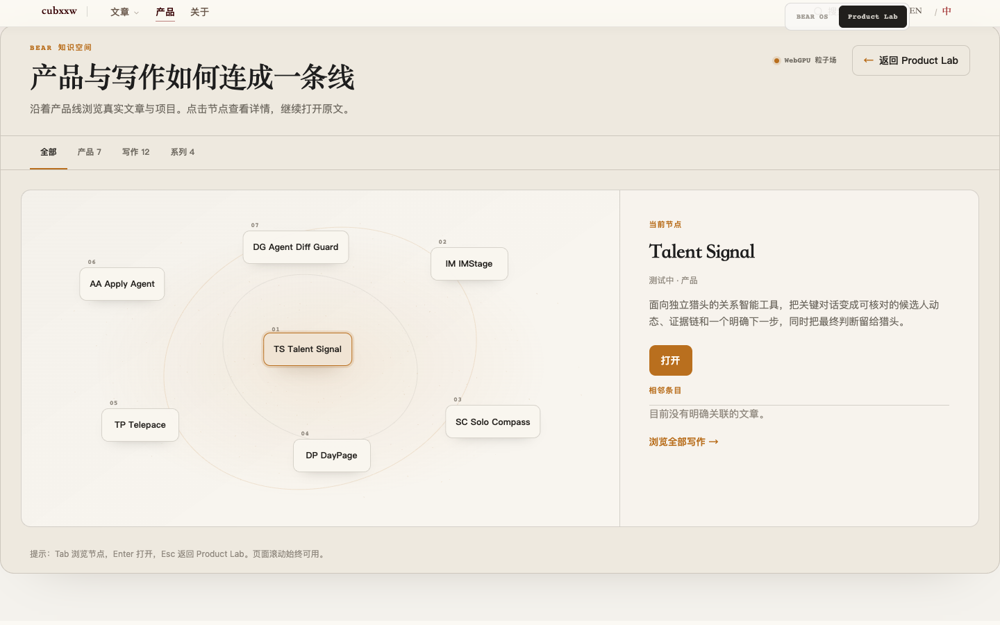

# BEAR Knowledge Space — Browser Test Notes

These are **observed results**, not performance goals. Environment and
screenshot artifacts come from the local prototype pass on 2026-09-25.

## 2026-09-26 refinement pass

| Item | Observed environment/result |
| --- | --- |
| Build | Local Hugo `0.145.0+extended`; production `hugo --minify` passed |
| Browser | Google Chrome `153.0.8010.53`, headless through bundled Playwright `1.62.1`, macOS arm64 |
| Site | Local Hugo server at `http://127.0.0.1:1313`, Chinese route `/zh/projects/` |
| Desktop | 1440×900; WebGPU tier reported; seven product chips measured with zero rectangle overlap |
| Writing | 12 actual writing nodes in a two-column HTML index; selecting a node preserved keyboard focus and exposed its real route. IMStage product and its same-name project article retained distinct node IDs and a real connection |
| Keyboard | `P` opened product search, ArrowDown/Enter opened Solo Compass, Escape closed it; Tab moved between writing nodes, Enter opened a real article, Escape returned to Product Lab |
| Theme | Light and dark captured after theme class transition; text stayed readable by visual inspection |
| Mobile | 390×844 emulated touch, reduced motion; static tier, seven product entries, no horizontal overflow; default BEAR OS rail and focus also captured |
| Failure path | Aborted the knowledge module request; fallback showed real links and an explicit failure title |
| Canvas fallback | Overrode `navigator.gpu` as unavailable in desktop Chromium; Canvas tier mounted with the same seven HTML product entries |
| English route | `/projects/` retained BEAR OS default, entered the English knowledge space, showed seven products, and returned to Product Lab |

Screenshot evidence is local under `_output/`: `bear-before-local.png`, `bear-after-desktop.png`, `bear-after-dark.png`, `bear-after-mobile.png`, `bks-after-desktop.png`, `bks-after-writing.png`, `bks-after-dark.png`, `bks-after-mobile.png`. The repeatable local probe is `_output/qa-bear.cjs` (ignored task evidence, not part of the site).

Portable visual comparison for the PR:

| Before: all nodes compete | After: one readable product atlas |
| --- | --- |
|  |  |

The [refined BEAR OS desktop](evidence/bear-os-after.png) and [mobile static knowledge view](evidence/bear-knowledge-mobile.png) are also captured from the same pass.

The first prototype's WebGPU vertex shader used the raw vertex index as the particle index. This produced the radial shards visible in `bks-desktop-final.png`. The refinement uses `vertex_index / 3` so a particle's three vertices share one position; the new desktop capture shows a quiet field behind readable HTML.

The first product-search shortcut attempted `/` and `⌘K`. Both belong to the site-wide search bootstrap, which intercepts them before BEAR OS. The refined shortcut is `P`; the existing global shortcuts remain available.

**Limits:** No FPS, frame-time, memory, or energy measurement was collected. WebGPU device loss and offscreen pause were code-reviewed but not fault-injected or timed. Touch was checked with browser emulation, not a physical phone. `npm run products:check` initially failed on a visible en dash in the new hint; that copy was corrected and the check passed after the build. The repository E2E file gained a `P`-search scenario. `npm ci` could not fetch a lockfile tarball because this host's npm policy returned `EALLOWREMOTE`, so the Playwright CLI suite and TypeScript typecheck remain unrun here; the equivalent focused browser probe used the bundled Playwright runtime.

## Earlier prototype record (2026-09-25)

## Environment

| | |
| --- | --- |
| Date | 2026-09-25 |
| Site build | Hugo `0.145.0+extended`, `hugo --gc --minify -b http://127.0.0.1:8765` |
| Static server | `python3 -m http.server` on `127.0.0.1:8765` (and `:1313` for Playwright baseURL) |
| Browser automation | Playwright MCP (Chromium) |
| Desktop viewport | 1280×800 and 1440×900 |
| Mobile viewport | 390×844 |
| Motion | `prefers-reduced-motion: reduce` and `no-preference` via `page.emulateMedia` |
| Color scheme | light and dark via `page.emulateMedia` + site theme toggle |
| GPU path observed | `navigator.gpu` available in the automation Chromium → **WebGPU** tier mounted |
| Locale | `/zh/projects/` and `/projects/` |

Artifacts: `bks-desktop-light.png`, `bks-desktop-light-2.png`, `bks-desktop-final.png`, `bks-mobile-reduced.png`, `bks-mobile-flow.png`.

## What was checked

### Entry and return

| Check | Result |
| --- | --- |
| `/projects/` default view is BEAR OS | Observed `data-product-view="bear"`, lab panel count `0` before interaction |
| Product Lab is a secondary view (`#product-lab`) | Observed after switch button |
| Knowledge entry lives in Product Lab | Observed `.bks-entry` / `data-bks-enter` after lab mount |
| Enter knowledge → `#knowledge` | Observed URL hash |
| `Esc` /「返回 Product Lab」returns to Product Lab | Observed `#product-lab`, host hidden, entry button visible |
| Focus restore on return | Observed `document.activeElement` is「进入知识空间」 |
| Switching back to BEAR OS after knowledge | Observed `data-product-view="bear"` |

### Content

| Check | Result |
| --- | --- |
| Real nodes only | 7 products + curated writing/series (22 chips on ZH; 21 on EN — one curated path is ZH-only in this build) |
| Click node opens real detail | Observed real title, plain-text description, and `RelPermalink` / product URL |
| Filter 产品/写作/系列 | Observed non-matching chips dimmed and removed from tab order |
| Neighbours list | Series/product edges resolve when present; products without explicit writing links list other products on the line |

### Visual / interaction

| Check | Result |
| --- | --- |
| First paint readable before GPU | HTML title, filters, chips, and detail panel appear first; field fades in when ready |
| No intro wait / no scroll hijack | Observed immediate content; `documentElement.scrollHeight` > viewport; no `overflow-hidden` lock |
| Pointer field response | WebGPU uniform receives pointer while moving over stage (code path exercised) |
| Theme switch continuity | Dark palette applied on `.bks` (`#ece7dd` / `#e9a04c` / `#12100d`); CSS transitions on tokens |
| Chip hit targets | Desktop product chips ≥44px; mobile flow chips 44px height |
| Desktop constellation readability | Separation pass reduced visible overlaps (still some dense clusters in the center) |
| Mobile readability | ≤720px switches to flex chip cloud; measured **0** overlapping chip rects at 390px |

### Degradation

| Path | Result |
| --- | --- |
| WebGPU tier | Mounted on automation Chromium (`tier=webgpu`) |
| Reduced motion | `tier=static`, `.bks__field--static`, chips still fully usable |
| Module load failure | Route-abort of `bear-knowledge-space*.js` produced fallback title「知识空间暂时无法渲染」plus 12 real linked entries |
| Offscreen / tab pause | Implemented via IntersectionObserver + `visibilitychange` (logic present; not stress-measured) |

### Regression

Playwright CLI is not installed in this workspace (`node_modules` missing), so the
repo file `tests/e2e/p1-p2-ux.spec.ts` could not be executed here. The
`products defaults to BEAR OS…` scenario was re-run through Playwright MCP as
equivalent assertions (13/13 passed), including enter/exit knowledge then return
to BEAR OS. A dedicated knowledge-space case was added to that spec for CI.

## Not claimed

- No FPS, frame-time, memory, or Lighthouse numbers were collected.
- WebGPU vs Canvas quality difference was not scored beyond “tier mounted”.
- Real iOS Safari / Android Chrome were not run; mobile checks used Chromium
  viewport + `prefers-reduced-motion`, not a device farm.
- Touch multi-gesture behaviour was not exhaustively tested.

## Follow-ups worth doing

1. Run `npx playwright test tests/e2e/p1-p2-ux.spec.ts` in CI after `npm ci`.
2. Soften the WebGPU center burst into a quieter dust field if it reads too loud.
3. Add more product↔writing edges from tags/series when the graph grows.
4. Re-check EN curated list so both locales share the same node count.
